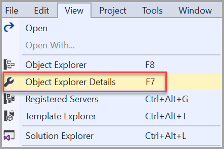
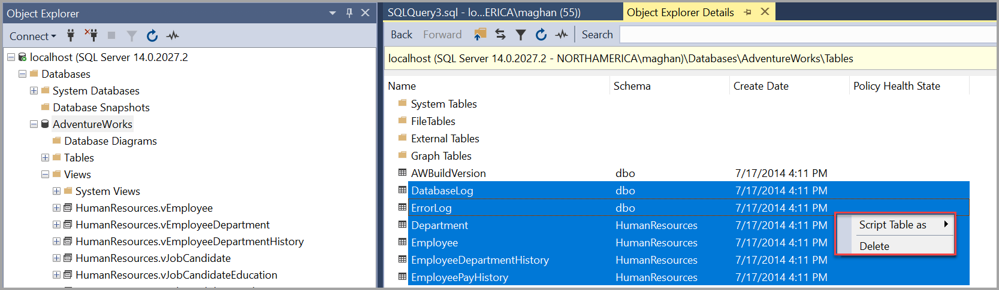

# Generate Scripts (SQL Server Management Studio)

[!INCLUDE[SQL Server Azure SQL Database Synapse Analytics PDW](../../includes/applies-to-version/sql-asdb-asdbmi-asa-pdw.md)]

SQL Server Management Studio provides two mechanisms for generating [!INCLUDE[tsql](../../includes/tsql-md.md)] scripts. You can create scripts for multiple objects by using the **Generate and Publish Scripts Wizard**. You can also generate a script for individual objects or multiple objects by using the **Script as** menu in **Object Explorer**.

For a detailed Tutorial on scripting various objects using SQL Server Management Studio (SSMS), see [Tutorial: Scripting in SSMS](../tutorials/scripting-ssms.md).

## Before You Begin

Choose the mechanism that best meets your requirements. 

###   Generate and Publish Scripts Wizard

Use the **Generate and Publish Scripts Wizard** to create a [!INCLUDE[tsql](../../includes/tsql-md.md)] script for many objects. The wizard generates a script of all the objects in a database, or a subset of the objects that you select. The wizard has many options for your scripts, such as whether to include permissions, collation, constraints, and so on. For instructions on using the wizard, see [Generate and Publish Scripts Wizard](./generate-and-publish-scripts-wizard.md).
  
###  Object Explorer Script As Menu

You can use the **Object Explorer Script as** menu to script a single object, script multiple objects, or script multiple statements for a single object. You can choose one of several types of scripts; for example to create, alter, or drop the object. You can save the script in a Query Editor window, to a file, or to the Clipboard. The script is created in Unicode format.

##  To generate a script of a single object

**To script a single object**

1. In Object Explorer, connect to an instance of the [!INCLUDE[ssDEnoversion](../../includes/ssdenoversion-md.md)] and then expand that instance.

2. Expand **Databases**, and then expand the database containing the object to be scripted.

3. Expand the category of the object. For example, expand the **Tables** or **Views** node.

4. Right-click the object, point to **Script \<object type> as**, For example, point to **Script Table as**.

5. Point to the script type, such as **Create to** or **Alter to**.

6. Select the location to save the script, such as **New Query Editor Window** or **Clipboard**.

    

You can use the **Object Explorer Details** pane to generate a script for multiple objects of the same category.

1. In Object Explorer, connect to an instance of the [!INCLUDE[ssDEnoversion](../../includes/ssdenoversion-md.md)] and then expand that instance.

2. Expand **Databases**, and then expand the database containing the objects to be scripted.

3. Expand the category node of the types of object you want to script, such as the **Tables** node.

4. Open the **Object Explorer Details** pane by either selecting **F7**, or opening the **View** menu and selecting **Object Explorer Details**.

    

5. Left-click one of the objects you want to script.

6. Ctrl + left-click the second object you want to script.

7. Right-click one of the selected objects, and select **Script \<object type> as**.

    