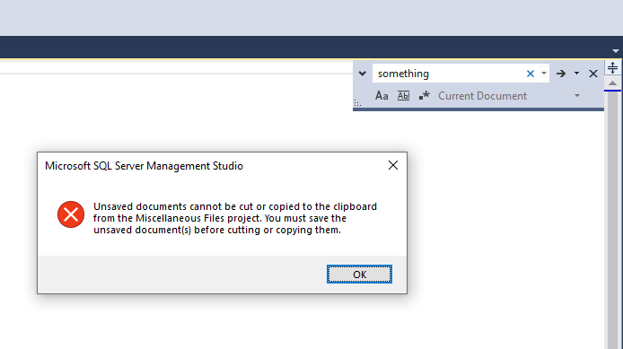
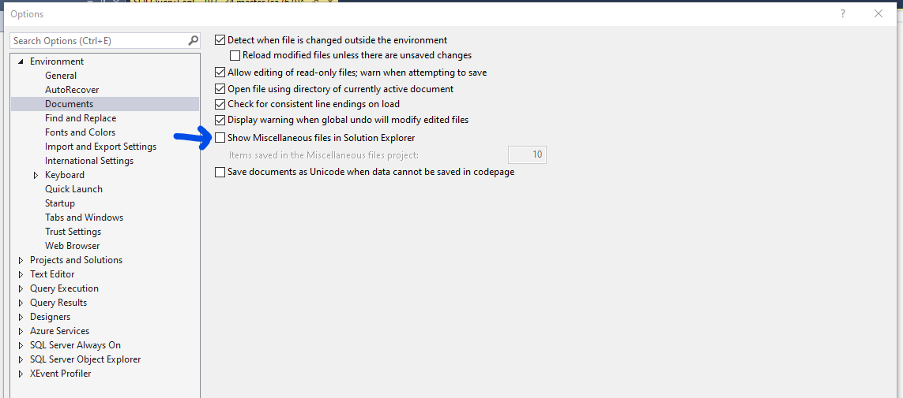

# Workaround to enable copying from find and replace window

[!INCLUDE[Applies to](../../includes/appliesto-ss-asdb-asdw-xxx-md.md)]

A workaround is required to enable copying from find and replace window.  If you find you are unable to copy from find and replace window in SQL Server Management Studio, follow the [workaround](#workaround) below.

## Error Message

When you attempt to copy text from the find and replace window in SQL Server Management Studio, you get an error message.

> Unsaved documents cannot be cut or copied to the clipboard from the miscellaneous files project. You must save the unsaved document(s) before cutting or copying them.

## Workaround

To enable copying text from the find and replace window, follow these steps:

1. In the **Tools** menu, open **Options**.

2. Under **Environment**>**Documents**, uncheck the item for "Show Miscellaneous files in Solution Explorer"

3. Close and reopen SQL Server Management Studio

