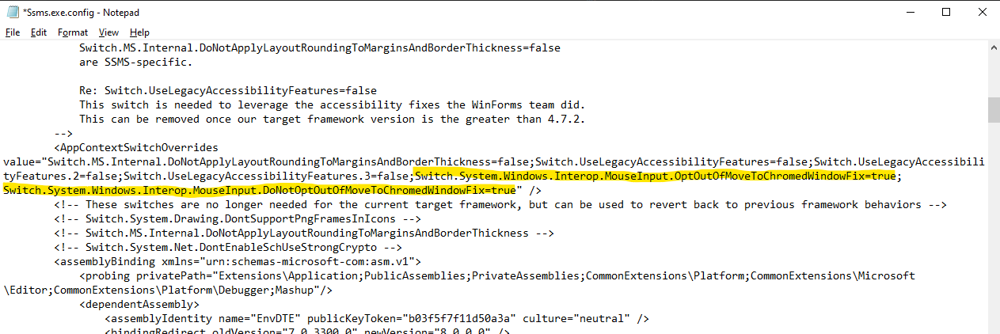

# Workaround to move tabs

[!INCLUDE[Applies to](../../includes/appliesto-ss-asdb-asdw-xxx-md.md)]

A workaround may be required to enable moving query editor tabs, whether within the window or to dock a previously removed tab.  If you have applied all available Windows updates and find you are unable to manipulate query editor tabs without experiencing a crash, follow the [workaround](#workaround) below.

## Applicable Environments
Windows updates to the .NET Framework introduced a known issue, which results in an application crash for SQL Server Management Studio (SSMS) when docking tabs or splitting the window.  The latest information can be found at [SQL Server User Feedback](https://feedback.azure.com/forums/908035/suggestions/42651556).

## Workaround

If the crash persists after applying all available Windows updates, follow these steps to mitigate the issue:

1. Close all SQL Server Management Studio (SSMS) instances.

2. Locate your SSMS application file (exe).  This is commonly found in `C:\Program Files (x86)\Microsoft SQL Server Management Studio 18\Common7\IDE`.

3. Open the file `Ssms.exe.config` in Notepad as Administrator.

4. Locate the `AppContextSwitchOverrides` node and append these two properties to the value.
    ```
    ;Switch.System.Windows.Interop.MouseInput.OptOutOfMoveToChromedWindowFix=true; Switch.System.Windows.Interop.MouseInput.DoNotOptOutOfMoveToChromedWindowFix=true
    ```

    

5. Save the config file and reopen SSMS.
