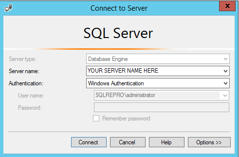
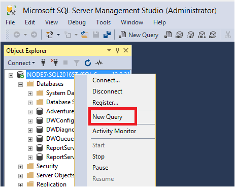
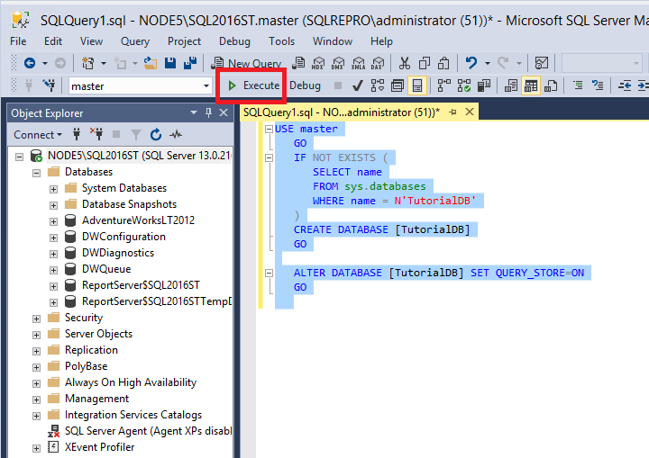
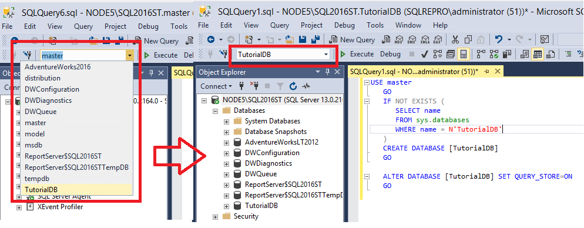
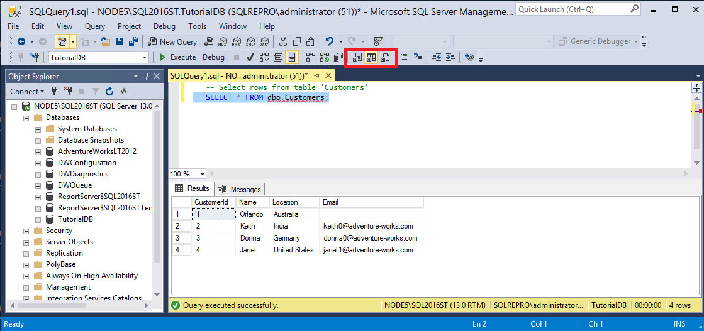

# Tutorial: Connect to and query a SQL Server instance by using SQL Server Management Studio

> [!div class="nextstepaction"]
> [Please share your feedback about the SQL Docs Table of Contents!](https://aka.ms/sqldocsurvey)

This tutorial teaches you how to use SQL Server Management Studio (SSMS) to connect to your SQL Server instance and run some basic Transact-SQL (T-SQL) commands. The article demonstrates how to do the following:

> [!div class="checklist"]	
> * Connect to a SQL Server instance	
> * Create a database ("TutorialDB")	
> * Create a table ("Customers") in your new database	
> * Insert rows into your new table	
> * Query the new table and view the results	
> * Use the query window table to verify your connection properties	
> * Change the server that your query window is connected to

## Prerequisites
To complete this tutorial, you need SQL Server Management Studio and access to a SQL Server instance. 

- Install [SQL Server Management Studio](https://docs.microsoft.com/sql/ssms/download-sql-server-management-studio-ssms).

If you don't have access to a SQL Server instance, select your platform from the following links. If you choose SQL Authentication, use your SQL Server login credentials.
- **Windows**: [Download SQL Server 2017 Developer Edition](https://www.microsoft.com/sql-server/sql-server-downloads).
- **macOS**: [Download SQL Server 2017 on Docker](https://docs.microsoft.com/sql/linux/quickstart-install-connect-docker).


## Connect to a SQL Server instance

1. Start SQL Server Management Studio. The first time you run SSMS, the **Connect to Server** window opens. If it doesn't open, you can open it manually by selecting **Object Explorer** > **Connect** > **Database Engine**.

    

2. In the **Connect to Server** window, do the following: 

    - For **Server type**, select **Database Engine** (usually the default option).
    - For **Server name**, enter the name of your SQL Server instance. (This article uses the instance name SQL2016ST on the hostname NODE5 [NODE5\SQL2016ST].) If you're unsure how to determine your SQL Server instance name, see [Additional tips and tricks for using SSMS](ssms-tricks.md#determine-sql-server-name).  

    

    - For **Authentication**, select **Windows Authentication**. This article uses Windows Authentication, but SQL Server login is also supported. If you select **SQL Login**, you will be prompted for a username and password. For more information about authentication types, see [Connect to server (database engine)](https://docs.microsoft.com/sql/ssms/f1-help/connect-to-server-database-engine).

    You can also modify additional connection options by selecting **Options**. Examples of connection options are the database you're connecting to, the connection timeout value, and the network protocol. This article uses the default values for all the options. 

3. After you've completed all the fields, select **Connect**. 

### Examples of successful connections
To verify that your SQL Server connection succeeded, expand and explore the objects within **Object Explorer**. These objects will be different depending on the type of server you're connected to. 

- Connecting to an on-premises SQL server - in this case NODE5\SQL2016ST: 
  

- Connecting to SQL Azure DB - in this case msftestserver.database.windows.net:
  

  >[!NOTE]
  > In this tutorial, you previously used *Windows Authentication* to connect to your on-premises SQL server, but this method is not supported for SQL Azure DB. As such, this image shows using SQL Authentication to connect to the SQL Azure DB. For more information, see [SQL on-premises authentication](../../relational-databases/security/choose-an-authentication-mode.md) and [SQL Azure authentication](https://docs.microsoft.com/azure/sql-database/sql-database-security-overview#control-access). 

## Create a database
Create a database named TutorialDB by doing the following: 

1. Right-click your server instance in Object Explorer, and then select **New Query**:

   
   
2. Into the query window, paste the following T-SQL code snippet: 
   ```sql
   USE master
   GO
   IF NOT EXISTS (
      SELECT name
      FROM sys.databases
      WHERE name = N'TutorialDB'
   )
   CREATE DATABASE [TutorialDB]
   GO
   ```
2. To execute the query, select **Execute** (or select F5 on your keyboard). 

   
  
    After the query is complete, the new TutorialDB database appears in the list of databases in Object Explorer. If it isn't displayed, right-click the **Databases** node, and then select **Refresh**.  


## Create a table in the new database
In this section, you create a table in the newly created TutorialDB database. Because the query editor is still in the context of the *master* database, switch the connection context to the *TutorialDB* database by doing the following: 

1. In the database drop-down list, select the database that you want, as shown here: 

   

2. Paste the following T-SQL code snippet into the query window, select it, and then select **Execute** (or select F5 on your keyboard).  
   You can either replace the existing text in the query window or append it to the end. To execute everything in the query window, select **Execute**. To execute a portion of the text, highlight that portion, and then select **Execute**.  
  
   ```sql
   -- Create a new table called 'Customers' in schema 'dbo'
   -- Drop the table if it already exists
   IF OBJECT_ID('dbo.Customers', 'U') IS NOT NULL
   DROP TABLE dbo.Customers
   GO
   -- Create the table in the specified schema
   CREATE TABLE dbo.Customers
   (
      CustomerId        INT    NOT NULL   PRIMARY KEY, -- primary key column
      Name      [NVARCHAR](50)  NOT NULL,
      Location  [NVARCHAR](50)  NOT NULL,
      Email     [NVARCHAR](50)  NOT NULL
   );
   GO
   ```

After the query is complete, the new Customers table is displayed in the list of tables in Object Explorer. If the table is not displayed, right-click the **TutorialDB** > **Tables** node in Object Explorer, and then select **Refresh**.

## Insert rows into the new table
Insert some rows into the Customers table that you created previously. To do so, paste the following T-SQL code snippet into the query window, and then select **Execute**: 


   ```sql
   -- Insert rows into table 'Customers'
   INSERT INTO dbo.Customers
      ([CustomerId],[Name],[Location],[Email])
   VALUES
      ( 1, N'Orlando', N'Australia', N''),
      ( 2, N'Keith', N'India', N'keith0@adventure-works.com'),
      ( 3, N'Donna', N'Germany', N'donna0@adventure-works.com'),
      ( 4, N'Janet', N'United States', N'janet1@adventure-works.com')
   GO
   ```

## Query the table and view the results
The results of a query are visible below the query text window. To query the Customers table and view the rows that were previously inserted, do the following:  

1. Paste the following T-SQL code snippet into the query window, and then select **Execute**: 

   ```sql
   -- Select rows from table 'Customers'
   SELECT * FROM dbo.Customers;
   ```

    The results of the query are displayed under the area where text was entered: 

   

2. Modify the way results are presented by selecting one of the following options:

     

    - The middle button displays the results in **Grid View**, which is the default option. 
    - The first button displays the results in **Text View**, as shown in the image in the next section.
    - The third button lets you save the results to a file whose extension is .rpt by default.

## Verify your connection properties by using the query window table
You can find information about the connection properties under the results of your query. After you run the previously mentioned query in the preceding step, review the connection properties at the bottom of the query window.

- You can determine which server and database you're connected to, and the username that you're logged in with.
- You can also view the query duration and the number of rows that are returned by the previously executed query.

    
    
    In the image, note that the results are displayed in **Text View**. 

## Change the server that the query window is connected to
You can change the server that your current query window is connected to by doing the following:

1. Right-click in the query window, and then select **Connection** > **Change connection**. The **Connect to Server** window opens again.
2. Change the server that your query is connected to. 
 
   

    > [!NOTE]
    > This action changes only the server that the query window is connected to, not the server that Object Explorer is connected to. 

## Next steps
The next article teaches you how to script various objects within SQL Server Managment Studio. 

Go to the next article to learn more:
> [!div class="nextstepaction"]
> [Next steps](scripting-ssms.md)


