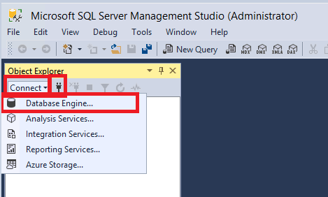
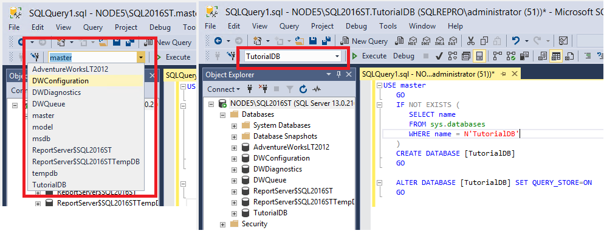

# Quickstart: Connect and query SQL Server using SQL Server Management Studio
This Quickstart shows how to use SQL Server Management Studio (SSMS) connect to SQL and run some basic Transact-SQL (T-SQL) commands to create a database.  

## Prerequisites
To complete this Quickstart, you need SQL Server Management Studio and access to a SQL Server. 

- Install [SQL Server Management Studio](https://docs.microsoft.com/en-us/sql/ssms/download-sql-server-management-studio-ssms).

If you don't have access to a SQL Server, select your platform from the following links (make sure you remember your SQL Login and Password!):
- [Windows - Download SQL Server 2017 Developer Edition](https://www.microsoft.com/en-us/sql-server/sql-server-downloads)
- [macOS - Download SQL Server 2017 on Docker](https://docs.microsoft.com/en-us/sql/linux/quickstart-install-connect-docker)
- [Linux - Download SQL Server 2017 Developer Edition](https://docs.microsoft.com/en-us/sql/linux/sql-server-linux-overview#install) - You only need to follow the steps up to *Create and Query Data*.

## Connect to a SQL Server

1. Start SQL Server Management Studio (SSMS)
1. The first time  you run SSMS the **Connect to Server** dialog opens. 
      - If the **Connection** dialog doesn't open, Object Explorer > Connect button / connect icon > Database Engine.

     

1. In the **Connect to Server** dialog box, select your connection options and hit connect. This article uses *Windows Authentication* but *SQL Login* is also supported. The remaining fields should be as follows:

    - Server type: Database Engine (should be selected by default)
    - Authentication: Windows Authentication
    - Options: you can also modify your connection options, such as the database you're connecting to, the connection timeout value, and the network protocol. This article uses the default values. 
   
   

1. Once the fields have been filled out, hit **Connect**. 

1. You are now connected to your SQL Server, and  you can verify this by exploring the objects available within Object Explorer: 

   


## Create a database
The following steps create a database named TutorialDB. 

1. Right-click your server in **Object Explorer** and select **New Query**:

   
   
1. Paste the following snippet into the query window: 
   ```sql
   USE master
   GO
   IF NOT EXISTS (
      SELECT name
      FROM sys.databases
      WHERE name = N'TutorialDB'
   )
   CREATE DATABASE [TutorialDB]
   GO

   ALTER DATABASE [TutorialDB] SET QUERY_STORE=ON
   GO
   ```
1. To execute the query, hit **Execute** (or F5 on your keyboard). If you want to execute a portion of the text, highlight that portion and then hit **Execute**.  Executing without highlighting anything will run everything in the query window. 
   
  
 
After the query completes, the new **TutorialDB** appears in the list of databases. If you don’t see it, right-click the Databases node and select **Refresh**.  


## Create a Table
The query editor is still connected to the *master* database, but you want to create a table in the *TutorialDB*. 

1. Change the connection context of your query from the master to **TutorialDB** by selecting the database you want from the drop-down on the top left. 

   

1. Paste the following snippet into the query window, highlight it, and hit **Execute**: 
  
   ```sql
   -- Create a new table called 'Customers' in schema 'dbo'
   -- Drop the table if it already exists
   IF OBJECT_ID('dbo.Customers', 'U') IS NOT NULL
   DROP TABLE dbo.Customers
   GO
   -- Create the table in the specified schema
   CREATE TABLE dbo.Customers
   (
      CustomerId        INT    NOT NULL   PRIMARY KEY, -- primary key column
      Name      [NVARCHAR](50)  NOT NULL,
      Location  [NVARCHAR](50)  NOT NULL,
      Email     [NVARCHAR](50)  NOT NULL
   );
   GO
   ```
After the query completes, the new **Customers** table appears in the list of tables. You might need to right-click the **TutorialDB > Tables** node and select **Refresh**.

## Insert rows
1. Paste the following snippet into the query window and **Execute**: 


   ```sql
   -- Insert rows into table 'Customers'
   INSERT INTO dbo.Customers
      ([CustomerId],[Name],[Location],[Email])
   VALUES
      ( 1, N'Orlando', N'Australia', N''),
      ( 2, N'Keith', N'India', N'keith0@adventure-works.com'),
      ( 3, N'Donna', N'Germany', N'donna0@adventure-works.com'),
      ( 4, N'Janet', N'United States', N'janet1@adventure-works.com')
   GO
   ```

## View the data returned by a query
1. Paste the following snippet into the query window and click **Execute**: 

   ```sql
   -- Select rows from table 'Customers'
   SELECT * FROM dbo.Customers;
   ```
1. The results of the query are displayed under the area where text was entered: 
   


1.  You can modify the way results are presented by selecting one of these options
    - By default, the results will be in **Grid**, which shows a table and is the middle option
    - The first option will display your results via text
    - The third option will save your results to a file

## Verify your query window connection properties
You can find information about the connection properties under the results of your query. 
1. After running the aforementioned query from the step above, review the connection properties at the bottom of the query window.   
    - You can determine which server and database you're connected to, and the user  you're logged in with.
    - You can also see the query duration and the number of rows returned by the query executed earlier.
      
    In this image, the results are displayed as text as an example. 

## Change the server the query window is connected to
If you need to quickly change the server your query is connected to, you can do so within the query window.
1. Right click within the query window > Connection > Change connection
1. This will open the **Connect to Server** dialog box again, allowing you to change which server your query is connected to. 
    - Note that this does not change which server your **Object Explorer** is connected to, just the current query window. 

  

<!----
Advance to the next article to learn more
> [!div class="nextstepaction"]
> [Next steps button](contribute-get-started-mvc.md)/]---!>


