# Tutorial: Script Objects in SQL Server Management Studio
This tutorial will teach you how to generate Transact-SQL (T-SQL) scripts for various  objects found within SQL Server Management Studio.  In this tutorial, you will find examples of how to script the following objects: 

> [!div class="checklist"]
> * Queries when performing actions within the GUI
> * Databases in two different ways ("Script As" and "Generate Script")
> * Tables
> * Stored procedures
> * Extended events

The summary of this tutorial is that any object in **Object Explorer** can be scripted by right-clicking it and selecting the **Script Object As** option. 

## Prerequisites
To complete this Tutorial, you need SQL Server Management Studio, access to a SQL Server, and an AdventureWorks database. 

- Install [SQL Server Management Studio](https://docs.microsoft.com/en-us/sql/ssms/download-sql-server-management-studio-ssms).
- Install [SQL Server 2017 Developer Edition](https://www.microsoft.com/en-us/sql-server/sql-server-downloads).
- Download [AdventureWorks2016 Sample Databases](https://github.com/Microsoft/sql-server-samples/releases). Instructions for restoring databases in SSMS can be found here: [Restoring a Database](https://docs.microsoft.com/en-us/sql/relational-databases/backup-restore/restore-a-database-backup-using-ssms). 

## Script Queries from GUI
Any time you perform a task using the GUI in SSMS, you can also generate the T-SQL code associated with that task. The following examples show how to do so when taking a backup of a database, and when  you shrink the transaction log.  These same steps can be applied to any action that's completed via the GUI. 

### Script T-SQL when backing up a database
1. Connect to your SQL Server.
2. Expand the **Databases** node.
3. Right-click the **Adventureworks2016** database > **Tasks** > **Back up**:

    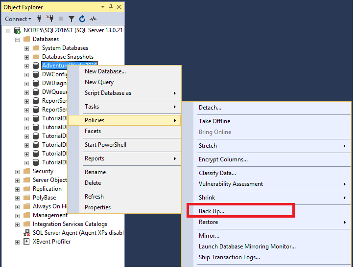

4. Configure the backup the way you want. For the purpose of this Tutorial, everything is left at default. However, any changes made in the window will also be reflected in the script. 
5. Select the option to **Script** > **Script Action to Query Window**:
 
    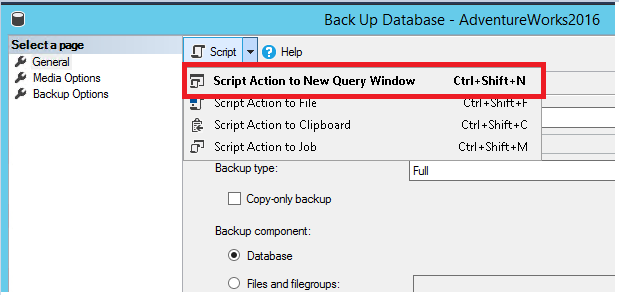
6. Review the T-SQL populated in the query window: 

    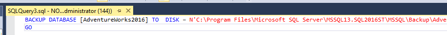
7. Select **Execute** to execute the query to backup the database via T-SQL. 

### Script T-SQL when shrinking the transaction log
1. Right-click the **AdventureWorks2016** database > **Tasks** > **Shrink** > **Files**:

     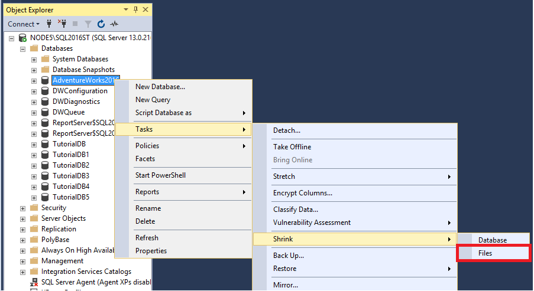

2. Select **Log** from the **File Type** drop down:

    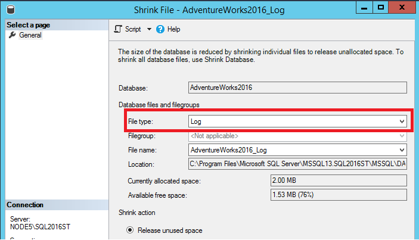

3. Select the option **Script** and **Script Action to Clipboard**:

    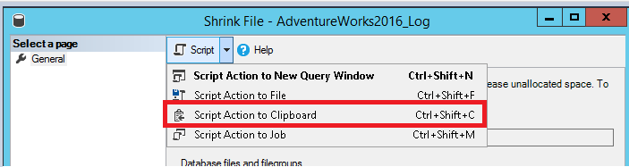

4. Open a **New Query** window and paste (Right-click in the window > **Paste**):

    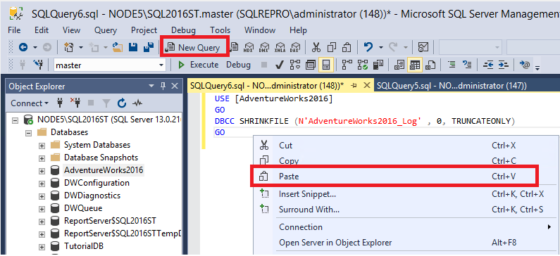
5. Select **Execute** to execute the query and shrink the transaction log. 

## Script Databases
The following section teaches you how to script out the database, both using the **Script As** option and the **Generate Scripts** option.  The **Script As** option will recreate the database and the configuration options for it. The **Generate Scripts** option will allow you to script both the schema and the data. In this section, you will create two new databases, *AdventureWorks2016a* will be created using the **Script As** option. *AdventureWorks2016b* will be created using the **Generate Scripts** option. 

### Script database using Script option
1. Connect to your SQL Server.
2. Expand the **Databases** node.
3. Right-click the **AdventureWorks2016** database > **Script Database As** > **Create To** > **New Query Window**:

    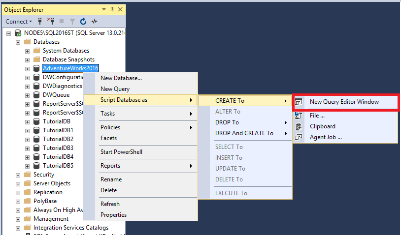

4. Review the database creation query in the window: 

    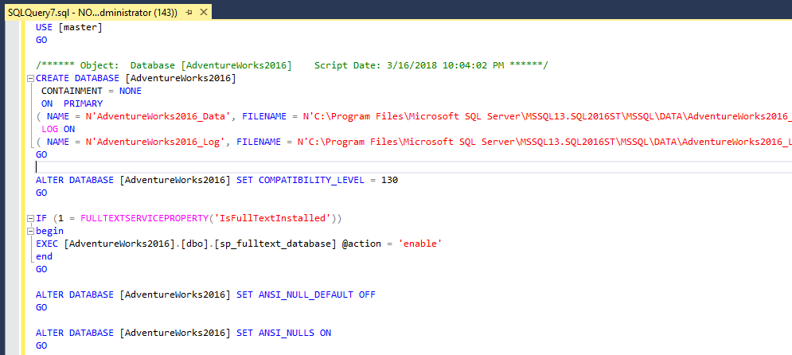
    - This option will only script out the database configuration options.
5. On your keyboard, select **Ctrl + F** to open the **Find** dialog box and select the down arrow to open the **Replace** option. On the top **Find** line, type in *AdventureWorks2016* and on the bottom **Replace** line, type in *AdventureWorks2016a*. 
6. Select **Replace All** to replace all instances of *AdventureWorks2016* with *AdventureWorks2016a*. 

    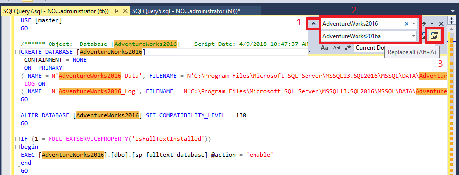

1. Select **Execute** to execute the query and create your new *AdventureWorks2016a* database. 

### Script database using Generate Scripts option
1. Connect to your SQL Server.
2. Expand the **Databases** node.
3. Right-click the **AdventureWorks2016** database > **Tasks** > **Generate Scripts**:

    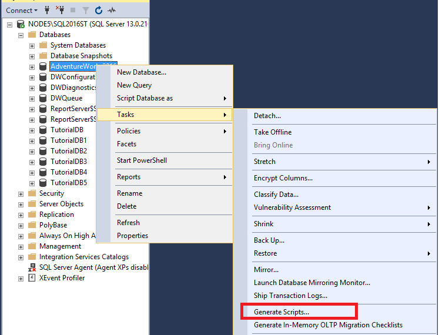

4. The **Introduction** page opens, select **Next** to open **Chose Objects** page. You have the option to select the entire database or specific objects in the database. Select the option to **Script entire database and all database objects** 
 
    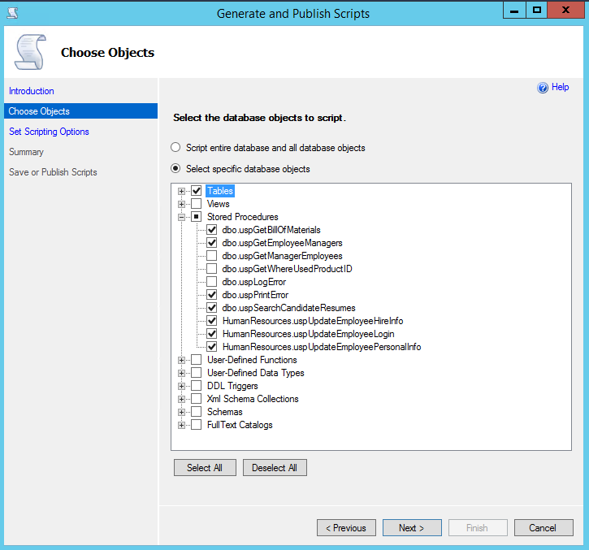
 
5. Select **Next** to open the **Set Scripting Options** page, which is where you can configure where to save the script as well as some additional advanced options. 

    a. Select the option to **Save to new query Window**. 

    b. Select **Advanced** and ensure these options are set: 

      - **Script Statistics** set to *Script Statistics*
      - **Types of data to script** set to *Schema only*
      - **Script Indexes** set to *true*

 
   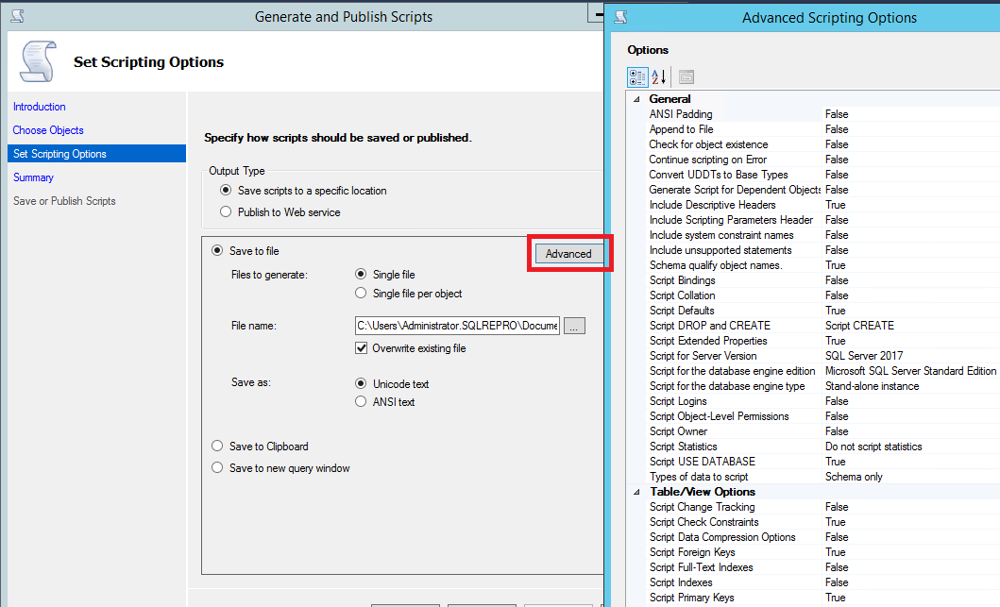

   >[!NOTE]
   > You have the ability to script the data for the database when you select *Schema and data* for the **Types of data to script** option. However, this is not ideal with large databases as it can take more memory than SSMS is able to allocate. This is okay for small databases, but if you want to move data for a larger database, you should use the [Import and Export Wizard](https://docs.microsoft.com/en-us/sql/integration-services/import-export-data/import-and-export-data-with-the-sql-server-import-and-export-wizard).

6. Select **OK** and then select **Next**. 
7. Select **Next** on the **Summary** and then select **Next** again to generate the script to a **New Query** Window.  
8. On your keyboard, select **Ctrl + F** to open the **Find** dialog box and select the down arrow to open the **Replace** option. On the top **Find** line, type in *AdventureWorks2016* and on the bottom **Replace** line, type in *AdventureWorks2016b*. 
    a. Select **Replace All** to replace all instances of *AdventureWorks2016* with *AdventureWorks2016b*. 

    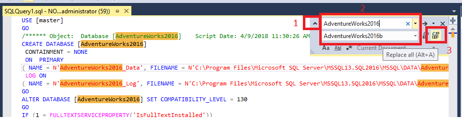
7. Select **Execute** to execute the query and create your new *AdventureWorks2016b* database. 
 
## Script Tables
This section covers how to script out tables from your database. Using this option, you can either create the table, or drop and create the table. You can also use this option to script the T-SQL associated with modifying the table, such as to insert into it, or update to it. In this section, you will drop a table, and then recreate it. 

1. Connect to your SQL Server.
2. Expand your **Databases** node.
3. Expand your **AdventureWorks** database node. 
4. Expand your **Tables** node.
5. Right-click the **dbo.ErrorLog** >  **Script Table as** > **Drop and Create To** > **New Query Editor Window**:
    
    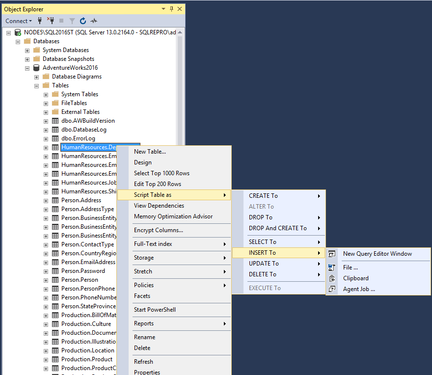

6. Select **Execute** to execute the query - this will drop the *Errorlog* table and recreate it. 

    >[!NOTE]
    > The *Errorlog* table is empty by default in the AdventureWorks2016 database, so you're not losing any data by dropping the table. However, following these steps on a table with data will cause data loss. 
 
## Script Stored Procedures
In this section, you will learn how to drop and create a stored procedure.  

1. Connect to your SQL Server.
2. Expand your **Databases** node.
3. Expand your **Programmability** node. 
4. Expand your **Stored Procedure** node.
5. Right-click the stored procedure **dbo.uspGetBillOfMaterials**> **Script Stored Procedure As** > **Drop and Create to** > **New Query Window**:
    
    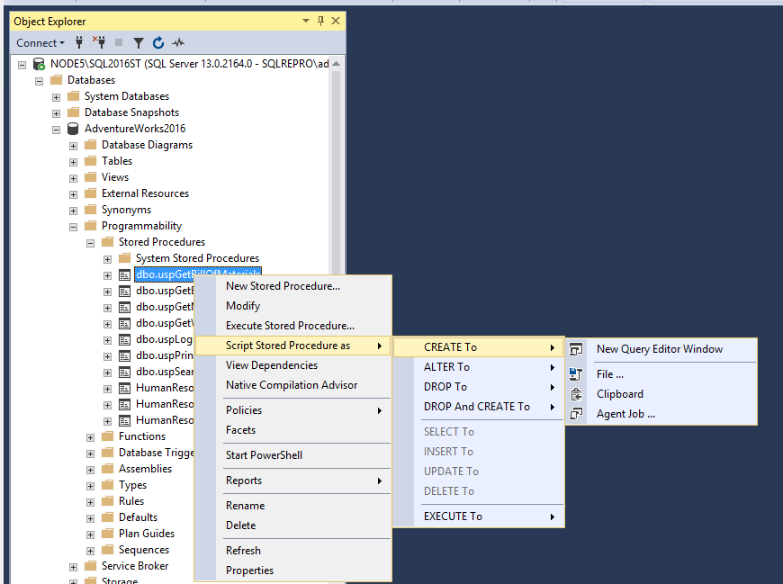

## Script Extended Events
This section covers how to script out [extended events](https://docs.microsoft.com/en-us/sql/relational-databases/extended-events/extended-events). 

1. Connect to your SQL Server.
2. Expand your **Management** node.
3. Expand your **Extended Events** node.
4. Expand your **Sessions** node.
5. Right-click the extended session you're interested in > **Script Session As** > **New Query Editor Window**:

    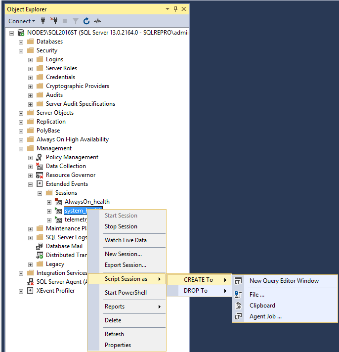 
6. In the **New Query Window**, modify the new name of the session from *system_health* to *system_health2* and select **Execute** to execute the query. 

    a. Right-click **Sessions** in **Object Explorer** and select **Refresh** to see your new Extended Event Session. The green icon next to the session indicates the session is running whereas the red icon indicates the session is stopped. 

    

    >[!NOTE]
    > You can start the session by right-clicking it and selecting **Start**. However, since this is a copy of the already-running *system_health* session, this step can be skipped. You can delete the copy of the extended event session by right-clicking it and selecting **Delete**. 

## Next steps
The next article introduces you to the pre-built T-SQL templates found within SSMS. 

Advance to the next article to learn more:
> [!div class="nextstepaction"]
> [Next steps](templates-ssms.md)

