# SQL Server Management Studio components and configuration

This tutorial describes the various window components in SQL Server Management Studio (SSMS), and a set of basic configuration options for your workspace. In this article, you learn how to:

> [!div class="checklist"]
> * Identify the components that make up the SSMS environment
> * Change the environment layout, and reset it to the default
> * Maximize the query editor
> * Change the font
> * Configure startup options

## Prerequisites

To complete this tutorial, you need SQL Server Management Studio.  

* Install [SQL Server Management Studio](../download-sql-server-management-studio-ssms.md).

## SQL Server Management Studio components

This section describes the various window components that are available in the workspace and how to use them.

* To close a window, select the **X** in the right corner of the title bar.
* To reopen a window, select the window in the **View** menu.

    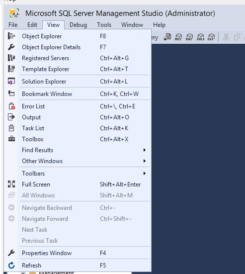

* **Object Explorer** (F8): Object Explorer is a tree view of all the objects for a database or server. This view includes the databases of the SQL Server Database Engine, SQL Server Analysis Services, SQL Server Reporting Services, and SQL Server Integration Services. Object Explorer displays information for all servers to which there's a connection.

    
* **Query Window** (Ctrl+N): After you select **New Query**, enter your Transact-SQL (T-SQL) queries in this window. The results of your queries also appear in the Results pane.

    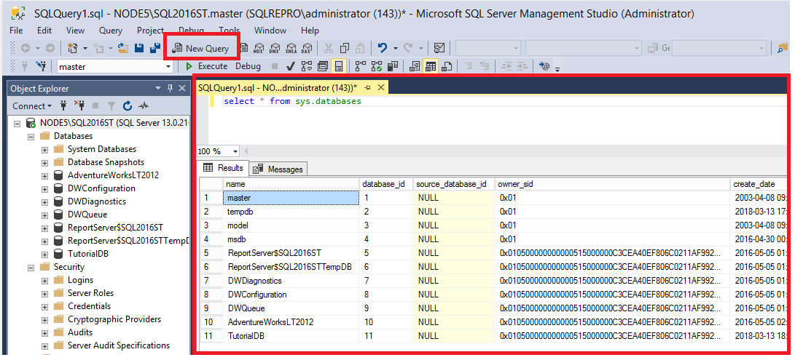

* **Current connection properties** (F4): You can see the Current connection properties pane when the Query Window is open. The view displays properties for the connection. For example, it shows the Server name, the start time for the query last executed, the number of rows returned, and other connection details.  

    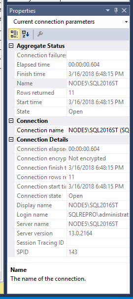

* **Template Browser** (Ctrl+Alt+T): The Template Browser has an extensive set of prebuilt T-SQL templates. You can use these templates to perform various functions, such as creating or backing up a database, or creating an index.

    

* **Object Explorer Details** (F7): The details pane provides more granular information compared to Object Explorer. You can use the Object Explorer Details pane to manipulate multiple objects at the same time. For example, you can select multiple databases and then script them out simultaneously.

    

## Change the environment layout

This section describes how to change the environment layout, such as how to move various windows.

* To move a window, select and hold the title, and then drag the window.
* To pin or unpin a window, select the pushpin icon in the title bar:

    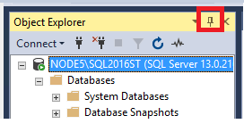

* Each window component has a drop-down menu that you can use to manipulate the window in various ways:

    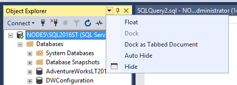

* When two or more query windows are open, the windows can be separated into multiple tab groups so that all query windows are visible. Tab groups can be vertical or horizontal. To create a tab group, right-click the title of the query, and then select the tabbed option that you want:

    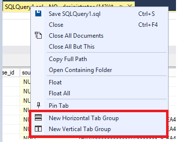

  * Horizontal Tab Group:

      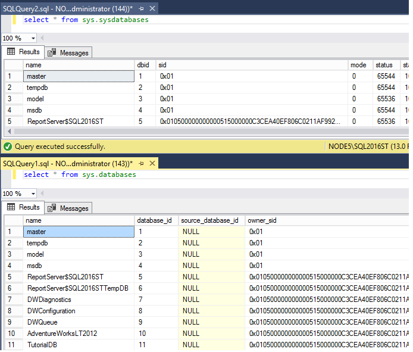

  * Vertical Tab Group:

      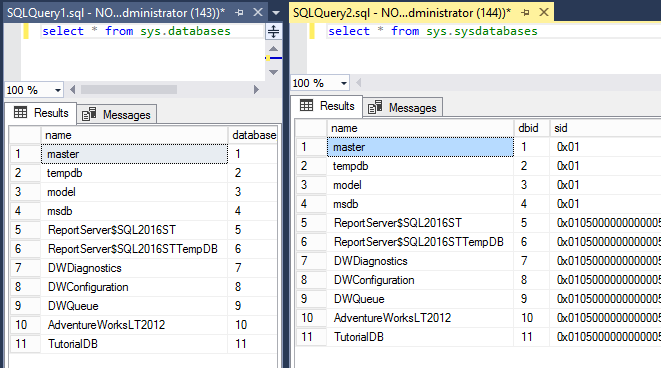

    * To merge a query window into another tabs, right-click the query title, and then select **Move to Previous Tab Group**  or **Move to Next Tab Group**:

      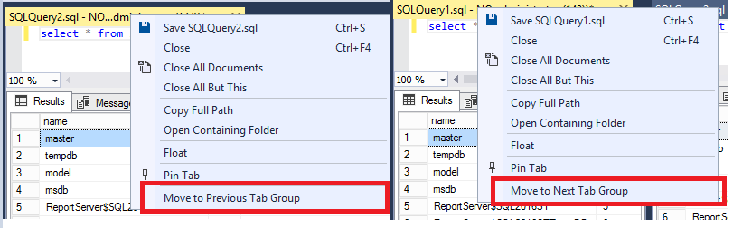

* To restore the default environment layout, in the **Window** menu, select **Reset Window Layout**:

    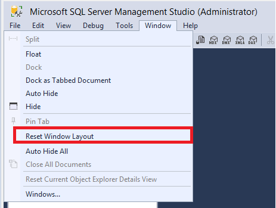

## Maximize Query Editor

To maximize Query Editor to full-screen mode:

1. Click anywhere in the Query Editor window.

1. Press Shift+Alt+Enter to toggle between full-screen mode and regular mode.

This keyboard shortcut works with any document window.

## Change basic settings

This section describes how to modify some basic settings in SSMS from the **Tools** menu.

  

* To modify a toolbar, select **Tools** > **Customize**, or right-click on the toolbar and select **Customize...**:

    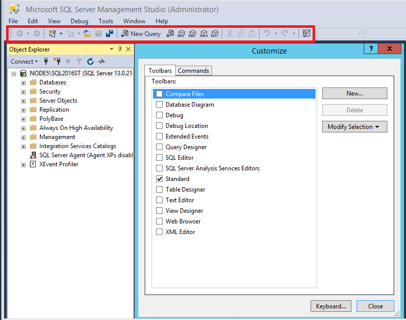

  * Use the **Toolbars** pane to enable or disable the toolbars displayed under the menu bar.

  * Use the **Commands** pane to customize the icons displayed for a toolbar.

### Change the font

* To change the font for a window, select **Tools** > **Options** > **Fonts and Colors**:

     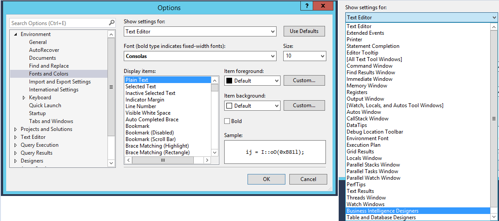

### Change startup options

* The startup options determine what your workspace looks like when you first open SSMS. To change startup options, select **Tools** > **Options** > **Startup**:

    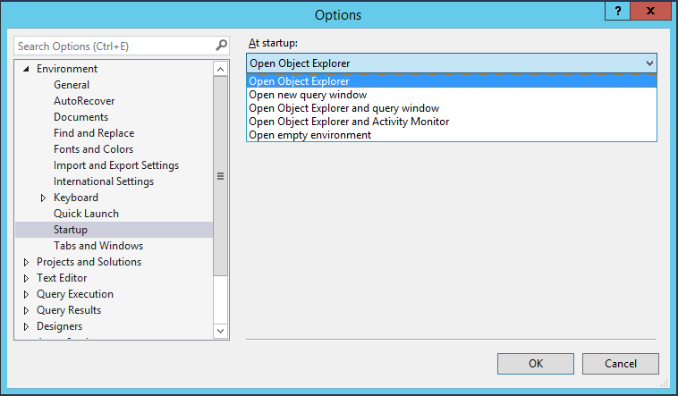

## Next steps

The best way to get acquainted with SSMS is through hands-on practice. These *tutorial* and *how-to* articles help you with various features available within SSMS. These articles teach you how to manage the components of SSMS and how to find the features that you use regularly.

* [Connect to and query an instance](../quickstarts/ssms-connect-query-sql-server.md)
* [Scripting](scripting-ssms.md)
* [Using Templates in SSMS](../template/templates-ssms.md)
* [Import and Export settings](import-export-settings.md)
* [Tips and tricks for SSMS](ssms-tricks.md)
