# Tutorial: Additional tips and tricks for using SSMS
This tutorial gives you some additional tricks for using SQL Server Management Studio. This article teaches you how to: 

> [!div class="checklist"]
> * Comment/uncomment your Transact-SQL (T-SQL) text
> * Indent your text
> * Filter objects in Object Explorer
> * Access your SQL Server error log
> * Find the name of your SQL Server instance

## Prerequisites
To complete this tutorial, you need SQL Server Management Studio, access to a SQL Server instance, and an AdventureWorks database. 

- Install [SQL Server Management Studio](https://docs.microsoft.com/sql/ssms/download-sql-server-management-studio-ssms).
- Install [SQL Server 2017 Developer Edition](https://www.microsoft.com/sql-server/sql-server-downloads).
- Download an [AdventureWorks sample database](https://github.com/Microsoft/sql-server-samples/releases). To learn how to restore a database in SSMS, see [Restoring a database](https://docs.microsoft.com/sql/relational-databases/backup-restore/restore-a-database-backup-using-ssms). 

## Comment/uncomment your T-SQL code
You can comment and uncomment portions of your text by using the **Comment** button on the toolbar. Text that is commented out is not executed. 

1. Open SQL Server Management Studio. 
2. Connect to your SQL server.
3. Open a **New Query** window. 
4. Paste the following T-SQL code in your text window: 

  ```sql
    USE master
    GO

    -- Drop the database if it already exists
    IF  EXISTS (
	    SELECT name 
		    FROM sys.databases 
		    WHERE name = N'TutorialDB'
            )

    DROP DATABASE TutorialDB
    GO

    CREATE DATABASE TutorialDB
    GO

    ALTER DATABASE [TutorialDB] SET QUERY_STORE=ON
    GO
 ``` 


5. Highlight the **Alter Database** portion of the text, and then select **Comment** in the toolbar: 

    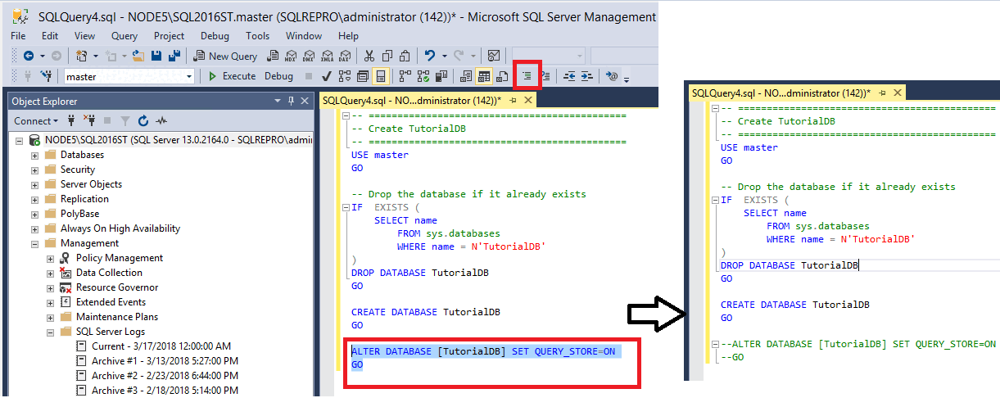
6. Select **Execute** to run the uncommented portion of the text. 
7. Highlight everything except for the **Alter Database** command, and then select **Comment** in the toolbar:

    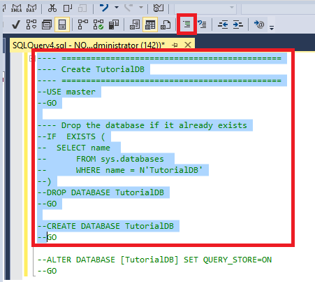

8. Highlight the **Alter Database** portion, and then select **Uncomment** to uncomment it:

    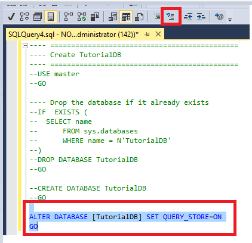
    
9. Select **Execute** to run the uncommented portion of the text. 

## Indent your text
You can use the indentation buttons in the toolbar to increase and decrease the indent of your text. 

1. Open a **New Query** window. 
2. Paste the following T-SQL code in your text window: 

  ```sql
    USE master
    GO

    -- Drop the database if it already exists
    IF  EXISTS (
	    SELECT name 
		    FROM sys.databases 
		    WHERE name = N'TutorialDB'
            )

    DROP DATABASE TutorialDB
    GO

    CREATE DATABASE TutorialDB
    GO

    ALTER DATABASE [TutorialDB] SET QUERY_STORE=ON
    GO
 ``` 
 
3. Highlight the **Alter Database** portion of the text, and then select **Increase Indent** in the toolbar to move this text forward:

    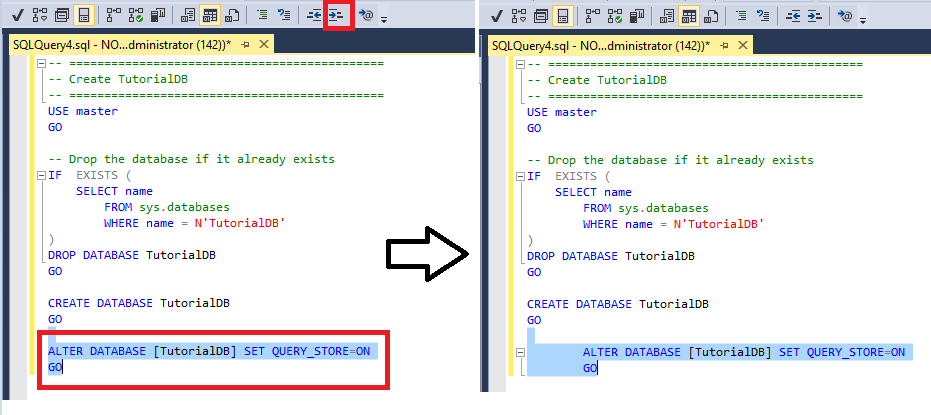

4. Highlight the **Alter Database** portion of the text again, and then select **Decrease Indent** to move this text back. 
    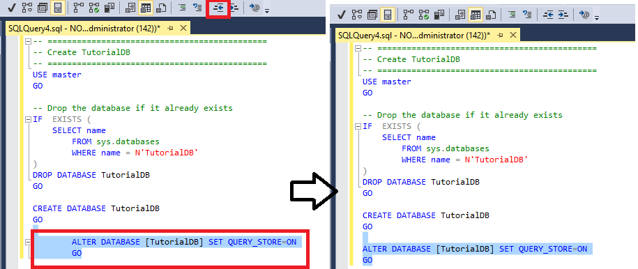


## Filter objects in Object Explorer
When a database has many objects, finding a specific object might be difficult. To make finding an object easier, you can filter objects. This section describes how to filter tables, but you can use the following steps in any other node in **Object Explorer**:

1. Connect to your SQL server.
2. Expand **Databases** > **AdventureWorks** > **Tables**. 
   - You'll notice that you can see all the tables that are present in the database.
5. Right-click the **Tables** node, then select **Filter** > **Filter Settings**:

    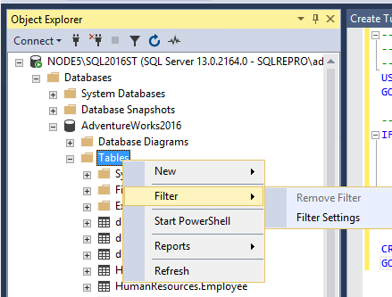

6. In the **Filter Settings** window, you can modify filter settings. A few examples:
    - Filter by name: 
   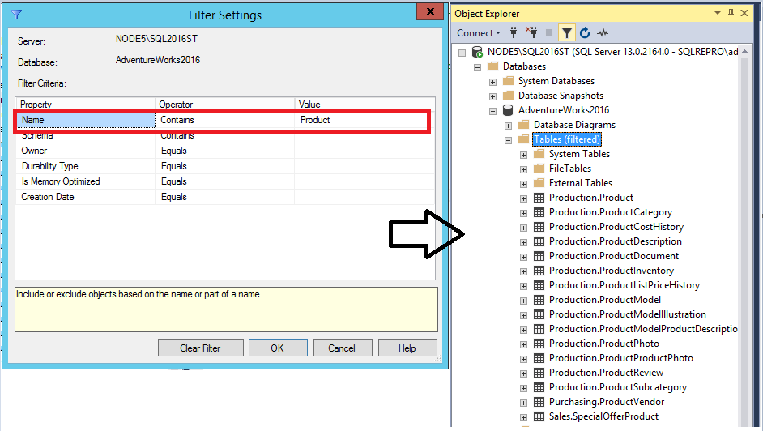
    - Filter by schema: 
    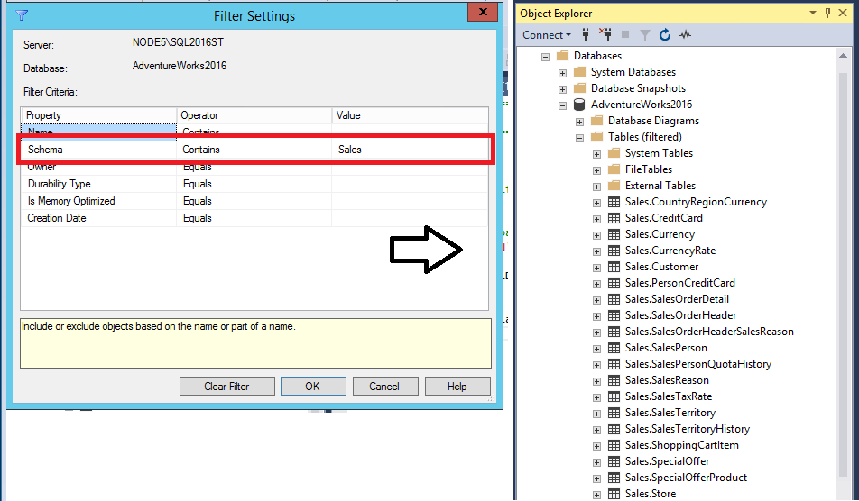

7. To clear the filter, right-click **Tables**, then select **Remove Filter**.

    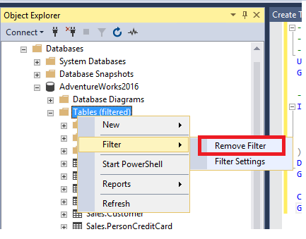
    


## Access your SQL Server error log
The error log is a file that contains details about things occurring in your SQL server instance. You can browse and query the error log in SSMS. The error log is a .log file on disk.

### Open the error log in SSMS
1. Connect to your SQL server.
2. Expand **Management** > **SQL Server Logs**. 
4. Right-click the **Current** error log, then select **View SQL Server Log**:

    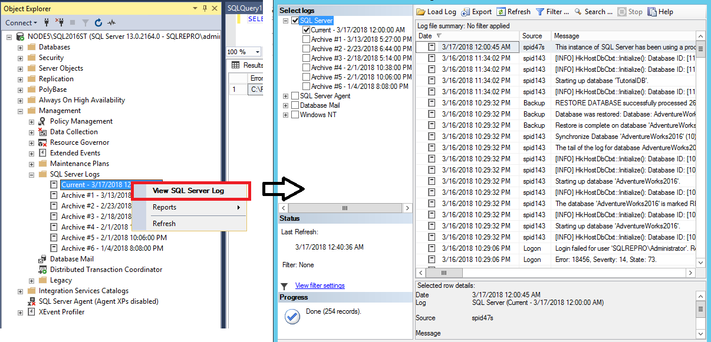

### Query the error log in SSMS
1. Connect to your SQL server.
2. Open a **New Query** window.
3. Paste the following T-SQL code in your query Window:

 ```sql
   sp_readerrorlog 0,1,'Server process ID' 
  ``` 
4. Modify the text in the single quotes to text you want to search for.
5. Execute the query and review the results:
   
    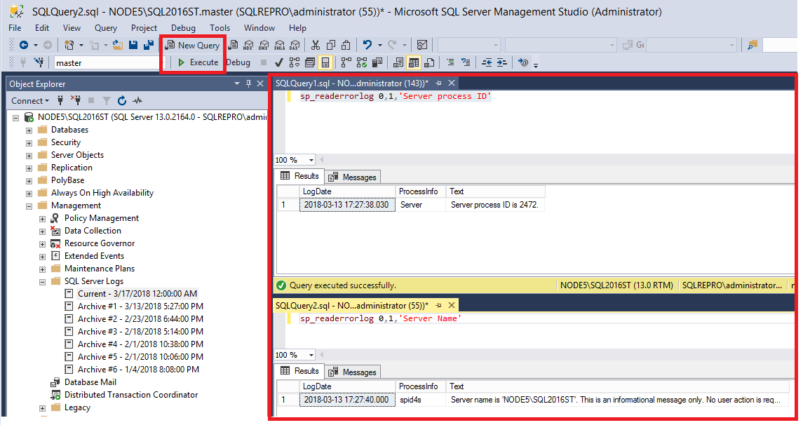


### Find the error log location if you're connected to SQL
1. Connect to  your SQL server.
2. Open a **New Query** window.
3. Paste the following T-SQL code in your query window, and then select **Execute**:

 ```sql
    SELECT SERVERPROPERTY('ErrorLogFileName') AS 'Error log file location'  
  ``` 

4. The results show you the location of the error log in the file system: 

    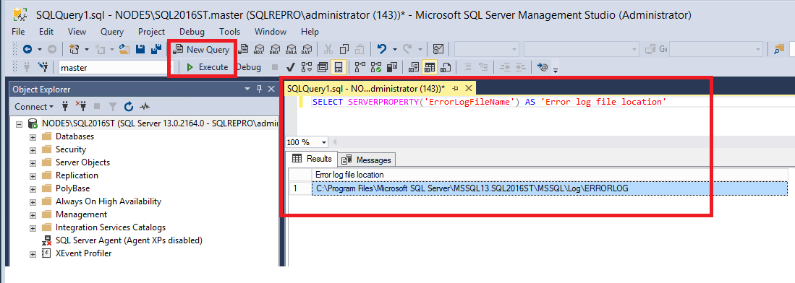

### Find the error log location if you can't connect to SQL
1. Open your SQL Server Configuration Manager. 
2. Expand the **Services** node.
3. Right-click your SQL Server instance, then select **Properties Window**:

    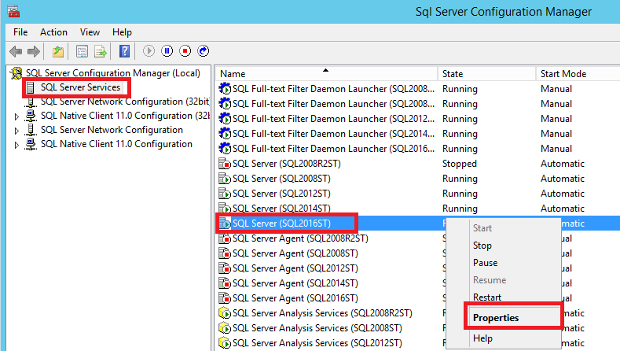

4. Select the **Startup Parameters** tab.
5. In the **Existing Parameters** area, the path after "-e" is the location of the error log: 
    
    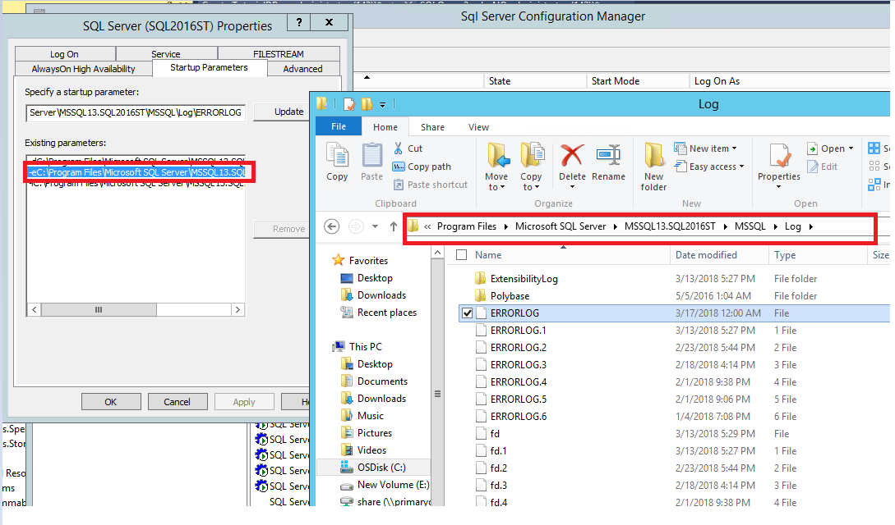
    - There are several errorlog.* files in this location. The file name that ends with *.log is the current error log file. The file names that end with numbers are previous log files. A new log is created every time the SQL server restarts. 
6. Open the errorlog.log file in Notepad. 

## Determine your SQL server name
You have a few options for determining the name of your SQL server before and after you connect to your SQL server.  

### Before you connect to the SQL server
1. Follow the steps to locate the [SQL Server error log on disk](#finding-your-error-log-if-you-cannot-connect-to-sql). 
2. Open the errorlog.log file in Notepad. 
3. Scroll through the file until you find the text "Server name is":
  - Whatever is listed in the single quotes is the name of the SQL server and what you'll be connecting to: 
    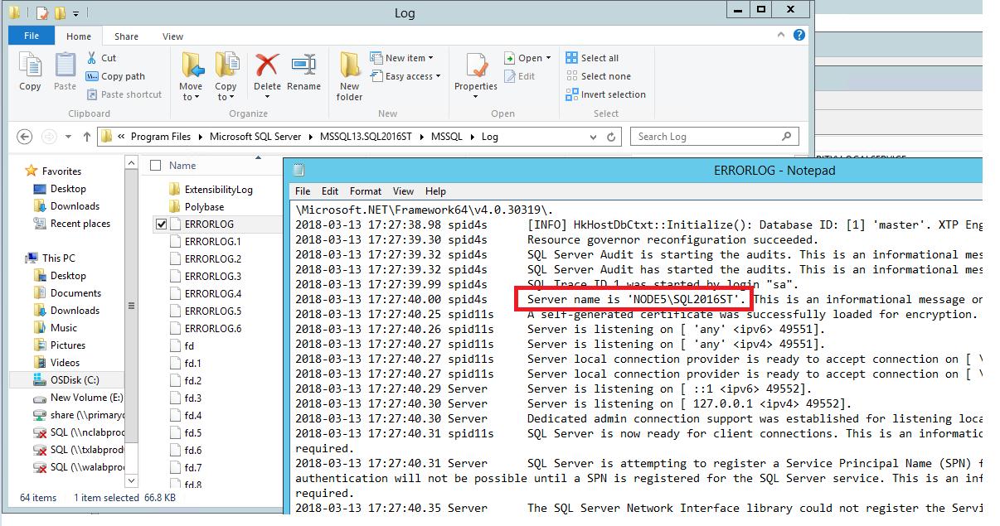
    The format of the name is 'HOSTNAME\INSTANCENAME'. If all you see is the hostname, then you've installed the default instance, and your instance name is 'MSSQLSERVER'. When connecting to a default instance, the hostname is all you need to type in to connect to  your SQL Server.  

### When you're connected to the SQL server 
When you're connected to SQL Server, you can find the server name in three locations: 

1. The name of the server is listed in **Object Explorer**:

    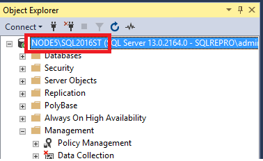
2. The name of the server is listed in the **Query** window:

    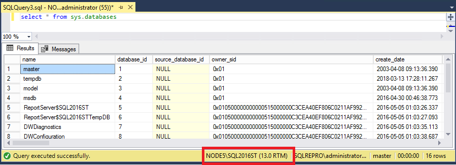
3. The name of the server is listed in the **Properties** window.
    - In the **View** menu, select **Properties Window**:

    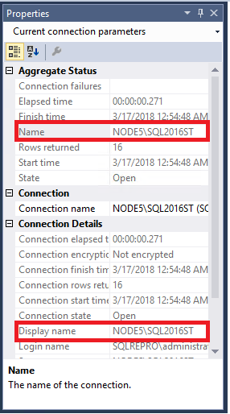

### If you're connected to an alias or Availability Group listener 
If you're connected to an alias or to an Availability Group listener, that information appears in **Object Explorer** and **Properties**. In this case, the SQL Server name might not be readily apparent, and must be queried. 

1. Connect to SQL Server.
2. Open a **New Query** window.
3. Paste the following T-SQL code in the window: 

  ```sql
   select @@Servername 
 ``` 
4. View the results of the query to identify the name of the SQL server you're connected to: 
    
    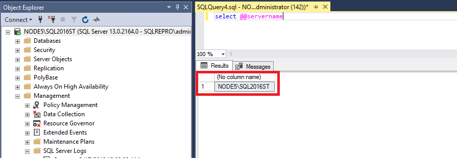


