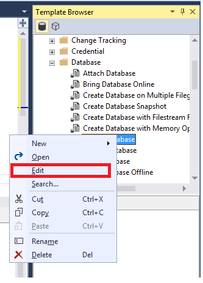
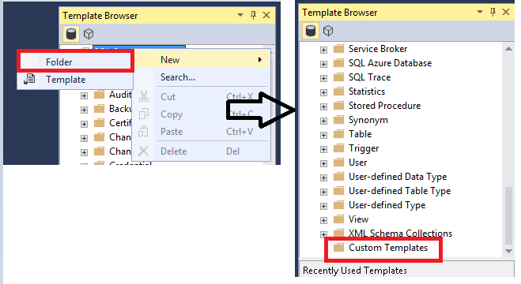
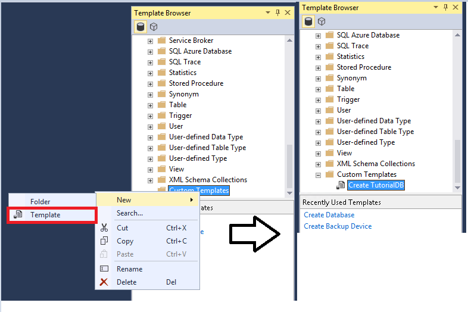

# Tutorial: Using templates in SQL Server Management Studio
This tutorial introduces you to the prebuilt Transact-SQL (T-SQL) templates that are available in SQL Server Management Studio (SSMS). In this article, you learn how to:

> [!div class="checklist"]
> * Use the template browser to generate T-SQL scripts
> * Edit an existing template 
> * Locate templates on disk
> * Create a new template
   

## Prerequisites
To complete this tutorial, you need SQL Server Management Studio and access to a SQL server. 

- Install [SQL Server Management Studio](https://docs.microsoft.com/sql/ssms/download-sql-server-management-studio-ssms).
- Install [SQL Server 2017 Developer Edition](https://www.microsoft.com/sql-server/sql-server-downloads).

 

## Use Template Browser
In this section, you learn how to locate and use Template Browser. 

1. Open SQL Server Management Studio.
2. In the **View** menu, select **Template Browser** (Ctrl+Alt+T): 

    
    
    You can see recently used templates at the bottom of the template browser.

3. Expand the node you're interested in. Right-click the template, and then select **Open**:

    
    
    You can also double-click the template name to open it.

4. A new query window opens. The T-SQL script is already populated. 
5. Modify the template to suit your needs, and then select **Execute** to run the query:
    
    

## Edit an existing template
You can also edit existing templates in Template Browser.  

1. In Template Browser, go to the template you want to work with.
2. Right-click the template, and then select **Edit**:

    

3. In the query window that opens, make the changes that you want to make.
4. To save the template, select **File** > **Save** (Ctrl+S).
5. Close the query window.
6. Reopen the template. Your edits should appear.
 

## Locate templates on disk
When a template is open, you can locate the templates that are on disk.

1. In Template Browser, select a template, and then select **Edit**.
2. Right-click **Query Title**, and then select **Open Containing Folder**. 
The explorer should open where the templates are stored on disk: 

   
  

## Create a new template
You can also create a new template in Template Browser. The following steps show you how to create a new folder, and then create a new template in that folder. You can also use these steps to create a custom template in an existing folder. 

1. Open Template Browser.
2. Right-click **SQL Server Templates**, and then select **New** > **Folder**.
3. Name this folder **Custom Templates**:

    

4. Right-click the newly created Custom Templates folder, and then select **New** > **Template**. Enter a name for your template:
 
    
   
5. Right-click the template you created, and then select **Edit**. The New Query Window opens.
6. Enter the T-SQL text that you want to save. 
7. In the **File** menu, select **Save**.
8. Close the existing query window, and then open your new custom template. 

    

## Next steps
The next article provides additional tips and tricks for using SQL Server Management Studio. 

> [!div class="nextstepaction"]
> [Additional tips and tricks for using SSMS](ssms-tricks.md)
