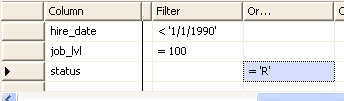
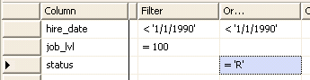

# Conventions for Combining Search Conditions in the Criteria Pane (Visual Database Tools)
[!INCLUDE[SQL Server](../../includes/applies-to-version/sqlserver.md)]
You can create queries that include any number of search conditions, linked with any number of AND and OR operators. A query with a combination of AND and OR clauses can become complex, so it is helpful to understand how such a query is interpreted when you execute it, and how such a query is represented in the [Criteria Pane](../../ssms/visual-db-tools/criteria-pane-visual-database-tools.md) and [SQL Pane](../../ssms/visual-db-tools/sql-pane-visual-database-tools.md).  
  
> [!NOTE]  
> For details about search conditions that contain only one AND or OR operator, see [Specify Multiple Search Conditions for One Column &#40;Visual Database Tools&#41;](../../ssms/visual-db-tools/specify-multiple-search-conditions-for-one-column-visual-database-tools.md) and [Specify Multiple Search Conditions for Multiple Columns &#40;Visual Database Tools&#41;](../../ssms/visual-db-tools/specify-multiple-search-conditions-for-multiple-columns-visual-database-tools.md).  
  
Below you will find information about:  
  
-   The precedence of AND and OR in queries that contain both.  
  
-   How the conditions in AND and OR clauses relate logically to one another.  
  
-   How the Query and View Designer represents in the Criteria Pane queries that contain both AND and OR.  
  
To help you understand the discussion below, imagine that you are working with an `employee` table containing the columns `hire_date`, `job_lvl`, and `status`. The examples assume that you need to know information such as how long an employee has worked with the company (that is, what the employee's hire date is), what type of job the employee performs (what the job level is), and the employee's status (for example, retired).  
  
## Precedence of AND and OR  
When a query is executed, it evaluates first the clauses linked with AND, and then those linked with OR.  
  
> [!NOTE]  
> The NOT operator takes precedence over both AND and OR.  
  
For example, to find either employees who have been with the company for more than five years in lower-level jobs or employees with middle-level jobs without regard for their hire date, you can construct a WHERE clause such as the following:  
  
```  
WHERE   
   hire_date < '01/01/95' AND   
   job_lvl = 100 OR  
   job_lvl = 200  
```  
  
To override the default precedence of AND over OR, you can put parentheses around specific conditions in the SQL pane. Conditions in parentheses are always evaluated first. For example, to find all employees who have been with the company more than five years in either lower or middle-level jobs, you can construct a WHERE clause such as the following:  
  
```  
WHERE   
   hire_date < '01/01/95' AND   
   (job_lvl = 100 OR job_lvl = 200)  
```  
  
> [!TIP]  
> It is recommended that, for clarity, you always include parentheses when combining AND and OR clauses instead of relying on the default precedence.  
  
## How AND Works with Multiple OR Clauses  
Understanding how AND and OR clauses are related when combined can help you construct and understand complex queries in the Query and View Designer.  
  
If you link multiple conditions using AND, the first set of conditions linked with AND applies to all the conditions in the second set. In other words, a condition linked with AND to another condition is distributed to all the conditions in the second set. For example, the following schematic representation shows an AND condition linked to a set of OR conditions:  
  
```  
A AND (B OR C)  
```  
  
The representation above is logically equivalent to the following schematic representation, which shows how the AND condition is distributed to the second set of conditions:  
  
```  
(A AND B) OR (A AND C)  
```  
  
This distributive principle affects how you use the Query and View Designer. For example, imagine that you are looking for all employees who have been with the company more than five years in either lower or middle-level jobs. You enter the following WHERE clause into the statement in the SQL pane:  
  
```  
WHERE (hire_date < '01/01/95' ) AND   
   (job_lvl = 100 OR job_lvl = 200)  
```  
  
The clause linked with AND applies to both clauses linked with OR. An explicit way to express this is to repeat the AND condition once for each condition in the OR clause. The following statement is more explicit (and longer) than the previous statement, but is logically equivalent to it:  
  
```  
WHERE    (hire_date < '01/01/95' ) AND  
  (job_lvl = 100) OR   
  (hire_date < '01/01/95' ) AND   
  (job_lvl = 200)  
```  
  
The principle of distributing AND clauses to linked OR clauses applies no matter how many individual conditions are involved. For example, imagine that you want to find higher or middle-level employees who have been with the company more than five years or are retired. The WHERE clause might look like this:  
  
```  
WHERE   
   (job_lvl = 200 OR job_lvl = 300) AND  
   (hire_date < '01/01/95' ) OR (status = 'R')  
```  
  
After the conditions linked with AND have been distributed, the WHERE clause will look like this:  
  
```  
WHERE   
   (job_lvl = 200 AND hire_date < '01/01/95' ) OR  
   (job_lvl = 200 AND status = 'R') OR  
   (job_lvl = 300 AND hire_date < '01/01/95' ) OR  
   (job_lvl = 300 AND status = 'R')  
```  
  
## How Multiple AND and OR Clauses Are Represented in the Criteria Pane  
The Query and View Designer represents your search conditions in the [Criteria Pane](../../ssms/visual-db-tools/criteria-pane-visual-database-tools.md). However, in some cases that involve multiple clauses linked with AND and OR, the representation in the Criteria Pane might not be what you expect. In addition, if you modify your query in the Criteria Pane or [Diagram Pane](../../ssms/visual-db-tools/diagram-pane-visual-database-tools.md), you might find that your SQL statement has been changed from what you entered.  
  
In general, these rules dictate how AND and OR clauses appear in the Criteria Pane:  
  
-   All conditions linked with AND appear in the **Filter** grid column or in the same **Or...** column.  
  
-   All conditions linked with OR appear in separate **Or...** columns.  
  
-   If the logical result of a combination of AND and OR clauses is that the AND is distributed into several OR clauses, the Criteria Pane represents this explicitly by repeating the AND clause as many times as necessary.  
  
For example, in the SQL pane you might create a search condition such as the following, in which two clauses linked with AND take precedence over a third one linked with OR:  
  
```  
WHERE (hire_date < '01/01/95' ) AND   
  (job_lvl = 100) OR   
  (status = 'R')  
```  
  
The Query and View Designer represents this WHERE clause in the Criteria Pane as follows:  
  
  
  
However, if the linked OR clauses take precedence over an AND clause, the AND clause is repeated for each OR clause. This causes the AND clause to be distributed to each OR clause. For example, in the SQL pane you might create a WHERE clause such as the following:  
  
```  
WHERE (hire_date < '01/01/95' ) AND   
  ( (job_lvl = 100) OR   
  (status = 'R') )  
```  
  
The Query and View Designer represents this WHERE clause in the Criteria Pane as follows:  
  
  
  
If the linked OR clauses involve only one data column, the Query and View Designer can place the entire OR clause into a single cell of the grid, avoiding the need to repeat the AND clause. For example, in the SQL pane you might create a WHERE clause such as the following:  
  
```  
WHERE (hire_date < '01/01/95' ) AND   
  ((status = 'R') OR (status = 'A'))  
```  
  
The Query and View Designer represents this WHERE clause in the Criteria Pane as follows:  
  
  
  
If you make a change to the query (such as changing one of the values in the Criteria Pane), the Query and View Designer recreates the SQL statement in the SQL pane. The recreated SQL statement will resemble the Criteria Pane display rather than your original statement. For example, if the Criteria Pane contains distributed AND clauses, the resulting statement in the SQL pane will be recreated with explicit distributed AND clauses. For details, see "How AND Works with Multiple OR Clauses" earlier in this topic.  
  
## See Also  
[Specify Search Criteria &#40;Visual Database Tools&#41;](../../ssms/visual-db-tools/specify-search-criteria-visual-database-tools.md)  
  
