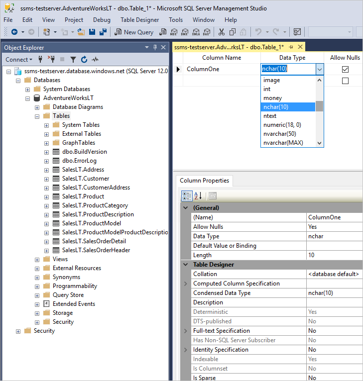
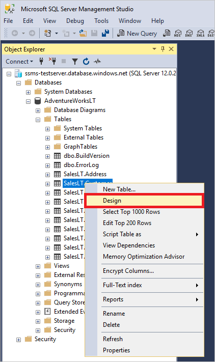
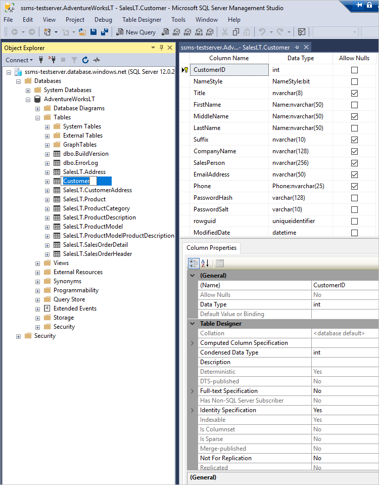

# Create and update database tables

[!INCLUDE[SQL Server](../../includes/applies-to-version/sqlserver.md)]

The Table Designer is a visual tool where you design and visualizes [database tables](../../relational-databases/tables/tables.md). Use the SQL Server Management Studio (SSMS) Table Designer to create, edit, or delete tables, columns, keys, indexes, relationships, and constraints.  

## Create a table

1. Right-click the **Tables** node in your database and select  **New** > **Table**:

    

2. Add [columns](column-properties-visual-database-tools.md) to your table:

    

3. Close the designer and save your changes.

## Update a table

1. Right-click the table under the **Tables** node of your database and select **Design**:

    

2. Update the desired table settings:

    

3. Close the designer and save your changes.

## See Also

- [Tables](../../relational-databases/tables/tables.md)
- [Table Properties &#40;Visual Database Tools&#41;](../../ssms/visual-db-tools/table-properties-visual-database-tools.md)
- [Column Properties](column-properties-visual-database-tools.md)
- [Add Columns to a Table](../../relational-databases/tables/add-columns-to-a-table-database-engine.md)
- [Primary and Foreign Keys](../../relational-databases/tables/primary-and-foreign-key-constraints.md)
- [Indexes](../../relational-databases/indexes/indexes.md)
- [Data types (Transact-SQL)](../../t-sql/data-types/data-types-transact-sql.md)
- [Download SQL Server Management Studio (SSMS)](../download-sql-server-management-studio-ssms.md)
- [Create a database and add tables in Visual Studio](/visualstudio/data-tools/create-a-sql-database-by-using-a-designer)
