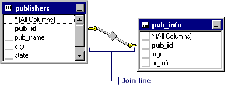
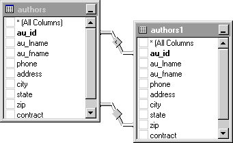
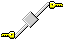
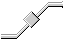

# How the Query and View Designer Represents Joins (Visual Database Tools)
[!INCLUDE[appliesto-ss-asdb-asdw-pdw-md](../../includes/appliesto-ss-asdb-asdw-pdw-md.md)]
If tables are joined, the [Query and View Designer](../../ssms/visual-db-tools/query-and-view-designer-tools-visual-database-tools.md) represents the join graphically in the [Diagram pane](../../ssms/visual-db-tools/diagram-pane-visual-database-tools.md) and by using SQL syntax in the [SQL pane](../../ssms/visual-db-tools/sql-pane-visual-database-tools.md).  
  
## Diagram Pane  
In the Diagram pane the Query and View Designer displays a join line between the data columns involved in the join. The Query and View Designer displays one join line for each join condition. For example, the following illustration shows a join line between two tables that are joined:  
  
  
  
If tables are joined using more than one join condition, the Query and View Designer displays multiple join lines, as in the following example:  
  
  
  
If the joined data columns are not displayed (for example, the rectangle representing the table or table-structured object is minimized or the join involves an expression), the Query and View Designer places the join line at the title bar of the rectangle representing the table or table-structured object.  
  
The shape of the icon in the middle of the join line indicates how the tables or table-structured objects are joined. If the join clause uses an operator other than equal (=), the operator appears in the join line icon. The following table lists the icons that appear in the join line.  
  
|**Join line icon**|**Description**|  
|----------------------|-------------------|  
||Inner join (created using an equal sign).|  
||Inner join based on the "greater than" operator.|  
||Outer join in which all rows from the table represented on the left will be included, even if they do not have matches in the related table.|  
||Outer join in which all rows from the table represented on the right will be included, even if they do not have matches in the related table.|  
||Full outer join in which all rows from both tables will be included, even if they do not have matches in the related table.|  
  
The symbols on the ends of the join line indicate the type of join. The following table lists the types of joins and the icons displayed on the ends of the join line.  
  
|**Icon on ends of join line**|**Type of join**|  
|---------------------------------|--------------------|  
||One-to-one join.|  
||One-to-many join.|  
||Query and View Designer cannot determine the join type. This situation occurs most often when you have created a join manually.|  
  
## SQL Pane  
A join can be expressed in a number of ways in an SQL statement. The exact syntax depends on the database you are using and on how you have defined the join.  
  
Syntax options for joining tables include:  
  
-   **JOIN qualifier for the FROM clause**.   The keywords INNER and OUTER specify the join type. This syntax is standard for ANSI 92 SQL.  
  
    For example, if you join the `publishers` and `pub_info` tables based on the `pub_id` column in each table, the resulting SQL statement might look like this:  
  
    ```  
    SELECT *  
    FROM publishers INNER JOIN pub_info ON  
       publishers.pub_id = pub_info.pub_id  
    ```  
  
    If you create an outer join, the words LEFT OUTER or RIGHT OUTER appear in place of the word INNER.  
  
-   **WHERE clause compares columns in both tables**.   A WHERE clause appears if the database does not support the JOIN syntax (or if you entered it yourself). If the join is created in the WHERE clause, both table names appear in the FROM clause.  
  
    For example, the following statement joins the `publishers` and `pub_info` tables.  
  
    ```  
    SELECT *  
    FROM publishers, pub_info  
    WHERE publishers.pub_id = pub_info.pub_id  
    ```  
  
## See Also  
[Query with Joins &#40;Visual Database Tools&#41;](../../ssms/visual-db-tools/query-with-joins-visual-database-tools.md)  
[Join Dialog Box &#40;Visual Database Tools&#41;](../../ssms/visual-db-tools/join-dialog-box-visual-database-tools.md)  
  
