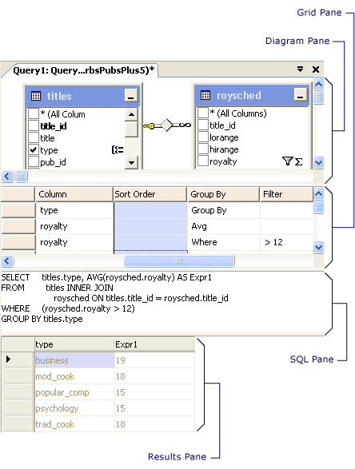

# Query and View Designer Tools (Visual Database Tools)
[!INCLUDE[appliesto-ss-asdb-asdw-pdw-md](../../includes/appliesto-ss-asdb-asdw-pdw-md.md)]
When you design a query, view, in-line function, or single-statement stored procedure, the designer you use consists of four panes: the Diagram pane, the Criteria pane, the SQL pane, and the Results pane.  
  
  
  
-   The Diagram pane displays the tables and other table-valued objects that you are querying. Each rectangle represents a table or table-valued object and shows the available data columns. Joins are indicated by lines between the rectangles. For more information, see [Diagram Pane &#40;Visual Database Tools&#41;](../../ssms/visual-db-tools/diagram-pane-visual-database-tools.md).  
  
-   The Criteria pane contains a spreadsheet-like grid in which you specify options, such as which data columns to display, what rows to select, how to group rows, and so on. For more information, see [Criteria Pane &#40;Visual Database Tools&#41;](../../ssms/visual-db-tools/criteria-pane-visual-database-tools.md).  
  
-   The SQL pane displays the SQL statement for the query or view. You can edit the SQL statement created by the Designer or you can enter your own SQL statement. It is particularly useful for entering SQL statements that cannot be created using the Diagram and Criteria panes, such as union queries. For more information, see [SQL Pane &#40;Visual Database Tools&#41;](../../ssms/visual-db-tools/sql-pane-visual-database-tools.md).  
  
-   The Results pane shows a grid with data retrieved by the query or view. In the Query and View Designer, the pane shows the results of the most recently executed SELECT query. You can modify the database by editing values in the cells of the grid, and you can add or delete rows. For more information, see [Results Pane &#40;Visual Database Tools&#41;](../../ssms/visual-db-tools/results-pane-visual-database-tools.md).  
  
You can create a query or view by working in any of the panes: you can specify a column to display by choosing it in the Diagram pane, entering it into the Criteria pane, or making it part of the SQL statement in the SQL pane.  
  
## Displaying and Hiding Panes  
To hide a pane or display a pane that is not visible, right-click the design surface, point to **Pane**, and then click the name of the pane. If the Query and View Designer is opened in Query Designer mode, the **Results** pane is not available.  
  
## See Also  
[Design Queries and Views How-to Topics &#40;Visual Database Tools&#41;](../../ssms/visual-db-tools/design-queries-and-views-how-to-topics-visual-database-tools.md)  
[Open the Query and View Designer &#40;Visual Database Tools&#41;](../../ssms/visual-db-tools/open-the-query-and-view-designer-visual-database-tools.md)  
[SQL Editor &#40;Visual Database Tools&#41;](../../ssms/visual-db-tools/sql-editor-visual-database-tools.md)  
  
