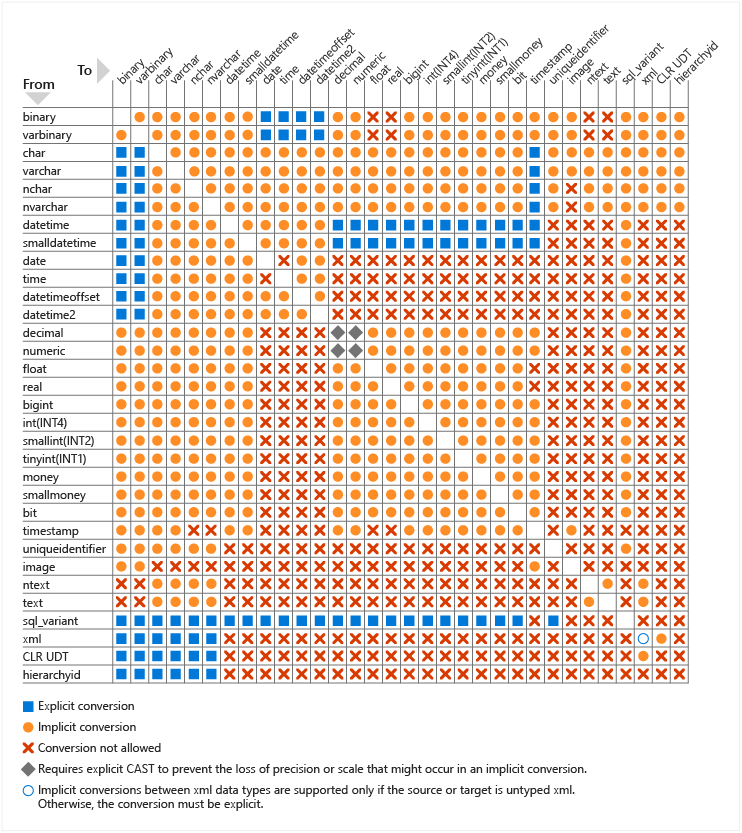

# Data type conversion (Database Engine)
[!INCLUDE [sql-asdb-asdbmi-asa-pdw](../../includes/applies-to-version/sql-asdb-asdbmi-asa-pdw.md)]

Data types can be converted in the following scenarios:
-   When data from one object is moved to, compared with, or combined with data from another object, the data may have to be converted from the data type of one object to the data type of the other.  
-   When data from a [!INCLUDE[tsql](../../includes/tsql-md.md)] result column, return code, or output parameter is moved into a program variable, the data must be converted from the [!INCLUDE[ssNoVersion](../../includes/ssnoversion-md.md)] system data type to the data type of the variable.  
  
When you convert between an application variable and a [!INCLUDE[ssNoVersion](../../includes/ssnoversion-md.md)] result set column, return code, parameter, or parameter marker, the supported data type conversions are defined by the database API.
  
## Implicit and explicit conversion
Data types can be converted either implicitly or explicitly.
  
Implicit conversions are not visible to the user. [!INCLUDE[ssNoVersion](../../includes/ssnoversion-md.md)] automatically converts the data from one data type to another. For example, when a **smallint** is compared to an **int**, the **smallint** is implicitly converted to **int** before the comparison proceeds.
  
**GETDATE()** implicitly converts to date style 0. **SYSDATETIME()** implicitly converts to date style 21.
  
Explicit conversions use the CAST or CONVERT functions.
  
The [CAST and CONVERT](../../t-sql/functions/cast-and-convert-transact-sql.md) functions convert a value (a local variable, a column, or another expression) from one data type to another. For example, the following `CAST` function converts the numeric value of `$157.27` into a character string of `'157.27'`:
  
```sql
CAST ( $157.27 AS VARCHAR(10) )  
```  
  
Use CAST instead of CONVERT if you want [!INCLUDE[tsql](../../includes/tsql-md.md)] program code to comply with ISO. Use CONVERT instead of CAST to take advantage of the style functionality in CONVERT.
  
The following illustration shows all explicit and implicit data type conversions that are allowed for [!INCLUDE[ssNoVersion](../../includes/ssnoversion-md.md)] system-supplied data types. These include **xml**, **bigint**, and **sql_variant**. There is no implicit conversion on assignment from the **sql_variant** data type, but there is implicit conversion to **sql_variant**.
  


While the above chart illustrates all the explicit and implicit conversions that are allowed in SQL Server, it does not indicate the resulting data type of the conversion. When SQL Server performs an explicit conversion, the statement itself determines the resulting data type. For implicit conversions, assignment statements such as setting the value of a variable or inserting a value into a column result in the data type that was defined by the variable declaration or column definition. For comparison operators or other expressions, the resulting data type depends on the rules of data type precedence.

As an example, the following script defines a variable of type `varchar`, assigns an `int` type value to the variable, then selects a concatenation of the variable with a string.

```sql
DECLARE @string VARCHAR(10);
SET @string = 1;
SELECT @string + ' is a string.'
```

The `int` value of `1` is converted to a `varchar`, so the `SELECT` statement returns the value `1 is a string.`.

The following example, shows a similar script with an `int` variable instead:

```sql
DECLARE @notastring INT;
SET @notastring = '1';
SELECT @notastring + ' is not a string.'
```

In this case, the `SELECT` statement throws the following error:

`Msg 245, Level 16, State 1, Line 3`
`Conversion failed when converting the varchar value ' is not a string.' to data type int.`

In order to evaluate the expression `@notastring + ' is not a string.'`, SQL Server follows the rules of data type precedence to complete the implicit conversion before the result of the expression can be calculated. Because `int` has a higher precedence than `varchar`, SQL Server attempts to convert the string to an integer and fails because this string cannot be converted to an integer. If the expression provides a string that can be converted, the statement succeeds, as in the following example:

```sql
DECLARE @notastring INT;
SET @notastring = '1';
SELECT @notastring + '1'
```

In this case, the string `1` can be converted to the integer value `1`, so this `SELECT` statement returns the value `2`. Note that the `+` operator becomes addition rather than concatenation when the data types provided are integers.

## Data type conversion behaviors

Some implicit and explicit data type conversions are not supported when you are converting the data type of one [!INCLUDE[ssNoVersion](../../includes/ssnoversion-md.md)] object to another. For example, an **nchar** value cannot be converted to an **image** value. An **nchar** can only be converted to **binary** by using explicit conversion, an implicit conversion to **binary** is not supported. However, an **nchar** can be explicitly or implicitly converted to **nvarchar**.
  
The following topics describe the conversion behaviors exhibited by their corresponding  data types:
  
 - [binary and varbinary &#40;Transact-SQL&#41;](../../t-sql/data-types/binary-and-varbinary-transact-sql.md)  
 - [datetime2 &#40;Transact-SQL&#41;](../../t-sql/data-types/datetime2-transact-sql.md)  
 - [money and smallmoney &#40;Transact-SQL&#41;](../../t-sql/data-types/money-and-smallmoney-transact-sql.md)  
 - [bit &#40;Transact-SQL&#41;](../../t-sql/data-types/bit-transact-sql.md)  
 - [datetimeoffset &#40;Transact-SQL&#41;](../../t-sql/data-types/datetimeoffset-transact-sql.md)  
 - [smalldatetime &#40;Transact-SQL&#41;](../../t-sql/data-types/smalldatetime-transact-sql.md)  
 - [char and varchar &#40;Transact-SQL&#41;](../../t-sql/data-types/char-and-varchar-transact-sql.md)  
 - [decimal and numeric &#40;Transact-SQL&#41;](../../t-sql/data-types/decimal-and-numeric-transact-sql.md)  
 - [sql_variant &#40;Transact-SQL&#41;](../../t-sql/data-types/sql-variant-transact-sql.md)  
 - [date &#40;Transact-SQL&#41;](../../t-sql/data-types/date-transact-sql.md)  
 - [float and real &#40;Transact-SQL&#41;](../../t-sql/data-types/float-and-real-transact-sql.md)  
 - [time &#40;Transact-SQL&#41;](../../t-sql/data-types/time-transact-sql.md)  
 - [datetime &#40;Transact-SQL&#41;](../../t-sql/data-types/datetime-transact-sql.md)  
 - [int, bigint, smallint, and tinyint &#40;Transact-SQL&#41;](../../t-sql/data-types/int-bigint-smallint-and-tinyint-transact-sql.md)  
 - [uniqueidentifier &#40;Transact-SQL&#41;](../../t-sql/data-types/uniqueidentifier-transact-sql.md)  
  
###  Converting Data Types by Using OLE Automation Stored Procedures  
Because [!INCLUDE[ssNoVersion](../../includes/ssnoversion-md.md)] uses [!INCLUDE[tsql](../../includes/tsql-md.md)] data types and OLE Automation uses [!INCLUDE[vbprvb](../../includes/vbprvb-md.md)] data types, the OLE Automation stored procedures must convert the data that passes between them.
  
The following table describes [!INCLUDE[ssNoVersion](../../includes/ssnoversion-md.md)] to [!INCLUDE[vbprvb](../../includes/vbprvb-md.md)] data type conversions.
  
|SQL Server data type|Visual Basic data type|  
|--------------------------|----------------------------|  
|**char**, **varchar**, **text**, **nvarchar**, **ntext**|**String**|  
|**decimal**, **numeric**|**String**|  
|**bit**|**Boolean**|  
|**binary**, **varbinary**, **image**|One-dimensional **Byte()** array|  
|**int**|**Long**|  
|**smallint**|**Integer**|  
|**tinyint**|**Byte**|  
|**float**|**Double**|  
|**real**|**Single**|  
|**money**, **smallmoney**|**Currency**|  
|**datetime**, **smalldatetime**|**Date**|  
|Anything set to NULL|**Variant** set to Null|  
  
All single [!INCLUDE[ssNoVersion](../../includes/ssnoversion-md.md)] values are converted to a single [!INCLUDE[vbprvb](../../includes/vbprvb-md.md)] value with the exception of **binary**, **varbinary**, and **image** values. These values are converted to a one-dimensional **Byte()** array in [!INCLUDE[vbprvb](../../includes/vbprvb-md.md)]. This array has a range of **Byte(** 0 to _length_ 1**)** where *length* is the number of bytes in the [!INCLUDE[ssNoVersion](../../includes/ssnoversion-md.md)] **binary**, **varbinary**, or **image** values.
  
These are the conversions from [!INCLUDE[vbprvb](../../includes/vbprvb-md.md)] data types to [!INCLUDE[ssNoVersion](../../includes/ssnoversion-md.md)] data types.
  
|Visual Basic data type|SQL Server data type|  
|----------------------------|--------------------------|  
|**Long**, **Integer**, **Byte**, **Boolean**, **Object**|**int**|  
|**Double**, **Single**|**float**|  
|**Currency**|**money**|  
|**Date**|**datetime**|  
|**String** with 4000 characters or less|**varchar**/**nvarchar**|  
|**String** with more than 4000 characters|**text**/**ntext**|  
|One-dimensional **Byte()** array with 8000 bytes or less|**varbinary**|  
|One-dimensional **Byte()** array with more than 8000 bytes|**image**|  
  
## See also
[OLE Automation Stored Procedures &#40;Transact-SQL&#41;](../../relational-databases/system-stored-procedures/ole-automation-stored-procedures-transact-sql.md)  
[CAST and CONVERT &#40;Transact-SQL&#41;](../../t-sql/functions/cast-and-convert-transact-sql.md)  
[Data Types &#40;Transact-SQL&#41;](../../t-sql/data-types/data-types-transact-sql.md)  
[COLLATE &#40;Transact-SQL&#41;](../statements/collations.md)
  
