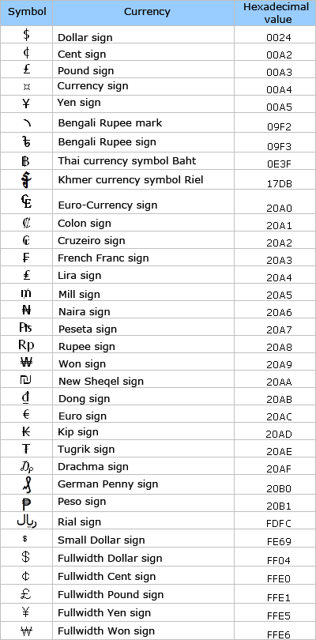

# money and smallmoney (Transact-SQL)
[!INCLUDE[tsql-appliesto-ss2008-all-md](../../includes/tsql-appliesto-ss2008-all-md.md)]

Data types that represent monetary or currency values.
  
## Remarks  
  
|Data type|Range|Storage|  
|---|---|---|
|**money**|-922,337,203,685,477.5808 to 922,337,203,685,477.5807 (-922,337,203,685,477.58<br />to 922,337,203,685,477.58 for Informatica.  Informatica only supports two decimals, not four.)|8 bytes|  
|**smallmoney**|- 214,748.3648 to 214,748.3647|4 bytes|  
  
The **money** and **smallmoney** data types are accurate to a ten-thousandth of the monetary units that they represent. For Informatica, the **money** and **smallmoney** data types are accurate to a one-hundredth of the monetary units that they represent.
  
Use a period to separate partial monetary units, like cents, from whole monetary units. For example, 2.15 specifies 2 dollars and 15 cents.
  
These data types can use any one of the following currency symbols.
  

  
Currency or monetary data does not need to be enclosed in single quotation marks ( ' ). It is important to remember that while you can specify monetary values preceded by a currency symbol, [!INCLUDE[ssNoVersion](../../includes/ssnoversion-md.md)] does not store any currency information associated with the symbol, it only stores the numeric value.
  
## Converting money data
When you convert to **money** from integer data types, units are assumed to be in monetary units. For example, the integer value of 4 is converted to the **money** equivalent of 4 monetary units.
  
The following example converts **smallmoney** and **money** values to **varchar** and **decimal** data types, respectively.
  
```sql
DECLARE @mymoney_sm smallmoney = 3148.29,  
        @mymoney    money = 3148.29;  
SELECT  CAST(@mymoney_sm AS varchar) AS 'SM_MONEY varchar',  
        CAST(@mymoney AS decimal)    AS 'MONEY DECIMAL';  
```  
  
[!INCLUDE[ssResult](../../includes/ssresult-md.md)]
  
```sql
SM_MONEY VARCHAR               MONEY DECIMAL  
------------------------------ ----------------------  
3148.29                        3148    
(1 row(s) affected)  
```  
  
## See also
[ALTER TABLE &#40;Transact-SQL&#41;](../../t-sql/statements/alter-table-transact-sql.md)
[CAST and CONVERT &#40;Transact-SQL&#41;](../../t-sql/functions/cast-and-convert-transact-sql.md)
[CREATE TABLE &#40;Transact-SQL&#41;](../../t-sql/statements/create-table-transact-sql.md)
[Data Types &#40;Transact-SQL&#41;](../../t-sql/data-types/data-types-transact-sql.md)
[DECLARE @local_variable &#40;Transact-SQL&#41;](../../t-sql/language-elements/declare-local-variable-transact-sql.md)
[SET @local_variable &#40;Transact-SQL&#41;](../../t-sql/language-elements/set-local-variable-transact-sql.md)
[sys.types &#40;Transact-SQL&#41;](../../relational-databases/system-catalog-views/sys-types-transact-sql.md)
  
  
