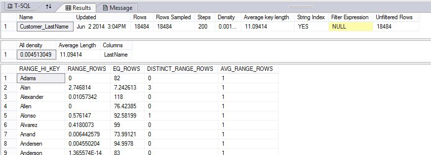

# DBCC SHOW_STATISTICS (Transact-SQL)
[!INCLUDE[tsql-appliesto-ss2008-all-md](../../includes/tsql-appliesto-ss2008-all-md.md)]

DBCC SHOW_STATISTICS displays current query optimization statistics for a table or indexed view. The query optimizer uses statistics to estimate the cardinality or number of rows in the query result, which enables the query optimizer to create a high quality query plan. For example, the query optimizer could use cardinality estimates to choose the index seek operator instead of the index scan operator in the query plan, improving query performance by avoiding a resource-intensive index scan.
  
The query optimizer stores statistics for a table or indexed view in a statistics object. For a table, the statistics object is created on either an index or a list of table columns. The statistics object includes a header with metadata about the statistics, a histogram with the distribution of values in the first key column of the statistics object, and a density vector to measure cross-column correlation. The [!INCLUDE[ssDE](../../includes/ssde-md.md)] can compute cardinality estimates with any of the data in the statistics object.
  
DBCC SHOW_STATISTICS displays the header, histogram, and density vector based on data stored in the statistics object. The syntax lets you specify a table or indexed view along with a target index name, statistics name, or column name. This topic describes how to display the statistics and how to understand the displayed results.
  
For more information, see [Statistics](../../relational-databases/statistics/statistics.md).
  
 [Transact-SQL Syntax Conventions](../../t-sql/language-elements/transact-sql-syntax-conventions-transact-sql.md)
  
## Syntax  
  
```
-- Syntax for SQL Server and Azure SQL Database  
  
DBCC SHOW_STATISTICS ( table_or_indexed_view_name , target )   
[ WITH [ NO_INFOMSGS ] < option > [ , n ] ]  
< option > :: =  
    STAT_HEADER | DENSITY_VECTOR | HISTOGRAM | STATS_STREAM  
```  
  
```
-- Syntax for Azure SQL Data Warehouse and Parallel Data Warehouse  

DBCC SHOW_STATISTICS ( table_name , target )   
    [ WITH {STAT_HEADER | DENSITY_VECTOR | HISTOGRAM } [ ,...n ] ]  
[;]  
```  
  
## Arguments  
 *table_or_indexed_view_name*  
 Name of the table or indexed view for which to display statistics information.  
  
 *table_name*  
 Name of the table that contains the statistics to display. The table cannot be an external table.  
  
 *target*  
 Name of the index, statistics, or column for which to display statistics information. *target* is enclosed in brackets, single quotes, double quotes, or no quotes. If *target* is a name of an existing index or statistics on a table or indexed view, the statistics information about this target is returned. If *target* is the name of an existing column, and an automatically created statistics on this column exists, information about that auto-created statistic is returned. If an automatically created statistic does not exist for a column target, error message 2767 is returned.  
 In [!INCLUDE[ssSDW](../../includes/sssdw-md.md)] and [!INCLUDE[ssPDW](../../includes/sspdw-md.md)], *target* cannot be a column name.  
  
 NO_INFOMSGS  
 Suppresses all informational messages that have severity levels from 0 through 10.  
  
 STAT_HEADER | DENSITY_VECTOR | HISTOGRAM | STATS_STREAM [ **,**_n_ ]  
 Specifying one or more of these options limits the result sets returned by the statement to the specified option or options. If no options are specified, all statistics information is returned.  
  
 STATS_STREAM is [!INCLUDE[ssInternalOnly](../../includes/ssinternalonly-md.md)]  
  
## Result Sets  
The following table describes the columns returned in the result set when STAT_HEADER is specified.
  
|Column name|Description|  
|-----------------|-----------------|  
|Name|Name of the statistics object.|  
|Updated|Date and time the statistics were last updated. The [STATS_DATE](../../t-sql/functions/stats-date-transact-sql.md) function is an alternate way to retrieve this information. For more information, see the [Remarks](#Remarks) section in this page.|  
|Rows|Total number of rows in the table or indexed view when the statistics were last updated. If the statistics are filtered or correspond to a filtered index, the number of rows might be less than the number of rows in the table. For more information, see[Statistics](../../relational-databases/statistics/statistics.md).|  
|Rows Sampled|Total number of rows sampled for statistics calculations. If Rows Sampled < Rows, the displayed histogram and density results are estimates based on the sampled rows.|  
|Steps|Number of steps in the histogram. Each step spans a range of column values followed by an upper bound column value. The histogram steps are defined on the first key column in the statistics. The maximum number of steps is 200.|  
|Density|Calculated as 1 / *distinct values* for all values in the first key column of the statistics object, excluding the histogram boundary values. This Density value is not used by the query optimizer and is displayed for backward compatibility with versions before [!INCLUDE[ssKatmai](../../includes/sskatmai-md.md)].|  
|Average Key Length|Average number of bytes per value for all of the key columns in the statistics object.|  
|String Index|Yes indicates the statistics object contains string summary statistics to improve the cardinality estimates for query predicates that use the LIKE operator; for example, `WHERE ProductName LIKE '%Bike'`. String summary statistics are stored separately from the histogram and are created on the first key column of the statistics object when it is of type **char**, **varchar**, **nchar**, **nvarchar**, **varchar(max)**, **nvarchar(max)**, **text**, or **ntext.**.|  
|Filter Expression|Predicate for the subset of table rows included in the statistics object. NULL = non-filtered statistics. For more information about filtered predicates, see [Create Filtered Indexes](../../relational-databases/indexes/create-filtered-indexes.md). For more information about filtered statistics, see [Statistics](../../relational-databases/statistics/statistics.md).|  
|Unfiltered Rows|Total number of rows in the table before applying the filter expression. If Filter Expression is NULL, Unfiltered Rows is equal to Rows.|  
|Persisted Sample Percent|Persisted sample percentage used for statistic updates that do not explicitly specify a sampling percentage. If value is zero, then no persisted sample percentage is set for this statistic.<br /><br /> **Applies to:** [!INCLUDE[ssSQL15](../../includes/sssql15-md.md)] SP1 CU4| 
  
The following table describes the columns returned in the result set when DENSITY_VECTOR is specified.
  
|Column name|Description|  
|-----------------|-----------------|  
|All Density|Density is 1 / *distinct values*. Results display density for each prefix of columns in the statistics object, one row per density. A distinct value is a distinct list of the column values per row and per columns prefix. For example, if the statistics object contains key columns (A, B, C), the results report the density of the distinct lists of values in each of these column prefixes: (A), (A,B), and (A, B, C). Using the prefix (A, B, C), each of these lists is a distinct value list: (3, 5, 6), (4, 4, 6), (4, 5, 6), (4, 5, 7). Using the prefix (A, B) the same column values have these distinct value lists: (3, 5), (4, 4), and (4, 5)|  
|Average Length|Average length, in bytes, to store a list of the column values for the column prefix. For example, if the values in the list (3, 5, 6) each require 4 bytes the length is 12 bytes.|  
|Columns|Names of columns in the prefix for which All density and Average length are displayed.|  
  
The following table describes the columns returned in the result set when the HISTOGRAM option is specified.
  
|Column name|Description|  
|---|---|
|RANGE_HI_KEY|Upper bound column value for a histogram step. The column value is also called a key value.|  
|RANGE_ROWS|Estimated number of rows whose column value falls within a histogram step, excluding the upper bound.|  
|EQ_ROWS|Estimated number of rows whose column value equals the upper bound of the histogram step.|  
|DISTINCT_RANGE_ROWS|Estimated number of rows with a distinct column value within a histogram step, excluding the upper bound.|  
|AVG_RANGE_ROWS|Average number of rows with duplicate column values within a histogram step, excluding the upper bound. When DISTINCT_RANGE_ROWS is greater than 0, AVG_RANGE_ROWS is calculated by dividing RANGE_ROWS by DISTINCT_RANGE_ROWS. When DISTINCT_RANGE_ROWS is 0, AVG_RANGE_ROWS returns 1 for the histogram step.| 
  
## <a name="Remarks"></a> Remarks 

Statistics update date is stored in the [statistics blob object](../../relational-databases/statistics/statistics.md#DefinitionQOStatistics) together with the [histogram](#histogram) and [density vector](#density), not in the metadata. When no data is read to generate statistics data, the statistics blob is not created, the date is not available, and the *updated* column is NULL. This is the case for filtered statistics for which the predicate does not return any rows, or for new empty tables.
  
## <a name="histogram"></a> Histogram  
A histogram measures the frequency of occurrence for each distinct value in a data set. The query optimizer computes a histogram on the column values in the first key column of the statistics object, selecting the column values by statistically sampling the rows or by performing a full scan of all rows in the table or view. If the histogram is created from a sampled set of rows, the stored totals for number of rows and number of distinct values are estimates and do not need to be whole integers.
  
To create the histogram, the query optimizer sorts the column values, computes the number of values that match each distinct column value and then aggregates the column values into a maximum of 200 contiguous histogram steps. Each step includes a range of column values followed by an upper bound column value. The range includes all possible column values between boundary values, excluding the boundary values themselves. The lowest of the sorted column values is the upper boundary value for the first histogram step.
  
The following diagram shows a histogram with six steps. The area to the left of the first upper boundary value is the first step.
  

  
For each histogram step:
-   Bold line represents the upper boundary value (RANGE_HI_KEY) and the number of times it occurs (EQ_ROWS)  
-   Solid area left of RANGE_HI_KEY represents the range of column values and the average number of times each column value occurs (AVG_RANGE_ROWS). The AVG_RANGE_ROWS for the first histogram step is always 0.  
-   Dotted lines represent the sampled values used to estimate total number of distinct values in the range (DISTINCT_RANGE_ROWS) and total number of values in the range (RANGE_ROWS). The query optimizer uses RANGE_ROWS and DISTINCT_RANGE_ROWS to compute AVG_RANGE_ROWS and does not store the sampled values.  
  
The query optimizer defines the histogram steps according to their statistical significance. It uses a maximum difference algorithm to minimize the number of steps in the histogram while maximizing the difference between the boundary values. The maximum number of steps is 200. The number of histogram steps can be fewer than the number of distinct values, even for columns with fewer than 200 boundary points. For example, a column with 100 distinct values can have a histogram with fewer than 100 boundary points.
  
## <a name="density"></a> Density Vector  
The query optimizer uses densities to enhance cardinality estimates for queries that return multiple columns from the same table or indexed view. The density vector contains one density for each prefix of columns in the statistics object. For example, if a statistics object has the key columns `CustomerId`, `ItemId` and `Price`, density is calculated on each of the following column prefixes.
  
|Column prefix|Density calculated on|  
|---|---|
|(CustomerId)|Rows with matching values for CustomerId|  
|(CustomerId, ItemId)|Rows with matching values for CustomerId and ItemId|  
|(CustomerId, ItemId, Price)|Rows with matching values for CustomerId, ItemId, and Price|  
  
## Restrictions  
 DBCC SHOW_STATISTICS does not provide statistics for spatial or xVelocity memory optimized columnstore indexes.  
  
## Permissions for [!INCLUDE[ssNoVersion](../../includes/ssnoversion-md.md)] and [!INCLUDE[ssSDS](../../includes/sssds-md.md)]  
In order to view the statistics object, the user must own the table or the user must be a member of the `sysadmin` fixed server role, the `db_owner` fixed database role, or the `db_ddladmin` fixed database role.
  
[!INCLUDE[ssSQL11](../../includes/sssql11-md.md)] SP1 modifies the permission restrictions and allows users with SELECT permission to use this command. Note that the following requirements exist for SELECT permissions to be sufficient to run the command:
-   Users must have permissions on all columns in the statistics object  
-   Users must have permission on all columns in a filter condition (if one exists)  
-   The table cannot have a row-level security policy.  
  
To disable this behavior, use traceflag 9485.
  
## Permissions for [!INCLUDE[ssSDW](../../includes/sssdw-md.md)] and [!INCLUDE[ssPDW](../../includes/sspdw-md.md)]  
DBCC SHOW_STATISTICS requires SELECT permission on the table or membership in one of the following:
-   sysadmin fixed server role  
-   db_owner fixed database role  
-   db_ddladmin fixed database role  
  
## Limitations and Restrictions for [!INCLUDE[ssSDW](../../includes/sssdw-md.md)] and [!INCLUDE[ssPDW](../../includes/sspdw-md.md)]  
DBCC SHOW_STATISTICS shows statistics stored in the Shell database at the Control node level. It does not show statistics that are auto-created by [!INCLUDE[ssNoVersion](../../includes/ssnoversion-md.md)] on the Compute nodes.
  
DBCC SHOW_STATISTICS is not supported on external tables.
  
## Examples: [!INCLUDE[ssNoVersion](../../includes/ssnoversion-md.md)] and [!INCLUDE[ssSDS](../../includes/sssds-md.md)]  
### A. Returning all statistics information  
The following example displays all statistics information for the `AK_Address_rowguid` index of the `Person.Address` table in the [!INCLUDE[ssSampleDBnormal](../../includes/sssampledbnormal-md.md)] database.
  
```sql
DBCC SHOW_STATISTICS ("Person.Address", AK_Address_rowguid);  
GO  
```  
  
### B. Specifying the HISTOGRAM option  
This limits the statistics information displayed for Customer_LastName to the HISTOGRAM data.
  
```sql
DBCC SHOW_STATISTICS ("dbo.DimCustomer",Customer_LastName) WITH HISTOGRAM;  
GO  
```  
  
## Examples: [!INCLUDE[ssSDW](../../includes/sssdw-md.md)] and [!INCLUDE[ssPDW](../../includes/sspdw-md.md)]  
### C. Display the contents of one statistics object  
 The following example displays the contents of the Customer_LastName statistics on the DimCustomer table.  
  
```sql
-- Uses AdventureWorks  
--First, create a statistics object  
CREATE STATISTICS Customer_LastName   
ON AdventureWorksPDW2012.dbo.DimCustomer (LastName);  
GO  
DBCC SHOW_STATISTICS ("dbo.DimCustomer",Customer_LastName);  
GO  
```  
  
The results show the header, the density vector, and part of the histogram.
  

  
## See Also  
[Statistics](../../relational-databases/statistics/statistics.md)  
[CREATE INDEX &#40;Transact-SQL&#41;](../../t-sql/statements/create-index-transact-sql.md)  
[CREATE STATISTICS &#40;Transact-SQL&#41;](../../t-sql/statements/create-statistics-transact-sql.md)  
[DROP STATISTICS &#40;Transact-SQL&#41;](../../t-sql/statements/drop-statistics-transact-sql.md)  
[sp_autostats &#40;Transact-SQL&#41;](../../relational-databases/system-stored-procedures/sp-autostats-transact-sql.md)  
[sp_createstats &#40;Transact-SQL&#41;](../../relational-databases/system-stored-procedures/sp-createstats-transact-sql.md)  
[STATS_DATE &#40;Transact-SQL&#41;](../../t-sql/functions/stats-date-transact-sql.md)  
[UPDATE STATISTICS &#40;Transact-SQL&#41;](../../t-sql/statements/update-statistics-transact-sql.md)  
[sys.dm_db_stats_properties (Transact-SQL)](../../relational-databases/system-dynamic-management-views/sys-dm-db-stats-properties-transact-sql.md)  
[sys.dm_db_stats_histogram (Transact-SQL)](../../relational-databases/system-dynamic-management-views/sys-dm-db-stats-histogram-transact-sql.md)   
