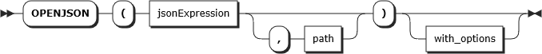
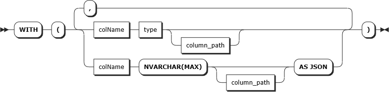

# OPENJSON (Transact-SQL)

[!INCLUDE [sqlserver2016-asdb-asdbmi-asa](../../includes/applies-to-version/sqlserver2016-asdb-asdbmi-asa.md)]

**OPENJSON** is a table-valued function that parses JSON text and returns objects and properties from the JSON input as rows and columns. In other words, **OPENJSON** provides a rowset view over a JSON document. You can explicitly specify the columns in the rowset and the JSON property paths used to populate the columns. Since **OPENJSON** returns a set of rows, you can use **OPENJSON** in the `FROM` clause of a [!INCLUDE[tsql](../../includes/tsql-md.md)] statement just as you can use any other table, view, or table-valued function.  
  
Use **OPENJSON** to import JSON data into [!INCLUDE[ssNoVersion](../../includes/ssnoversion-md.md)], or to convert JSON data to relational format for an app or service that can't consume JSON directly.  
  
> [!NOTE]  
>  The **OPENJSON** function is available only under compatibility level 130 or higher. If your database compatibility level is lower than 130, SQL Server can't find and run the **OPENJSON** function. Other JSON functions are available at all compatibility levels.
> 
> You can check compatibility level in the `sys.databases` view or in database properties. You can change the compatibility level of a database with the following command:  
> 
> `ALTER DATABASE DatabaseName SET COMPATIBILITY_LEVEL = 130`
  
 [Transact-SQL Syntax Conventions](../../t-sql/language-elements/transact-sql-syntax-conventions-transact-sql.md)  
  
## Syntax  
  
```syntaxsql
OPENJSON( jsonExpression [ , path ] )  [ <with_clause> ]

<with_clause> ::= WITH ( { colName type [ column_path ] [ AS JSON ] } [ ,...n ] )
```  

The **OPENJSON** table-valued function parses the *jsonExpression* provided as the first argument and returns one or more rows containing data from the JSON objects in the expression. *jsonExpression* can contain nested sub-objects. If you want to parse a sub-object from within *jsonExpression*, you can specify a **path** parameter for the JSON sub-object.

### openjson

  

By default, the **OPENJSON** table-valued function returns three columns, which contain the key name, the value, and the type of each {key:value} pair found in *jsonExpression*. As an alternative, you can explicitly specify the schema of the result set that **OPENJSON** returns by providing *with_clause*.
  
### with_clause
  


*with_clause* contains a list of columns with their types for **OPENJSON** to return. By default, **OPENJSON** matches keys in *jsonExpression* with the column names in *with_clause* (in this case, matches keys implies that it is case sensitive). If a column name does not match a key name, you can provide an optional *column_path*, which is a [JSON Path Expression](../../relational-databases/json/json-path-expressions-sql-server.md) that references a key within the *jsonExpression*. 

## Arguments

### *jsonExpression*

Is a Unicode character expression containing JSON text.  
  
OPENJSON iterates over the elements of the array or the properties of the object in the JSON expression and returns one row for each element or property. The following example returns each property of the object provided as *jsonExpression*:  

```sql
DECLARE @json NVARCHAR(2048) = N'{
   "String_value": "John",
   "DoublePrecisionFloatingPoint_value": 45,
   "DoublePrecisionFloatingPoint_value": 2.3456,
   "BooleanTrue_value": true,
   "BooleanFalse_value": false,
   "Null_value": null,
   "Array_value": ["a","r","r","a","y"],
   "Object_value": {"obj":"ect"}
}';

SELECT * FROM OpenJson(@json);
```

**Results:**

| key                                | value                 | type |
| :--                                | :----                 | :--- |
| String_value                       | John                  | 1 |
| DoublePrecisionFloatingPoint_value | 45                    | 2 |
| DoublePrecisionFloatingPoint_value | 2.3456                | 2 |
| BooleanTrue_value                  | true                  | 3 |
| BooleanFalse_value                 | false                 | 3 |
| Null_value                         | NULL                  | 0 |
| Array_value                        | ["a","r","r","a","y"] | 4 |
| Object_value                       | {"obj":"ect"}         | 5 |

- The DoublePrecisionFloatingPoint_value conforms to IEEE-754.

### *path*

Is an optional JSON path expression that references an object or an array within *jsonExpression*. **OPENJSON** seeks into the JSON text at the specified position and parses only the referenced fragment. For more info, see [JSON Path Expressions &#40;SQL Server&#41;](../../relational-databases/json/json-path-expressions-sql-server.md).

In [!INCLUDE [sssql17-md](../../includes/sssql17-md.md)] and in [!INCLUDE[ssSDSfull_md](../../includes/sssdsfull-md.md)], you can provide a variable as the value of *path*.
  
The following example returns a nested object by specifying the *path*:  

```sql  
DECLARE @json NVARCHAR(4000) = N'{  
      "path": {  
            "to":{  
                 "sub-object":["en-GB", "en-UK","de-AT","es-AR","sr-Cyrl"]  
                 }  
              }  
 }';

SELECT [key], value
FROM OPENJSON(@json,'$.path.to."sub-object"')
```  
  
 **Results**  
  
|Key|Value|  
|---------|-----------|  
|0|en-GB|  
|1|en-UK|  
|2|de-AT|  
|3|es-AR|  
|4|sr-Cyrl|  

When **OPENJSON** parses a JSON array, the function returns the indexes of the elements in the JSON text as keys.

The comparison used to match path steps with the properties of the JSON expression is case-sensitive and collation-unaware (that is, a BIN2 comparison). 

#### Array element identity

the `OPENROWSET` function in the serverless SQL pool in Azure Synapse Analytics can automatically  generate the identity of each row that is returned as a result. The identity column is specified using the expression `$.sql:identity()` in the JSON path after the column definition. The column with this value in the JSON path expression will generate a unique 0-based number for each element in the JSON array that the function parses. The identity value represents the position/index of the array element.

```sql
DECLARE @array VARCHAR(MAX);
SET @array = '[{"month":"Jan", "temp":10},{"month":"Feb", "temp":12},{"month":"Mar", "temp":15},
               {"month":"Apr", "temp":17},{"month":"May", "temp":23},{"month":"Jun", "temp":27}
              ]';

SELECT * FROM OPENJSON(@array)
        WITH (  month VARCHAR(3),
                temp int,
                month_id tinyint '$.sql:identity()') as months
```

**Results**

| month	| temp	| month_id |
| --- | --- | --- |
| Jan	| 10	| 0 |
| Feb	| 12	| 1 |
| Mar	| 15	| 2 |
| Apr	| 17	| 3 |
| May	| 23	| 4 |
| Jun	| 27	| 5 |

The identity is available only in the serverless SQL pool in Synapse Analytics.

### *with_clause*

Explicitly defines the output schema for the **OPENJSON** function to return. The optional *with_clause* can contain the following elements:

*colName*
Is the name for the output column.  
  
By default, **OPENJSON** uses the name of the column to match a property in the JSON text. For example, if you specify the column *name* in the schema, OPENJSON tries to populate this column with the property "name" in the JSON text. You can override this default mapping by using the  *column_path* argument.  
  
*type*  
Is the data type for the output column.  

> [!NOTE]
> If you also use the **AS JSON** option, the column *type* must be `NVARCHAR(MAX)`.
  
*column_path*  
Is the JSON path that specifies the property to return in the specified column. For more info, see the description of the *path* parameter previously in this topic.  
  
Use *column_path* to override default mapping rules when the name of an output column doesn't match the name of the property.  
  
The comparison used to match path steps with the properties of the JSON expression is case-sensitive and collation-unaware (that is, a  BIN2 comparison).  
  
For more info about paths, see [JSON Path Expressions &#40;SQL Server&#41;](../../relational-databases/json/json-path-expressions-sql-server.md).  
  
*AS JSON*  
Use the **AS JSON** option in a column definition to specify that the referenced property contains an inner JSON object or array. If you specify the **AS JSON** option, the type of the column must be NVARCHAR(MAX).

- If you don't specify **AS JSON** for a column, the function returns a scalar value (for example, int, string, true, false) from the specified JSON property on the specified path. If the path represents an object or an array, and the property can't be found at the specified path, the function returns null in lax mode or returns an error in strict mode. This behavior is similar to the behavior of the **JSON_VALUE** function.  
  
- If you specify **AS JSON** for a column, the function returns a JSON fragment from the specified JSON property on the specified path. If the path represents a scalar value, and the property can't be found at the specified path, the function returns null in lax mode or returns an error in strict mode. This behavior is similar to the behavior of the **JSON_QUERY** function.  
  
> [!NOTE]  
> If you want to return a nested JSON fragment from a JSON property, you have to provide the **AS JSON** flag. Without this option, if the property can't be found, OPENJSON returns a NULL value instead of the referenced JSON object or array, or it returns a run-time error in strict mode.  
  
For example, the following query returns and formats the elements of an array:  
  
```sql  
DECLARE @json NVARCHAR(MAX) = N'[  
  {  
    "Order": {  
      "Number":"SO43659",  
      "Date":"2011-05-31T00:00:00"  
    },  
    "AccountNumber":"AW29825",  
    "Item": {  
      "Price":2024.9940,  
      "Quantity":1  
    }  
  },  
  {  
    "Order": {  
      "Number":"SO43661",  
      "Date":"2011-06-01T00:00:00"  
    },  
    "AccountNumber":"AW73565",  
    "Item": {  
      "Price":2024.9940,  
      "Quantity":3  
    }  
  }
]'  
   
SELECT *
FROM OPENJSON ( @json )  
WITH (   
              Number   VARCHAR(200)   '$.Order.Number',  
              Date     DATETIME       '$.Order.Date',  
              Customer VARCHAR(200)   '$.AccountNumber',  
              Quantity INT            '$.Item.Quantity',  
              [Order]  NVARCHAR(MAX)  AS JSON  
 )
```  
  
**Results**
  
|Number|Date|Customer|Quantity|Order|  
|------------|----------|--------------|--------------|-----------|  
|SO43659|2011-05-31T00:00:00|AW29825|1|{"Number":"SO43659","Date":"2011-05-31T00:00:00"}|  
|SO43661|2011-06-01T00:00:00|AW73565|3|{"Number":"SO43661","Date":"2011-06-01T00:00:00"}|  
  
## Return value
The columns that the OPENJSON function returns depend on the WITH option.  
  
1. When you call OPENJSON with the default schema - that is, when you don't specify an explicit schema in the WITH clause - the function returns a table with the following columns:  
    1.  **Key**. An nvarchar(4000) value that contains the name of the specified property or the index of the element in the specified array. The key column has a BIN2 collation.  
    2.  **Value**. An nvarchar(max) value that contains the value of the property. The value column inherits its collation from *jsonExpression*.
    3.  **Type**. An int value that contains the type of the value. The **Type** column is returned only when you use OPENJSON with the default schema. The type column has one of the following values:  
  
        |Value of the Type column|JSON data type|  
        |------------------------------|--------------------|  
        |0|null|  
        |1|string|  
        |2|number|  
        |3|true/false|  
        |4|array|  
        |5|object|  
  
     Only first-level properties are returned. The statement fails if the JSON text is not properly formatted.  

2. When you call OPENJSON and you specify an explicit schema in the WITH clause, the function returns a table with the schema that you defined in the WITH clause.

> [!NOTE]  
> The **Key**, **Value**, and **Type** columns are returned only when you use OPENJSON with the default schema and are not available with an explicit schema.

## Remarks  

*json_path* used in the second argument of **OPENJSON** or in *with_clause* can start with the **lax** or **strict** keyword.

- In **lax** mode, **OPENJSON** doesn't raise an error if the object or value on the specified path can't be found. If the path can't be found, **OPENJSON** returns either an empty result set or a NULL value.
- In **strict**, mode **OPENJSON** returns an error if the path can't be found.

Some of the examples on this page explicitly specify the path mode, lax or strict. The path mode is optional. If you don't explicitly specify a path mode, lax mode is the default. For more info about path mode and path expressions, see [JSON Path Expressions &#40;SQL Server&#41;](../../relational-databases/json/json-path-expressions-sql-server.md).    

Column names in *with_clause* are matched with keys in the JSON text. If you specify the column name `[Address.Country]`, it's matched with the key `Address.Country`. If you want to reference a nested key `Country` within the object `Address`, you have to specify the path `$.Address.Country` in column path.

*json_path* may contain keys with alphanumeric characters. Escape the key name in *json_path* with double quotes if you have special characters in the keys. For example, `$."my key $1".regularKey."key with . dot"` matches value 1 in the following JSON text:

```json
{
  "my key $1": {
    "regularKey":{
      "key with . dot": 1
    }
  }
}
```  

## Examples  
  
### Example 1 - Convert a JSON array to a temporary table

The following example provides a list of identifiers as a JSON array of numbers. The query converts the JSON array to a table of identifiers and filters all products with the specified IDs.  
  
```sql  
DECLARE @pSearchOptions NVARCHAR(4000) = N'[1,2,3,4]'

SELECT *
FROM products
INNER JOIN OPENJSON(@pSearchOptions) AS productTypes
 ON product.productTypeID = productTypes.value
```  
  
This query is equivalent to the following example. However, in the example below, you have to embed numbers in the query instead of passing them as parameters.  
  
```sql  
SELECT *
FROM products
WHERE product.productTypeID IN (1,2,3,4)
```  
  
### Example 2 - Merge properties from two JSON objects

The following example selects a union of all the properties of two JSON objects. The two objects have a duplicate *name* property. The example uses the key value to exclude the duplicate row from the results.  
  
```sql  
DECLARE @json1 NVARCHAR(MAX),@json2 NVARCHAR(MAX)

SET @json1=N'{"name": "John", "surname":"Doe"}'

SET @json2=N'{"name": "John", "age":45}'

SELECT *
FROM OPENJSON(@json1)
UNION ALL
SELECT *
FROM OPENJSON(@json2)
WHERE [key] NOT IN (SELECT [key] FROM OPENJSON(@json1))
```  
  
### Example 3 - Join rows with JSON data stored in table cells using CROSS APPLY

In the following example, the `SalesOrderHeader` table has a `SalesReason` text column that contains an array of `SalesOrderReasons` in JSON format. The `SalesOrderReasons` objects contain properties like *Quality* and *Manufacturer*. The example creates a report that joins every sales order row to the related sales reasons. The OPENJSON operator expands the JSON array of sales reasons as if the reasons were stored in a separate child table. Then the CROSS APPLY operator joins each sales order row to the rows returned by the OPENJSON table-valued function.  
  
```sql  
SELECT SalesOrderID,OrderDate,value AS Reason
FROM Sales.SalesOrderHeader
CROSS APPLY OPENJSON(SalesReasons)
```  
  
> [!TIP] 
> When you have to expand JSON arrays stored in individual fields and join them with their parent rows, you typically use the [!INCLUDE[tsql](../../includes/tsql-md.md)] CROSS APPLY operator. For more info about CROSS APPLY, see [FROM &#40;Transact-SQL&#41;](../../t-sql/queries/from-transact-sql.md).  
  
The same query can be rewritten by using `OPENJSON` with an explicitly defined schema of rows to return:  
  
```sql  
SELECT SalesOrderID, OrderDate, value AS Reason  
FROM Sales.SalesOrderHeader  
     CROSS APPLY OPENJSON (SalesReasons) WITH (value NVARCHAR(100) '$')
```  
  
In this example, the `$` path references each element in the array. If you want to explicitly cast the returned value, you can use this type of query.  
  
### Example 4 - Combine relational rows and JSON elements with CROSS APPLY

The following query combines relational rows and JSON elements into the results shown in the following table.  
  
```sql  
SELECT store.title, location.street, location.lat, location.long  
FROM store  
CROSS APPLY OPENJSON(store.jsonCol, 'lax $.location')   
     WITH (street VARCHAR(500) ,  postcode VARCHAR(500) '$.postcode' ,  
     lon int '$.geo.longitude', lat int '$.geo.latitude')  
     AS location
```  
  
**Results**
  
|title|street|postcode|lon|lat|  
|-----------|------------|--------------|---------|---------|  
|Whole Food Markets|17991 Redmond Way|WA  98052|47.666124|-122.10155|  
|Sears|148th Ave NE|WA  98052|47.63024|-122.141246,17|  
  
### Example 5 - Import JSON data into SQL Server

The following example loads an entire JSON object into a [!INCLUDE[ssNoVersion](../../includes/ssnoversion-md.md)] table.  
  
```sql  
DECLARE @json NVARCHAR(max)  = N'{  
  "id" : 2,  
  "firstName": "John",  
  "lastName": "Smith",  
  "isAlive": true,  
  "age": 25,  
  "dateOfBirth": "2015-03-25T12:00:00",  
  "spouse": null  
  }';  
   
  INSERT INTO Person  
  SELECT *   
  FROM OPENJSON(@json)  
  WITH (id INT,  
        firstName NVARCHAR(50), lastName NVARCHAR(50),   
        isAlive BIT, age INT,  
        dateOfBirth DATETIME, spouse NVARCHAR(50))
```  

### Example 6 - Simple example with JSON content

```sql
--simple cross apply example
DECLARE @JSON NVARCHAR(MAX) = N'[
{
"OrderNumber":"SO43659",
"OrderDate":"2011-05-31T00:00:00",
"AccountNumber":"AW29825",
"ItemPrice":2024.9940,
"ItemQuantity":1
},
{
"OrderNumber":"SO43661",
"OrderDate":"2011-06-01T00:00:00",
"AccountNumber":"AW73565",
"ItemPrice":2024.9940,
"ItemQuantity":3
}
]'

SELECT root.[key] AS [Order],TheValues.[key], TheValues.[value]
FROM OPENJSON ( @JSON ) AS root
CROSS APPLY OPENJSON ( root.value) AS TheValues
```

## See also

- [JSON Path Expressions &#40;SQL Server&#41;](../../relational-databases/json/json-path-expressions-sql-server.md)   
- [Convert JSON Data to Rows and Columns with OPENJSON &#40;SQL Server&#41;](../../relational-databases/json/convert-json-data-to-rows-and-columns-with-openjson-sql-server.md)   
- [Use OPENJSON with the Default Schema &#40;SQL Server&#41;](../../relational-databases/json/use-openjson-with-the-default-schema-sql-server.md)   
- [Use OPENJSON with an Explicit Schema &#40;SQL Server&#41;](../../relational-databases/json/use-openjson-with-an-explicit-schema-sql-server.md)  
  
