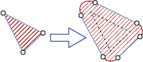

# BufferWithCurves (geometry Data Type)
[!INCLUDE[sql-asdb-asdbmi](../../includes/applies-to-version/sql-asdb-asdbmi.md)]

  Returns a **geometry** instance that represents the set of all points whose distance from the calling **geometry** instance is less than or equal to the *distance* parameter.  
  
## Syntax  
  
```syntaxsql
.BufferWithCurves ( distance )  
```

[!INCLUDE[sql-server-tsql-previous-offline-documentation](../../includes/sql-server-tsql-previous-offline-documentation.md)]

## Arguments  
 *distance*  
 Is a **float** indicating the maximum distance that points forming the buffer can be from the **geometry** instance.  
  
## Return Types
SQL Server return type: **geometry**  
  
 CLR return type: **SqlGeometry**  
  
## Exceptions  
 The following criteria will throw an **ArgumentException**.  
  
-   No parameter is passed to the method, such as `@g.BufferWithCurves()`  
  
-   A non-numeric parameter is passed to the method, such as `@g.BufferWithCurves('a')`  
  
-   **NULL** is passed to the method, such as `@g.BufferWithCurves(NULL)`  
  
## Remarks  
 The following illustration shows an example of a geometry instance returned by this method.  
  
 
  
 The following table shows the results returned for different distance values.  
  
|distance Value|Type Dimensions|Spatial Type Returned|  
|--------------------|---------------------|---------------------------|  
|distance < 0|Zero or One|Empty **GeometryCollection** instance|  
|distance < 0|Two or More|A **CurvePolygon** or **GeometryCollection** instance with a negative buffer. **Note:** A negative buffer may create an empty **GeometryCollection**|  
|distance = 0|All dimensions|Copy of the invoking **geometry** instance|  
|distance > 0|All dimensions|**CurvePolygon** or **GeometryCollection** instance|  
  
> [!NOTE]  
>  Since *distance* is a **float**, a very small value can equate to zero in the calculations. When this occurs then a copy of the calling **geometry** instance is returned. See [float and real &#40;Transact-SQL&#41;](../../t-sql/data-types/float-and-real-transact-sql.md).  
  
 A negative buffer removes all points enclosed in the given distance of the boundary of the geometry. The following illustration shows a negative buffer as the lighter-shaded area of the circle. The dotted line is the boundary of the original polygon and the solid line is the boundary of the resultant polygon.  
  
 If a **string** parameter is passed to the method, then it will be converted to a **float** or it will throw an `ArgumentException`.  
  
## Examples  
  
### A. Calling BufferWithCurves() with a parameter value < 0 on one dimensional geometry instance  
 The following example returns an empty `GeometryCollection` instance:  
  
```sql
 DECLARE @g geometry= 'LINESTRING(3 4, 8 11)'; 
 SELECT @g.BufferWithCurves(-1).ToString(); 
 ```
  
### B. Calling BufferWithCurves() with a parameter value < 0 on a two dimensional geometry instance  
 The following example returns a `CurvePolygon` instance with a negative buffer:  
  
```sql
 DECLARE @g geometry = 'CURVEPOLYGON(COMPOUNDCURVE(CIRCULARSTRING(0 4, 4 0, 8 4), (8 4, 0 4)))'; 
 SELECT @g.BufferWithCurves(-1).ToString()
 ```  
  
### C. Calling BufferWithCurves() with a parameter value < 0 that returns an empty GeometryCollection  
 The following example shows what occurs when the *distance* parameter equals -2:  
  
```sql
 DECLARE @g geometry = 'CURVEPOLYGON(COMPOUNDCURVE(CIRCULARSTRING(0 4, 4 0, 8 4), (8 4, 0 4)))'; 
 SELECT @g.BufferWithCurves(-2).ToString();
 ```  
  
 This **SELECT** statement returns `GEOMETRYCOLLECTION EMPTY`  
  
### D. Calling BufferWithCurves() with a parameter value = 0  
 The following example returns a copy of the calling **geometry** instance:  
  
```sql
 DECLARE @g geometry = 'LINESTRING(3 4, 8 11)'; 
 SELECT @g.BufferWithCurves(0).ToString();
 ```  
  
### E. Calling BufferWithCurves() with a non-zero parameter value that is extremely small  
 The following example also returns a copy of the calling **geometry** instance:  
  
```sql
 DECLARE @g geometry = 'LINESTRING(3 4, 8 11)'; 
 DECLARE @distance float = 1e-20; 
 SELECT @g.BufferWithCurves(@distance).ToString();
 ```  
  
### F. Calling BufferWithCurves() with a parameter value > 0  
 The following example returns a `CurvePolygon` instance:  
  
```sql
 DECLARE @g geometry= 'LINESTRING(3 4, 8 11)'; 
 SELECT @g.BufferWithCurves(2).ToString();
 ```  
  
### G. Passing a valid string parameter  
 The following example returns the same `CurvePolygon` instance as mentioned earlier, but a string parameter is passed to the method:  
  
```sql
 DECLARE @g geometry= 'LINESTRING(3 4, 8 11)'; 
 SELECT @g.BufferWithCurves('2').ToString();
 ```  
  
### H. Passing an invalid string parameter  
 The following example will throw an error:  
  
```sql
 DECLARE @g geometry = 'LINESTRING(3 4, 8 11)' 
 SELECT @g.BufferWithCurves('a').ToString();
 ```  
  
 Note that the previous two examples passed a string literal to the `BufferWithCurves()` method. The first example works because the string literal can be converted to a numeric value. However, the second example throws an `ArgumentException`.  
  
### I. Calling BufferWithCurves() on MultiPoint instance  
 The following example returns two `GeometryCollection` instances and one `CurvePolygon` instance:  
  
```sql
 DECLARE @g geometry = 'MULTIPOINT((1 1),(1 4))'; 
 SELECT @g.BufferWithCurves(1).ToString(); 
 SELECT @g.BufferWithCurves(1.5).ToString(); 
 SELECT @g.BufferWithCurves(1.6).ToString();
 ```  
  
 The first two **SELECT** statements return a `GeometryCollection` instance because the parameter *distance* is less than or equal to 1/2 the distance between the two points (1 1) and (1 4). The third **SELECT** statement returns a `CurvePolygon` instance because the buffered instances of the two points (1 1) and (1 4) overlap.  
  
## See Also  
 [Extended Methods on Geometry Instances](../../t-sql/spatial-geometry/extended-methods-on-geometry-instances.md)  
 
