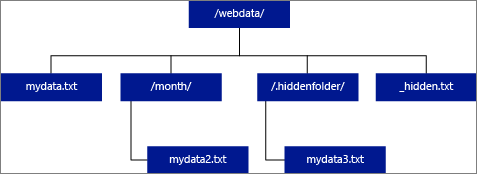

# CREATE EXTERNAL TABLE (Transact-SQL)
[!INCLUDE[tsql-appliesto-ss2016-all-md](../../includes/tsql-appliesto-ss2016-all-md.md)]

  Creates an external table for PolyBase, or Elastic Database queries. Depending on the scenario, the syntax differs significantly. An external table created for PolyBase cannot be used for Elastic Database queries.  Similarly, an external table created for Elastic Database queries cannot be used for PolyBase, etc. 
  
> [!NOTE]  
>  PolyBase is supported only on SQL Server 2016 (or higher), Azure SQL Data Warehouse, and Parallel Data Warehouse. Elastic Database queries are supported only on Azure SQL Database v12 or later.  


- [!INCLUDE[ssNoVersion](../../includes/ssnoversion-md.md)] uses external tables to access
data stored in a Hadoop cluster or Azure blob storagea PolyBase external table that references data stored in a Hadoop cluster or Azure blob storage. Can also be used to create an external table for [Elastic Database query](https://azure.microsoft.com/documentation/articles/sql-database-elastic-query-overview/).  
  
 Use an external table to:  
  
-   Query Hadoop or Azure blob storage data with [!INCLUDE[tsql](../../includes/tsql-md.md)] statements.  
  
-   Import and store data from Hadoop or Azure blob storage into your [!INCLUDE[ssNoVersion](../../includes/ssnoversion-md.md)] database.  
  
-   Create an external table for use with an Elastic Database  
     query.  
     
- Import and store data from Azure Data Lake Store into Azure SQL Data Warehouse
  
 See also [CREATE EXTERNAL DATA SOURCE &#40;Transact-SQL&#41;](../../t-sql/statements/create-external-data-source-transact-sql.md) and [DROP EXTERNAL TABLE &#40;Transact-SQL&#41;](../../t-sql/statements/drop-external-table-transact-sql.md).  
  
  [Transact-SQL Syntax Conventions](../../t-sql/language-elements/transact-sql-syntax-conventions-transact-sql.md)  
  
## Syntax  
  

```  
-- Syntax for SQL Server 
  
-- Create a new external table  
CREATE EXTERNAL TABLE [ database_name . [ schema_name ] . | schema_name. ] table_name   
    ( <column_definition> [ ,...n ] )  
    WITH (   
        LOCATION = 'folder_or_filepath',  
        DATA_SOURCE = external_data_source_name,  
        FILE_FORMAT = external_file_format_name  
        [ , <reject_options> [ ,...n ] ]  
    )  
[;]  
  
<reject_options> ::=  
{  
    | REJECT_TYPE = value | percentage  
    | REJECT_VALUE = reject_value  
    | REJECT_SAMPLE_VALUE = reject_sample_value  
  
}  
  
-- Create a table for use with Elastic Database query  
CREATE EXTERNAL TABLE [ database_name . [ schema_name ] . | schema_name. ] table_name   
    ( <column_definition> [ ,...n ] )  
    WITH ( <sharded_external_table_options> )  
[;]  
  
<sharded_external_table_options> ::=  
        DATA_SOURCE = external_data_source_name,   
        SCHEMA_NAME = N'nonescaped_schema_name',  
        OBJECT_NAME = N'nonescaped_object_name',  
        [DISTRIBUTION  = SHARDED(sharding_column_name) | REPLICATED | ROUND_ROBIN]]  
    )  
[;]  
```  

```  
-- Syntax for Azure SQL Database
  
-- Create a table for use with Elastic Database query  
CREATE EXTERNAL TABLE [ database_name . [ schema_name ] . | schema_name. ] table_name   
    ( <column_definition> [ ,...n ] )  
    WITH ( <sharded_external_table_options> )  
[;]  
  
<sharded_external_table_options> ::=  
        DATA_SOURCE = external_data_source_name,   
        SCHEMA_NAME = N'nonescaped_schema_name',  
        OBJECT_NAME = N'nonescaped_object_name',  
        [DISTRIBUTION  = SHARDED(sharding_column_name) | REPLICATED | ROUND_ROBIN]]  
    )  
[;]  
```  


```  
-- Syntax for Azure SQL Data Warehouse and Parallel Data Warehouse  
  
-- Create a new external table in SQL Server PDW  
CREATE EXTERNAL TABLE [ database_name . [ schema_name ] . | schema_name. ] table_name   
    ( <column_definition> [ ,...n ] )  
    WITH (   
        LOCATION = 'hdfs_folder_or_filepath',  
        DATA_SOURCE = external_data_source_name,  
        FILE_FORMAT = external_file_format_name  
        [ , <reject_options> [ ,...n ] ]  
    )  
[;]  
  
<reject_options> ::=  
{  
    | REJECT_TYPE = value | percentage,  
    | REJECT_VALUE = reject_value,  
    | REJECT_SAMPLE_VALUE = reject_sample_value,
    | REJECTED_ROW_LOCATION = '\REJECT_Directory'
  
}  
```  
  
## Arguments  
 *database_name* . [ schema_name ] . | schema_name. ] *table_name*  
 The one to three-part name of the table to create. For an external table, only the table metadata is stored in SQL along with basic statistics about the file and or folder referenced in Hadoop or Azure blob storage. No actual data is moved or stored in [!INCLUDE[ssNoVersion](../../includes/ssnoversion-md.md)].  
  
 \<column_definition> [ ,...*n* ] 
 CREATE EXTERNAL TABLE allows one or more column definitions. Both CREATE EXTERNAL TABLE and CREATE TABLE use the same syntax for defining a column. An exception to this, you cannot use the DEFAULT CONSTRAINT on external tables. For the full details about column definitions and their data types, see [CREATE TABLE &#40;Transact-SQL&#41;](../../t-sql/statements/create-table-transact-sql.md) and [CREATE TABLE on Azure SQL Database](https://msdn.microsoft.com/library/d53c529a-1d5f-417f-9a77-64ccc6eddca1).  
  
 The column definitions, including the data types and number of columns, must match the data in the external files. If there is a mismatch, the file rows will be rejected when querying the actual data.  
  
 LOCATION =  '*folder_or_filepath*'  
 Specifies the folder or the file path and file name for the actual data in Hadoop or Azure blob storage. The location starts from the root folder; the root folder is the data location specified in the external data source.  


In SQL Server, the CREATE EXTERNAL TABLE statement creates the path and folder if it does not already exist. You can then use INSERT INTO to export data from a local SQL Server table to the external data source. For more information, see [PolyBase Queries](/sql/relational-databases/polybase/polybase-queries). 

In SQL Data Warehouse and Analytics Platform System, the [CREATE EXTERNAL TABLE AS SELECT](create-external-table-as-select-transact-sql.md) statement creates the path and folder if it does not exist. In these two products, CREATE EXTERNAL TABLE does not create the path and folder.

  
 If you specify LOCATION to be a folder, a PolyBase query that selects from the external table will retrieve files from the folder and all of its subfolders. Just like Hadoop, PolyBase does not return hidden folders. It also does not return files for which the file name begins with an underline (_) or a period (.).  
  
 In this example, if LOCATION='/webdata/', a PolyBase query will return rows from mydata.txt and mydata2.txt.  It will not return mydata3.txt because it is a subfolder of a hidden folder. It will not return _hidden.txt because it is a hidden file.  
  
   
  
 To change the default and only read from the root folder, set the attribute \<polybase.recursive.traversal> to 'false' in the core-site.xml configuration file. This file is located under `<SqlBinRoot>\PolyBase\Hadoop\Conf with SqlBinRoot the bin root of SQl Server`. For example, `C:\\Program Files\\Microsoft SQL Server\\MSSQL13.XD14\\MSSQL\\Binn`.  
  
 DATA_SOURCE = *external_data_source_name*  
 Specifies the name of the external data source that contains the location of the external data. This location is either a Hadoop or Azure blob storage. To create an external data source, use [CREATE EXTERNAL DATA SOURCE &#40;Transact-SQL&#41;](../../t-sql/statements/create-external-data-source-transact-sql.md).  
  
 FILE_FORMAT = *external_file_format_name*  
 Specifies the name of the external file format object that stores the file type and compression method for the external data. To create an external file format, use [CREATE EXTERNAL FILE FORMAT &#40;Transact-SQL&#41;](../../t-sql/statements/create-external-file-format-transact-sql.md).  
  
 Reject Options  
 You can specify reject parameters that determine how PolyBase will handle *dirty* records it retrieves from the external data source. A data record is considered 'dirty' if it actual data types or the number of columns do not match the column definitions of the external table.  
  
 When you do not specify or change reject values, PolyBase uses default values. This information about the reject parameters is stored as additional metadata when you create an external table with CREATE EXTERNAL TABLE statement.   When a future SELECT statement or SELECT INTO SELECT statement selects data from the external table , PolyBase will use the reject options to determine the number or percentage of rows that can be rejected before the actual query fails. . The query will return (partial) results until the reject threshold is exceeded; it then fails with the appropriate error message.  
  
 REJECT_TYPE = **value** | percentage  
 Clarifies whether the REJECT_VALUE option is specified as a literal value or a percentage.  
  
 value  
 REJECT_VALUE is a literal value, not a percentage. The PolyBase query will fail when the number of rejected rows exceeds *reject_value*.  
  
 For example, if REJECT_VALUE = 5 and REJECT_TYPE = value, the PolyBase SELECT query will fail after 5 rows have been rejected.  
  
 percentage  
 REJECT_VALUE is a percentage, not a literal value. A PolyBase query will fail when the *percentage* of failed rows exceeds *reject_value*. The percentage of failed rows is calculated at intervals.  
  
 REJECT_VALUE = *reject_value*  
 Specifies the value or the percentage of rows that can be rejected before the query fails.  
  
 For REJECT_TYPE = value, *reject_value* must be an integer between 0 and 2,147,483,647.  
  
 For REJECT_TYPE = percentage, *reject_value* must be a float between 0 and 100.  
  
 REJECT_SAMPLE_VALUE = *reject_sample_value*  
 This attribute is required when you specify REJECT_TYPE = percentage. It determines the number of rows to attempt to retrieve before the PolyBase recalculates the percentage of rejected rows.  
  
 The *reject_sample_value* parameter must be an integer between 0 and 2,147,483,647.  
  
 For example, if REJECT_SAMPLE_VALUE = 1000, PolyBase will calculate the percentage of failed rows after it has attempted to import 1000 rows from the external data file. If the percentage of failed rows is less than *reject_value*, PolyBase will attempt to retrieve another 1000 rows. It continues to recalculate the percentage of failed rows after it attempts to import each additional 1000 rows.  
  
> [!NOTE]  
>  Since PolyBase computes the percentage of failed rows at intervals, the actual percentage of failed rows can exceed *reject_value*.  
  

Example:  
  
 This example shows how the three REJECT options interact with each other. For example, if REJECT_TYPE = percentage, REJECT_VALUE = 30, and REJECT_SAMPLE_VALUE = 100, the following scenario could occur:  
  
-   PolyBase attempts to retrieve the first 100 rows; 25 fail and 75 succeed.  
  
-   Percent of failed rows is calculated as 25%, which is less than the reject value of 30%. Hence, PolyBase will continue retrieving data from the external data source.  
  
-   PolyBase attempts to load the next 100 rows; this time 25 succeed and 75 fail.  
  
-   Percent of failed rows is recalculated as 50%. The percentage of failed rows has exceeded the 30% reject value.  
  
-   The PolyBase query fails with 50% rejected rows after attempting to return the first 200 rows. Note that matching rows have been returned before the PolyBase query detects the reject threshold has been exceeded.  
  
REJECTED_ROW_LOCATION = *Directory Location*
  
  Specifies the directory within the External Data Source that the rejected rows and the corresponding error file should be written.
If the specified path does not exist, PolyBase will create one on your behalf. A child directory is created with the name "_rejectedrows". The "_" character ensures that the directory is escaped for other data processing unless explicitly named in the location parameter. Within this directory, there is a folder created based on the time of load submission in the format YearMonthDay -HourMinuteSecond (Ex. 20180330-173205). In this folder, two types of files are written, the _reason file and the data file. 

The reason files and the data files both have the queryID associated with the CTAS statement. Because the data and the reason are in separate files corresponding files have a matching suffix. 
  
 Sharded external table options  
 Specifies the external data source (a non-SQL Server data source) and a distribution method for the [Elastic Database query](https://azure.microsoft.com/documentation/articles/sql-database-elastic-query-overview/).  
  
 DATA_SOURCE  
 An external data source such as data stored in a Hadoop File System, Azure blob storage, or a [shard map manager](https://azure.microsoft.com/documentation/articles/sql-database-elastic-scale-shard-map-management/).  
  
 SCHEMA_NAME  
 The SCHEMA_NAME clause provides the ability to map the external table definition to a table in a different schema on the remote database. Use this to disambiguate between schemas that exist on both the local and remote databases.  
  
 OBJECT_NAME  
 The OBJECT_NAME clause provides the ability to map the external table definition to a table with a different name on the remote database. Use this to disambiguate between object names that exist on both the local and remote databases.  
  
 DISTRIBUTION  
 Optional. This is only required only for databases of type SHARD_MAP_MANAGER. This controls whether a table is treated as a sharded table or a replicated table. With **SHARDED** (*column name*)  tables, the data from different tables do not overlap. **REPLICATED** specifies that tables have the same data on every shard. **ROUND_ROBIN** indicates that an application-specific method is used to distribute the data.  
  
## Permissions  
 Requires these user permissions:  
  
-   **CREATE TABLE**  
  
-   **ALTER ANY SCHEMA**  
  
-   **ALTER ANY EXTERNAL DATA SOURCE**  
  
-   **ALTER ANY EXTERNAL FILE FORMAT**  

-   **CONTROL DATABASE**
  
 Note, the login that creates the external data source must have permission to read and write to the external data source, located in Hadoop or Azure blob storage.  


> [!IMPORTANT]
> 
>  The ALTER ANY EXTERNAL DATA SOURCE  permission grants any principal the ability to create and modify any external data source object, and therefore, it also grants the ability to access all database scoped credentials on the database. This permission must be considered as highly privileged, and therefore must be granted only to trusted principals in the system.

## Error Handling  
 While executing the CREATE EXTERNAL TABLE statement, PolyBase attempts to connect to the external data source. If the attempt to connect fails, the statement will fail and the external table will not be created. It can take a minute or more for the command to fail since PolyBase retries the connection before eventually failing the query.  
  
## General Remarks  
 In ad-hoc query scenarios, i.e. SELECT FROM EXTERNAL TABLE, PolyBase stores the rows retrieved from the external data source in a temporary table. After the query completes, PolyBase removes and deletes the temporary table. No permanent data is stored in SQL tables.  
  
 In contrast, in the import scenario, i.e. SELECT INTO FROM EXTERNAL TABLE, PolyBase stores the rows retrieved from the external data source as permanent data in the SQL table. The new table is created during query execution when PolyBase retrieves the external data.  
  
 PolyBase can push some of the query computation to Hadoop to improve query performance. This is called predicate pushdown. To enable this, specify the Hadoop resource manager location option in [CREATE EXTERNAL DATA SOURCE &#40;Transact-SQL&#41;](../../t-sql/statements/create-external-data-source-transact-sql.md).  
  
 You can create numerous external tables that reference the same or different external data sources.  
  
## Limitations and Restrictions  
 In CTP2, the export functionality is not supported, i.e. permanently storing SQL data into the external data source. This functionality will be available in CTP3.  
  
 Since the data for an external table resides off the appliance, it is not under the control of PolyBase, and can be changed or removed at any time by an external process. Because of this, query results against an external table are not guaranteed to be deterministic. The same query can return different results each time it runs against an external table. Similarly, a query can fail if the external data is removed or relocated.  
  
 You can create multiple external tables that each reference different external data sources. However, if you simultaneously run queries against different Hadoop data sources, then each Hadoop source must use the same 'hadoop connectivity' server configuration setting. For example, you can't simultaneously run a query against a Cloudera Hadoop cluster and a Hortonworks Hadoop cluster since these use different configuration settings. For the configuration settings and supported combinations, see [PolyBase Connectivity Configuration &#40;Transact-SQL&#41;](../../database-engine/configure-windows/polybase-connectivity-configuration-transact-sql.md).  
  
 Only these Data Definition Language (DDL) statements are allowed on external tables:  
  
-   CREATE TABLE and DROP TABLE  
  
-   CREATE STATISTICS and DROP STATISTICS  
Note: CREATE and DROP STATISTICS on external tables are not supported in Azure SQL Database. 
  
-   CREATE VIEW and DROP VIEW  
  
 Constructs and operations not supported:  
  
-   The DEFAULT constraint on external table columns  
  
-   Data Manipulation Language (DML) operations of delete, insert, and update  
  
 Query limitations:  
  
 PolyBase can consume a maximum of 33k files per folder when running 32 concurrent PolyBase queries. This maximum number includes both files and subfolders in each HDFS folder. If the degree of concurrency is less than 32, a user can run PolyBase queries against folders in HDFS which contain more than 33k files. We recommend that you keep external file paths short and use no more than 30k files per HDFS folder. When too many files are referenced, a Java Virtual Machine (JVM) out-of-memory exception might occur.  

Table width limitations:
PolyBase in SQL Server 2016 has a row width limit of 32KB based on the maximum size of a single valid row by table definition. If the sum of the column schema is greater than 32KB, PolyBase will not be able to query the data. 

In SQL Data Warehouse, this limitation has been raised to 1MB.


## Locking  
 Shared lock on the SCHEMARESOLUTION object.  
  
## Security  
 The data files for an external table is stored in Hadoop or Azure blob storage. These data files are created and managed by your own processes. It is your responsibility to manage the security of the external data.  
  
## Examples  
  
### A. Create an external table with data in text-delimited format.  
 This example shows all the steps required to create an external table that has data formatted in text-delimited files. It defines an external data source *mydatasource* and an external file format *myfileformat*. These database-level objects are then referenced in the CREATE EXTERNAL TABLE statement. For more information, see [CREATE EXTERNAL DATA SOURCE &#40;Transact-SQL&#41;](../../t-sql/statements/create-external-data-source-transact-sql.md) and [CREATE EXTERNAL FILE FORMAT &#40;Transact-SQL&#41;](../../t-sql/statements/create-external-file-format-transact-sql.md).  
  
```  
  
CREATE EXTERNAL DATA SOURCE mydatasource  
WITH (  
    TYPE = HADOOP,  
    LOCATION = 'hdfs://xxx.xxx.xxx.xxx:8020'  
)  
  
CREATE EXTERNAL FILE FORMAT myfileformat  
WITH (  
    FORMAT_TYPE = DELIMITEDTEXT,   
    FORMAT_OPTIONS (FIELD_TERMINATOR ='|')  
);  
  
CREATE EXTERNAL TABLE ClickStream (   
    url varchar(50),  
    event_date date,  
    user_IP varchar(50)  
)  
WITH (  
        LOCATION='/webdata/employee.tbl',  
        DATA_SOURCE = mydatasource,  
        FILE_FORMAT = myfileformat  
    )  
;  
  
```  
  
### B. Create an external table with data in RCFile format.  
 This example shows all the steps required to create an external table that has data formatted as RCFiles. It defines an external data source *mydatasource_rc* and an external file format *myfileformat_rc*. These database-level objects are then referenced in the CREATE EXTERNAL TABLE statement. For more information, see [CREATE EXTERNAL DATA SOURCE &#40;Transact-SQL&#41;](../../t-sql/statements/create-external-data-source-transact-sql.md) and [CREATE EXTERNAL FILE FORMAT &#40;Transact-SQL&#41;](../../t-sql/statements/create-external-file-format-transact-sql.md).  
  
```  
  
CREATE EXTERNAL DATA SOURCE mydatasource_rc  
WITH (  
    TYPE = HADOOP,  
    LOCATION = 'hdfs://xxx.xxx.xxx.xxx:8020'  
)  
  
CREATE EXTERNAL FILE FORMAT myfileformat_rc  
WITH (  
    FORMAT_TYPE = RCFILE,  
    SERDE_METHOD = 'org.apache.hadoop.hive.serde2.columnar.LazyBinaryColumnarSerDe'  
)  
;  
  
CREATE EXTERNAL TABLE ClickStream_rc (   
    url varchar(50),  
    event_date date,  
    user_ip varchar(50)  
)  
WITH (  
        LOCATION='/webdata/employee_rc.tbl',  
        DATA_SOURCE = mydatasource_rc,  
        FILE_FORMAT = myfileformat_rc  
    )  
;  
  
```  
  
### C. Create an external table with data in ORC format.  
 This example shows all the steps required to create an external table that has data formatted as ORC files. It defines an external data source mydatasource_orc and an external file format myfileformat_orc. These database-level objects are then referenced in the CREATE EXTERNAL TABLE statement. For more information, see [CREATE EXTERNAL DATA SOURCE &#40;Transact-SQL&#41;](../../t-sql/statements/create-external-data-source-transact-sql.md) and [CREATE EXTERNAL FILE FORMAT &#40;Transact-SQL&#41;](../../t-sql/statements/create-external-file-format-transact-sql.md).  
  
```  
  
CREATE EXTERNAL DATA SOURCE mydatasource_orc  
WITH (  
    TYPE = HADOOP,  
    LOCATION = 'hdfs://xxx.xxx.xxx.xxx:8020'  
)  
  
CREATE EXTERNAL FILE FORMAT myfileformat_orc  
WITH (  
    FORMAT = ORC,  
    COMPRESSION = 'org.apache.hadoop.io.compress.SnappyCodec'  
)  
;  
  
CREATE EXTERNAL TABLE ClickStream_orc (   
    url varchar(50),  
    event_date date,  
    user_ip varchar(50)  
)  
WITH (  
        LOCATION='/webdata/',  
        DATA_SOURCE = mydatasource_orc,  
        FILE_FORMAT = myfileformat_orc  
    )  
;  
  
```  
  
### D. Querying Hadoop data  
 Clickstream is an external table that connects to the employee.tbl delimited text file on a Hadoop cluster. The following query looks just like a query against a standard table. However, this query retrieves data from Hadoop and then computes the results.  
  
```  
SELECT TOP 10 (url) FROM ClickStream WHERE user_ip = 'xxx.xxx.xxx.xxx'  
;  
```  
  
### E. Join Hadoop data with SQL data  
 This query looks just like a standard JOIN on two SQL tables. The difference is that PolyBase retrieves the Clickstream data from Hadoop and then joins it to the UrlDescription table. One table is an external table and the other is a standard SQL table.  
  
```  
SELECT url.description  
FROM ClickStream cs  
JOIN UrlDescription url ON cs.url = url.name  
WHERE cs.url = 'msdn.microsoft.com'  
;  
```  
  
### F. Import data from Hadoop into a SQL table  
 This example creates a new SQL table ms_user that permanently stores the result of a join between the standard SQL table *user* and the external table *ClickStream*.  
  
```  
SELECT DISTINCT user.FirstName, user.LastName  
INTO ms_user  
FROM user INNER JOIN (  
    SELECT * FROM ClickStream WHERE cs.url = 'www.microsoft.com'  
    ) AS ms_user  
ON user.user_ip = ms.user_ip  
;  
  
```  
  
### G. Create an external table for a sharded data source  
 This example remaps a remote DMV to an external table using the SCHEMA_NAME and OBJECT_NAME clauses.  
  
```  
CREATE EXTERNAL TABLE [dbo].[all_dm_exec_requests]([session_id] smallint NOT NULL,  
  [request_id] int NOT NULL,  
  [start_time] datetime NOT NULL,   
  [status] nvarchar(30) NOT NULL,  
  [command] nvarchar(32) NOT NULL,  
  [sql_handle] varbinary(64),  
  [statement_start_offset] int,  
  [statement_end_offset] int,  
  [cpu_time] int NOT NULL)  
WITH  
(  
  DATA_SOURCE = MyExtSrc,  
  SCHEMA_NAME = 'sys',  
  OBJECT_NAME = 'dm_exec_requests',  
  DISTRIBUTION=ROUND_ROBIN  
);   
```  
  
## Examples: [!INCLUDE[ssSDWfull](../../includes/sssdwfull-md.md)] and [!INCLUDE[ssPDW](../../includes/sspdw-md.md)]  
  
### H. Importing Data from ADLS into Azure [!INCLUDE[ssDW](../../includes/ssdw-md.md)]  
 
  
```  

-- These values come from your Azure Active Directory Application used to authenticate to ADLS
CREATE DATABASE SCOPED CREDENTIAL ADLUser 
WITH IDENTITY = '<clientID>@\<OAuth2.0TokenEndPoint>',
SECRET = '<KEY>' ;


CREATE EXTERNAL DATA SOURCE AzureDataLakeStore
WITH (TYPE = HADOOP,
      LOCATION = 'adl://pbasetr.azuredatalakestore.net'
)


CREATE EXTERNAL FILE FORMAT TextFileFormat 
WITH
(
    FORMAT_TYPE = DELIMITEDTEXT 
    , FORMAT_OPTIONS ( FIELDTERMINATOR = '|' 
					 , STRINGDELIMITER = '' 
					 , DATEFORMAT = 'yyyy-MM-dd HH:mm:ss.fff' 
					 , USETYPE_DEFAULT = FALSE 
					 ) 
)


CREATE EXTERNAL TABLE [dbo].[DimProductexternal] 
( [ProductKey] [int] NOT NULL, 
  [ProductLabel] nvarchar NULL, 
  [ProductName] nvarchar NULL ) 
WITH
(
    LOCATION='/DimProduct/' , 
	DATA_SOURCE = AzureDataLakeStore , 
	FILE_FORMAT = TextFileFormat , 
	REJECT_TYPE = VALUE ,
	REJECT_VALUE = 0
) ;


CREATE TABLE [dbo].[DimProduct] 
WITH (DISTRIBUTION = HASH([ProductKey] ) ) 
AS SELECT * FROM 
[dbo].[DimProduct_external] ; 
     
```  
  
### I. Join external tables  
  
```  
SELECT url.description  
FROM ClickStream cs  
JOIN UrlDescription url ON cs.url = url.name  
WHERE cs.url = 'msdn.microsoft.com'  
;  
```  
  
### J. Join HDFS data with PDW data  
  
```  
SELECT cs.user_ip FROM ClickStream cs  
JOIN User u ON cs.user_ip = u.user_ip  
WHERE cs.url = 'www.microsoft.com'  
;  
  
```  
  
### K. Import row data from HDFS into a distributed PDW Table  
  
```  
CREATE TABLE ClickStream_PDW  
WITH ( DISTRIBUTION = HASH (url) )  
AS SELECT url, event_date, user_ip FROM ClickStream  
;  
```  
  
### L. Import row data from HDFS into a replicated PDW Table  
  
```  
CREATE TABLE ClickStream_PDW  
WITH ( DISTRIBUTION = REPLICATE )  
AS SELECT url, event_date, user_ip   
FROM ClickStream  
;  
```  
  
## See Also  
 [Common Metadata Query Examples (SQL Server PDW)](https://msdn.microsoft.com/733fc99b-b9f6-4a29-b085-a1bd4f09f2ed)   
 [CREATE EXTERNAL DATA SOURCE &#40;Transact-SQL&#41;](../../t-sql/statements/create-external-data-source-transact-sql.md)   
 [CREATE EXTERNAL FILE FORMAT &#40;Transact-SQL&#41;](../../t-sql/statements/create-external-file-format-transact-sql.md)   
 [CREATE EXTERNAL TABLE AS SELECT &#40;Transact-SQL&#41;](../../t-sql/statements/create-external-table-as-select-transact-sql.md)   
 [CREATE TABLE AS SELECT &#40;Azure SQL Data Warehouse&#41;](../../t-sql/statements/create-table-as-select-azure-sql-data-warehouse.md)  
  
  


