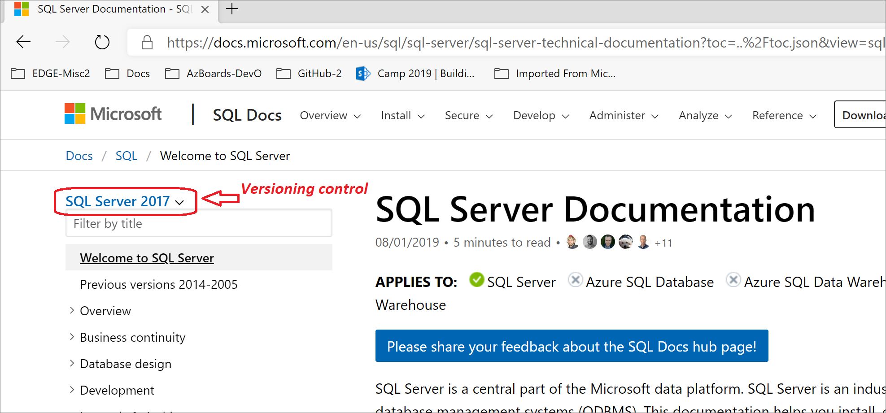

# Versioning system for SQL documentation

[!INCLUDE[includes_appliesto-ss-asdb-asdw-pdw-md.md](../includes/appliesto-ss-asdb-asdw-pdw-md.md)]

This article explains our _versioning system_ for SQL documentation. The versioning system knows about products and their versions. The system enables you to choose the product and version you are interested in. The system then displays the appropriate documentation.

## APPLIES TO products

Most of the SQL Server articles have the words **APPLIES TO** under their title. On the same line, there follows a handy listing of SQL _products_ with indicators of whether the article is relevant to the product. For example, the product SQL Server could be indicated as relevant, while Azure SQL Database could be indicated as irrelevant to the article.

The **APPLIES TO** line does not know about _versions_ of products. We strive to avoid discrepancies between the **APPLIES TO** line and the products aspect of our versioning system configurations.

## History of separate file sets

For SQL Server 2014 and earlier versions, each version has its own full separate copy of the documentation files. For instance, the documentation for SQL Server 2014 began as a copy of the documentation for SQL Server 2012. The 2014 copy was then edited during the product development cycle.

This old approach meant that if a flaw was discovered in the 2014 documentation, the flaw might also exist in 2012 and 2008. This made fixing flaws and general maintenance more difficult.

## Multiple versions in the same files

For this reason and others, the documentation files for SQL Server 2016 are also for 2017, 2019, and probably for \<vNext\>. This consolidation is made practical because we now assign _versioning monikers_ to our SQL Server documentation files. The versioning monikers are assigned, or are explicitly embedded, at whatever degree of granularity makes sense for each given documentation file.

## Versioning control in the UI

When you view any SQL documentation article by using our :::no-loc text="Docs"::: website, the currently chosen versioning moniker is visible above the table of contents. The control is a drop-down list.

If you want to see the documentation for a different version of SQL Server, you click the expander arrow located at the end of the current version moniker. Then click to choose any product and version combination you want. When you click a different version, the displayed documentation suddenly changes to show the differences for the newly chosen version. There might or might not be any changes, and both cases are common.

## Products, not editions

### Editions

In the 1990s and into the 2000s, Microsoft SQL Server had only one product. There were various _editions_ of each version of SQL Server, such as the _Developer_ and _Enterprise_ editions of SQL Server 2008. The editions represented slightly different feature sets, but the core product was the same. New SQL Server releases may still have a variety of editions.

### Products

With the more recent rise of cloud computing and Microsoft Azure, Microsoft released its Azure SQL Database product. While there is much code shared by both the traditional SQL Server on-premises product and the Azure SQL Database product, these products are two truly separate products.

For SQL, versioning monikers make distinctions between products, but not between editions.

## Hiding

The versioning system works by hiding documentation content that does not apply to the currently active moniker. The hiding occurs at the following levels:

- Sections or sentences within an article.
- Entries for articles in the table of contents.

The following is one normal scenario:

1. The current versioning moniker is **SQL Server 2017**.
2. You are reading a section that happens to describe a feature that was first added to version 2017 of SQL Server.
3. You change the moniker to **SQL Server 2016**.
4. You look back at the article, and you notice the section you were reading is gone.
5. You again change the moniker, this time to **SQL Server 2019**.
6. You again look back at the article, and you notice the 2017 section you were reading back on display.

In the preceding scenario, the section about the new 2017 feature is likely marked with a _moniker range_ that is equivalent to:

- `>=sql-server-2017`

When the moniker **SQL Server 2019** is chosen, the versioning system realizes that 2019 is greater-than-or-equal-to 2017, and it displays the section.

### All SQL - Hide nothing

There is one special versioning moniker named **All SQL**, and its only version is **Hide nothing**. This moniker is not useful to customers, and it can make the documentation display misleading. This moniker is only used for our internal testing.

## HTTPS parameter :::no-loc text="view=":::

On the Microsoft :::no-loc text="Docs"::: website, the SQL Server articles have `https` URLs that append a parameter named `view=`. For example:

- `https://docs.microsoft.com/sql/sql-server/what-s-new-in-sql-server-2017?view=sql-server-2017`

The value of `?view=` indicates the currently active versioning moniker. For amusement, you have the option of editing the `?view=` value instead of clicking the versioning control.

## Message: The requested page is not available for \<moniker\>

The following scenario leads to the display of an informational message near the top of the :::no-loc text="Docs"::: webpage:

1. Currently the versioning moniker is **SQL Server 2017**.
2. You are reading an article that is relevant to SQL Server 2017.
    - The article is _not_ relevant to the product Azure SQL Database.
3. You attempt to change the moniker to **Azure SQL Database - current**.
4. You see your attempt was rejected, and a message is displayed.

At the end of this scenario, you see the following informational message displayed near the top of the Docs webpage:

> The requested page is not available for Azure SQL Database - current. You have been redirected to the newest product version this page is available for.

The _newest_ version might exclude versions that are not yet fully released and are in _Preview_ status.

## See also

[Previous versions of SQL Server, 2014-2005](previous-versions-sql-server.md)  
