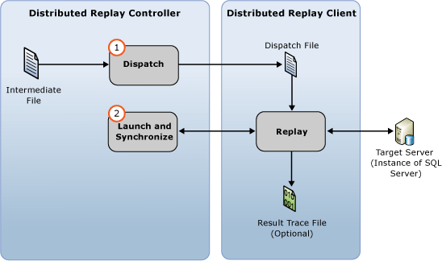

# Replay Trace Data
[!INCLUDE[appliesto-ss-xxxx-xxxx-xxx-md](../../includes/appliesto-ss-xxxx-xxxx-xxx-md.md)]
  You can start a distributed replay with the [!INCLUDE[msCoName](../../includes/msconame-md.md)] [!INCLUDE[ssNoVersion](../../includes/ssnoversion-md.md)] Distributed Replay feature after you have prepared the input trace data. For more information, see [Prepare the Input Trace Data](../../tools/distributed-replay/prepare-the-input-trace-data.md).  
  
 Use the administration tool **replay** option to initiate the event replay stage of the distributed replay. This stage consists of two parts: the trace data dispatch and the starting and synchronizing of the distributed replay.  
  
   
  
 You can replay trace data in one of two sequencing modes: stress mode or synchronization mode. The default behavior is to replay trace data in stress mode. For more information about the event replay stage and sequencing modes, see [SQL Server Distributed Replay](../../tools/distributed-replay/sql-server-distributed-replay.md)  
  
> [!NOTE]  
>  The input trace data must be captured in a version of [!INCLUDE[ssNoVersion](../../includes/ssnoversion-md.md)] that is compatible with Distributed Replay. The input trace data must also be compatible with the target server that you want to replay the trace data against. For more information about version requirements, see [Distributed Replay Requirements](../../tools/distributed-replay/distributed-replay-requirements.md).  
  
### To replay the trace  
  
1.  **(Optional) Modify replay configuration settings**: If you want to modify the replay configuration settings, such as the sequencing mode and various scaling values, you must modify the `<ReplayOptions>` element of the XML-based replay configuration file `DReplay.exe.replay.config`. You can also modify the `<OutputOptions>` element to specify output settings, such as whether to record the row count. If you modify the replay configuration file, we recommend that you modify a copy rather than the original. To modify settings, follow these steps:  
  
    1.  Make a copy of the default replay configuration file, `DReplay.exe.replay.config`, and rename the new file. The default replay configuration file is located in the administration tool installation folder.  
  
    2.  Modify the replay configuration settings in the new configuration file.  
  
    3.  When initiating the event replay stage (the next step), use the *config_file* parameter of the **replay** option to specify the location of the modified configuration file.  
  
     For more information about the replay configuration file, see [Configure Distributed Replay](../../tools/distributed-replay/configure-distributed-replay.md).  
  
2.  **Initiate the event replay stage**: To start the distributed replay, you must run the administration tool with the **replay** option. For more information, see [Replay Option &#40;Distributed Replay Administration Tool&#41;](../../tools/distributed-replay/replay-option-distributed-replay-administration-tool.md).  
  
    1.  Open the Windows Command Prompt utility (**CMD.exe**), and navigate to the installation location of the Distributed Replay administration tool (**DReplay.exe**).  
  
    2.  (Optional) Use the *controller* parameter, **-m**, to specify the controller, if the controller service is running on a computer different from the administration tool.  
  
    3.  Use the *controller_working_directory* parameter, **-d**, to specify where the intermediate file was saved on the controller during the preprocess stage.  
  
    4.  (Optional) Use the **-o** parameter to capture the replay activity in a result trace file on each client.  
  
    5.  (Optional) Use the *target_server* parameter, **-s**, to specify the instance of [!INCLUDE[ssNoVersion](../../includes/ssnoversion-md.md)] where the distributed replay clients should replay the trace workload. This parameter is not required if you used the `<Server>` element to specify the target server in the `<ReplayOptions>` element of the replay configuration file.  
  
    6.  Use the *clients* parameter, **-w**, to specify the distributed replay clients that should participate in the replay. List the client computer names, separated by commas. Note: IP addresses are not allowed.  
  
    7.  (Optional) Use the *config_file* parameter, **-c**, to specify location of the replay configuration file. Use this parameter to point to the new configuration file if you have modified a copy of the default replay configuration file.  
  
    8.  (Optional) Use the *status_interval* parameter, **-f**, to specify if you want the administration tool to display status messages at a frequency other than 30 seconds.  
  
     For example, the following syntax initiates the replay stage on the same computer as the controller service, uses a controller working directory located at `c:\WorkingDir`, captures the replay activity on each participating client, uses clients `client1` and `client2` to perform the replay, and obtains the remaining replay configuration settings from a modified replay configuration file located at `c:\modifiedreplay.config`:  
  
     `dreplay replay -d c:\WorkingDir -o -w client1,client2 -c c:\modifiedreplay.config`  
  
3.  When the distributed replay has finished, the administration tool returns summary information. If you specified the **-o** option, the replay activity has been saved in result trace files on each client. For more information about the result trace files, see [Review the Replay Results](../../tools/distributed-replay/review-the-replay-results.md).  
  
## See Also  
 [Distributed Replay Requirements](../../tools/distributed-replay/distributed-replay-requirements.md)   
 [Administration Tool Command-line Options &#40;Distributed Replay Utility&#41;](../../tools/distributed-replay/administration-tool-command-line-options-distributed-replay-utility.md)   
 [Configure Distributed Replay](../../tools/distributed-replay/configure-distributed-replay.md)  
  
  
