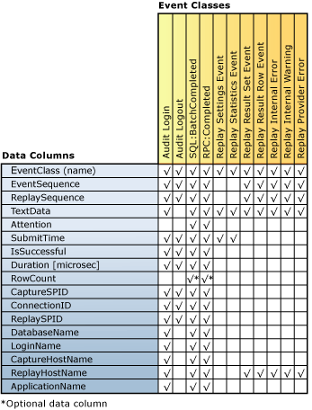

# Review the Replay Results
[!INCLUDE[appliesto-ss-xxxx-xxxx-xxx-md](../../includes/appliesto-ss-xxxx-xxxx-xxx-md.md)]
  After the [!INCLUDE[msCoName](../../includes/msconame-md.md)] [!INCLUDE[ssNoVersion](../../includes/ssnoversion-md.md)] Distributed Replay feature completes a distributed replay, the replay activity for each client can be captured and saved in result trace files on each client. In order to capture this activity, you must use the **-o** parameter when you run the administration tool with the **replay** option. For more information about the replay option, see [Replay Option &#40;Distributed Replay Administration Tool&#41;](../../tools/distributed-replay/replay-option-distributed-replay-administration-tool.md).  
  
 The location of where the result trace files are stored is specified by the `<ResultDirectory>` XML element in the client configuration file, `DReplayClient.xml`, located on each client. The trace files in the client result directory are overwritten on each replay.  
  
 To specify what kind of output should be captured in the result trace files, modify the replay configuration file, `DReplay.exe.replay.config`. You can use the `<OutputOptions>` XML element to specify whether the row count or result set contents should be recorded.  
  
 For more information about these configuration settings, see [Configure Distributed Replay](../../tools/distributed-replay/configure-distributed-replay.md).  
  
## Event Classes Captured in Result Trace Files  
 The following table lists all of the event classes that are captured in the result trace data.  
  
|Category|EventClass Name|Capture Frequency|Point of Capture|  
|--------------|---------------------|-----------------------|----------------------|  
|Replayable Events|Audit Login|One time for each Audit Login event in the original trace data|Upon successful completion or failure of the event|  
||Audit Logout|One time for each Audit Logout event in the original trace data|Upon successful completion or failure of the event|  
||SQL:BatchCompleted|One time for each SQL:BatchStarting event in the original trace data|Upon successful completion or failure of the event|  
||RPC:Completed|One time for each RPC:Starting event in the original trace data|Upon successful completion or failure of the event|  
|Statistics and Results|Replay Settings Event|One time|First event of the result trace|  
||Replay Statistics Event|One time|Last event of the result trace|  
||Replay Result Set Event|One time for each SQL:BatchStarting and RPC:Starting event.   Only captured if the value of the `<RecordResultSet>` option in the replay configuration file was set to `Yes`.||  
||Replay Result Row Event|One time for each row in the result set for SQL:BatchStarting and RPC:Starting events.   Only captured if the value of the `<RecordResultSet>` option in the replay configuration file was set to `Yes`.||  
|Errors and Warnings|Replay Internal Error|One time for each internal error|Upon internal error condition|  
||Replay Provider Error|One time for each provider error|Upon provider error condition|  
  
 Note the following:  
  
-   For each event that is successfully replayed on the target server, there is one corresponding output event class.  
  
-   For each event failure or cancellation, there may be multiple errors that are generated.  
  
## Event Class Column Mapping  
 The following figure lists which columns of the result trace are available for each type of event class that is captured during the replay.  
  
   
  
## Column Descriptions for Result Trace  
 The following table describes the columns of the result trace data.  
  
|Data Column Name|Data Type|Description|Column ID|  
|----------------------|---------------|-----------------|---------------|  
|EventClass|**nvarchar**|The name of the event class.|1|  
|EventSequence|**bigint**|For provider errors, and internal errors and warnings, this is the capture event sequence that corresponds to the error or warning.   For all other event classes, this is the sequence of the event in the original trace data.|2|  
|ReplaySequence|**bigint**|For provider errors, and internal errors and warnings, this is the replay event sequence that corresponds to the error or warning.   For all other event classes, this is the sequence of the event that is assigned during replay.|3|  
|TextData|**ntext**|The content of TextData depends on the EventClass.   For Audit Login and ExistingConnection, this is the set options for the connection.   For SQL:BatchStarting, this is the body of the batch request.   For RPC:Starting, this is the stored procedure that was called.   For Replay Settings Event, this column contains the settings that are defined in the replay configuration file.   For Replay Statistics Event, this contains the following information:   -The replay target SQL server   -Total number of replayable events   -The number of provider errors   -The number of internal errors   -Internal warnings   -Total number of errors   -Overall pass rate   -The replay time (HH:MM:SS:MMM)   For Replay Result Set Event, this shows the list of return result column headers.   For Replay Result Row Event, this shows the return value of all columns for that row.   For Replay Internal Warning and Replay Provider Error, this column contains the provider warnings or errors.|4|  
|Attention|**bigint**|The attention duration (in microseconds) for the event. This is calculated from the Attention event from the capture trace. If there was no query time-out specified for the event, this column is not populated (null).|5|  
|SubmitTime|**datetime**|The time when the event was submitted to [!INCLUDE[ssNoVersion](../../includes/ssnoversion-md.md)].|6|  
|IsSuccessful|**int**|A Boolean flag that indicates whether a particular event was successfully executed, and that result sets were returned to the client-side.   An event that generates a warning (such as when an event is cancelled because of Attention or a user-specified time-out) is considered successful.   IsSuccessful can be one of the following:   1 = successful   0 = failed|7|  
|Duration [microsec]|**bigint**|Response time duration (in microseconds) for the event. The measurement starts when the logon/log off/RPC/Language event was submitted to [!INCLUDE[ssNoVersion](../../includes/ssnoversion-md.md)].   If the event succeeds, the measurement ends when the complete result set has been consumed.   If the event does not succeed, the measurement ends at the time of event failure or cancellation.|8|  
|RowCount|**bigint**|Populated depending on the value of `<RecordRowCount>` in the replay configuration file:   If `<RecordRowCount>` equals Yes, this cell contains the number of rows in the result set that are returned by [!INCLUDE[ssNoVersion](../../includes/ssnoversion-md.md)].   If `<RecordRowCount>` equals No, this cell is not populated (null).|9|  
|CaptureSPID|**int**|The ID of the capture session for the event.|10|  
|ConnectionID|**int**|The ID of the capture connection for the event.|11|  
|ReplaySPID|**int**|The ID of the replay session for the event.|12|  
|DatabaseName|**nvarchar**|The name of the database in which the user statement is running.|13|  
|LoginName|**nvarchar**|The user login name. This can be either a [!INCLUDE[ssNoVersion](../../includes/ssnoversion-md.md)] security login or the Microsoft Windows login credentials, in the format *domain_name*\\*user_name*.|14|  
|CaptureHostName|**nvarchar**|The name of the computer on which the client service is running during capture.|15|  
|ReplayHostName|**nvarchar**|The name of the computer on which the client is running during replay.|16|  
|ApplicationName|**nvarchar**|The name of the client application that created the [!INCLUDE[ssNoVersion](../../includes/ssnoversion-md.md)] connection during capture.|17|  
  
## See Also  
 [SQL Server Distributed Replay](../../tools/distributed-replay/sql-server-distributed-replay.md)   
 [Distributed Replay Requirements](../../tools/distributed-replay/distributed-replay-requirements.md)   
 [Administration Tool Command-line Options &#40;Distributed Replay Utility&#41;](../../tools/distributed-replay/administration-tool-command-line-options-distributed-replay-utility.md)   
 [Configure Distributed Replay](../../tools/distributed-replay/configure-distributed-replay.md)  
  
  
