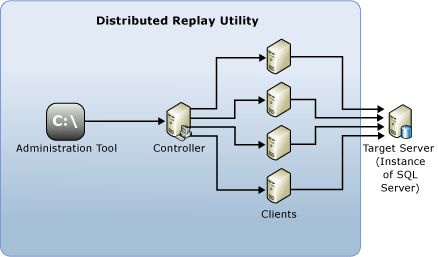

# SQL Server Distributed Replay

 [!INCLUDE [SQL Server](../../includes/applies-to-version/sqlserver.md)]

The [!INCLUDE[msCoName](../../includes/msconame-md.md)] [!INCLUDE[ssNoVersion](../../includes/ssnoversion-md.md)] Distributed Replay feature helps you assess the impact of future [!INCLUDE[ssNoVersion](../../includes/ssnoversion-md.md)] upgrades. You can also use it to help assess the impact of hardware and operating system upgrades, and [!INCLUDE[ssNoVersion](../../includes/ssnoversion-md.md)] tuning.

## Benefits of Distributed Replay

Similar to  SQL Server Profiler, you can use Distributed Replay to replay a captured trace against an upgraded test environment. Unlike  SQL Server Profiler, Distributed Replay is not limited to replaying the workload from a single computer.

Distributed Replay offers a more scalable solution than SQL Server Profiler. With Distributed Replay, you can replay a workload from multiple computers and better simulate a mission-critical workload.

The [!INCLUDE[msCoName](../../includes/msconame-md.md)] [!INCLUDE[ssNoVersion](../../includes/ssnoversion-md.md)] Distributed Replay feature can use multiple computers to replay trace data and simulate a mission-critical workload. Use Distributed Replay for application compatibility testing, performance testing, or capacity planning.

## When to Use Distributed Replay

SQL Server Profiler and Distributed Replay provide some overlap in functionality.

You may use  SQL Server Profiler  to replay a captured trace against an upgraded test environment. You can also analyze the replay results to look for potential functional and performance incompatibilities. However,  SQL Server Profiler  can only replay a workload from a single computer. When replaying an intensive OLTP application that has many active concurrent connections or high throughput,  SQL Server Profiler  can become a resource bottleneck.

Distributed Replay offers a more scalable solution than  SQL Server Profiler. Use Distributed Replay to replay a workload from multiple computers and better simulate a mission-critical workload.

The following table describes when to use each tool.

|Tool|Use When...|
|----------|---------------|
| SQL Server Profiler | You want to use the conventional replay mechanism on a single computer. In particular, you need line-by-line debugging capabilities, such as the **Step**, **Run to Cursor**, and **Toggle Breakpoint** commands.   You want to replay an [!INCLUDE[ssASnoversion](../../includes/ssasnoversion-md.md)] trace. |
| Distributed Replay |You want to evaluate application compatibility. For example, you want to test [!INCLUDE[ssNoVersion](../../includes/ssnoversion-md.md)] and operating system upgrade scenarios, hardware upgrades, or index tuning.   The concurrency in the captured trace is so high that a single replay client can't sufficiently simulate it.|  

## Distributed Replay Concepts

The following components make up the Distributed Replay environment:  

- **Distributed Replay administration tool**: A console application, **DReplay.exe**, used to communicate with the distributed replay controller. Use the administration tool to control the distributed replay.  

- **Distributed Replay controller**: A computer running the Windows service named [!INCLUDE[ssNoVersion](../../includes/ssnoversion-md.md)] Distributed Replay controller. The Distributed Replay controller orchestrates the actions of the distributed replay clients. There can only be one controller instance in each Distributed Replay environment.  

- **Distributed Replay clients**: One or more computers (physical or virtual) running the Windows service named [!INCLUDE[ssNoVersion](../../includes/ssnoversion-md.md)] Distributed Replay client. The Distributed Replay clients work together to simulate workloads against an instance of [!INCLUDE[ssNoVersion](../../includes/ssnoversion-md.md)]. There can be one or more clients in each Distributed Replay environment.  

- **Target server**: An instance of [!INCLUDE[ssNoVersion](../../includes/ssnoversion-md.md)] that the Distributed Replay clients can use to replay trace data. We recommend that the target server is located in a test environment.

The Distributed Replay administration tool, controller, and client can be installed on different computers or the same computer. There can be only one instance of the Distributed Replay controller or client service that is running on the same computer.

The following figure shows the [!INCLUDE[ssNoVersion](../../includes/ssnoversion-md.md)] Distributed Replay physical architecture:  

  

## Distributed Replay Tasks

|Task Description|Topic|  
|----------------------|-----------|  
| Describes how to configure Distributed Replay. | [Configure Distributed Replay](../../tools/distributed-replay/configure-distributed-replay.md) |
| Describes how to prepare the input trace data. | [Prepare the Input Trace Data](../../tools/distributed-replay/prepare-the-input-trace-data.md) |
| Describes how to replay trace data. |[Replay Trace Data](../../tools/distributed-replay/replay-trace-data.md) | | Describes how to review the Distributed Replay trace data results. |[Review the Replay Results](../../tools/distributed-replay/review-the-replay-results.md)|
| Describes how to use the administration tool to initiate, monitor, and cancel operations on the controller. | [Administration Tool Command-line Options &#40;Distributed Replay Utility&#41;](../../tools/distributed-replay/administration-tool-command-line-options-distributed-replay-utility.md) |

## See Also

[SQL Server Distributed Replay Forum](https://social.technet.microsoft.com/Forums/sl/sqldru/)