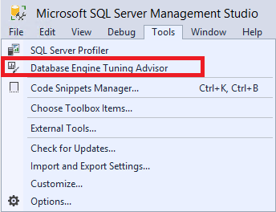
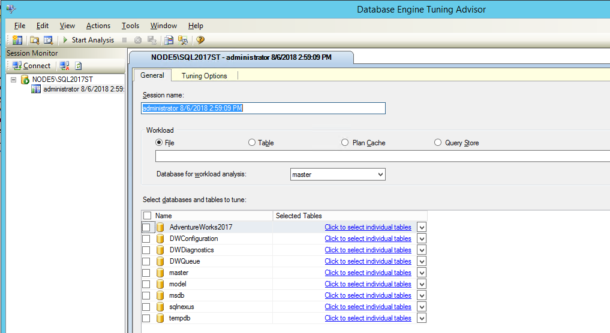
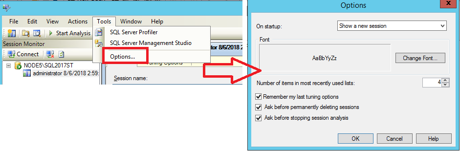

# Lesson 1: Basic Navigation in Database Engine Tuning Advisor (DTA)

 [!INCLUDE [SQL Server](../../includes/applies-to-version/sqlserver.md)]

Database Engine Tuning Advisor provides a graphical user interface (GUI) based way to view tuning sessions and tuning recommendation reports. This lesson shows you how to start the tool and how to configure the display. At the end of this lesson, you will know the different ways you can start the tool and how to configure its display to support the tuning tasks that you regularly perform.  

## Prerequisites 

To complete this tutorial, you need SQL Server Management Studio, access to a server that's running SQL Server, and an AdventureWorks database.

- Install [SQL Server Management Studio.](../../ssms/download-sql-server-management-studio-ssms.md)
- Install [SQL Server 2017 Developer Edition.](https://www.microsoft.com/sql-server/sql-server-downloads)
- Download [AdventureWorks2017 sample databases.](../../samples/adventureworks-install-configure.md)

Instructions for restoring databases in SSMS are here: [Restore a database.](../../relational-databases/backup-restore/restore-a-database-backup-using-ssms.md)

  >[!NOTE]
  > This tutorial is meant for a user familiar with using SQL Server Management Studio and basic database administration tasks. 
  

## Launch Database Tuning Advisor 
To begin, open the Database Engine Tuning Advisor (DTA) graphical user interface (GUI). On first use, a member of the **sysadmin** fixed server role must launch Database Engine Tuning Advisor to initialize the application. After initialization, members of the **db_owner** fixed database role can use Database Engine Tuning Advisor to tune databases that they own. For more information about initializing Database Engine Tuning Advisor, see [Start and Use the Database Engine Tuning Advisor](../../relational-databases/performance/start-and-use-the-database-engine-tuning-advisor.md).  
  
1. Start SQL Server Management Studio (SSMS). On the Windows **Start Menu**, point to **All Programs** and locate **SQL Server Management Studio**. 
2. Once SSMS is open, select the **Tools** menu and select **Database Tuning Advisor**. 

  

3. Database Tuning Advisor launches, and opens the **Connect to Server** dialog box. Verify the default settings, and then select **Connect** to connect to your SQL Server.  
  
By default, Database Engine Tuning Advisor opens to the configuration in the following illustration:  
  

  
> [!NOTE]  
> The **Session Monitor** tab displays the session name, which is the name of the connected user and current date. 
  
Two main panes are displayed in the Database Engine Tuning Advisor GUI when it is first opened.  
  
-   The left pane contains the Session Monitor, which lists all tuning sessions that have been performed on this [!INCLUDE[msCoName](../../includes/msconame-md.md)] [!INCLUDE[ssNoVersion](../../includes/ssnoversion-md.md)] instance. When you open Database Engine Tuning Advisor, it displays a new session at the top of the pane. You can name this session in the adjacent pane. Initially, only a default session is listed. This is the default session that Database Engine Tuning Advisor automatically creates for you. After you have tuned databases, all tuning sessions for the [!INCLUDE[ssNoVersion](../../includes/ssnoversion-md.md)] instance to which you are connected are listed below the new session. You can right-click a tuning session to rename it, close it, delete it, or clone it. If you right-click in the list you can sort the sessions by name, status, or creation time, or create a new session. In the bottom section of this pane, details of the selected tuning session are displayed. You can choose to display the details organized into categories with the **Categorized** button, or you can display them in an alphabetized list by using the **Alphabetical** button. You can also hide Session Monitor by dragging the right pane border to the left side of the window. To view it again, drag the pane border back to the right. Session Monitor enables you to view previous tuning sessions, or to use them to create new sessions with similar definitions. You can also use Session Monitor to evaluate tuning recommendations. For more information, see [View and Work with the Output from the Database Engine Tuning Advisor](../../relational-databases/performance/view-and-work-with-the-output-from-the-database-engine-tuning-advisor.md). Use the **Back** button on your browser to return to this tutorial.  
  
-   The right pane contains the **General** and the **Tuning Options** tabs. This is where you can define your Database Engine Tuning session. In the **General** tab, you type the name for your tuning session, specify the workload file or table to use, and select the databases and tables you want to tune in this session. A workload is a set of [!INCLUDE[tsql](../../includes/tsql-md.md)] statements that execute against a database or databases that you want to tune. Database Engine Tuning Advisor uses trace files, trace tables, [!INCLUDE[tsql](../../includes/tsql-md.md)] scripts, or XML files as workload input when tuning databases. On the **Tuning Options** tab, you can select the physical database design structures (indexes or indexed views) and the partitioning strategy that you want Database Engine Tuning Advisor to consider during its analysis. On this tab, you also can specify the maximum time that Database Engine Tuning Advisor takes to tune a workload. By default, Database Engine Tuning Advisor will tune a workload for one hour.  
  
> [!NOTE]
> Database Engine Tuning Advisor can take XML files as input when a [!INCLUDE[tsql](../../includes/tsql-md.md)] script is imported from [!INCLUDE[msCoName](../../includes/msconame-md.md)] [!INCLUDE[ssManStudioFull](../../includes/ssmanstudiofull-md.md)] Query Editor. For more information, see the section on launching Database Engine Tuning Advisor from the [!INCLUDE[ssManStudioFull](../../includes/ssmanstudiofull-md.md)] Query Editor in [Start and Use the Database Engine Tuning Advisor](../../relational-databases/performance/start-and-use-the-database-engine-tuning-advisor.md).  
  
## Configure tool options and layout 

1.  On the **Tools** menu, click **Options**.  

    
  
2.  In the **Options** dialog box, view the following options:  
  
    -   Expand the **On startup** list to view what Database Engine Tuning Advisor can display when it is started. By default, **Show a new session** is selected.  
  
    -   Click **Change Font** to see what fonts you can choose for the lists of databases and tables on the **General** tab. The fonts you choose for this option also are used in Database Engine Tuning Advisor recommendation grids and reports after you have performed tuning. By default, Database Engine Tuning Advisor uses system fonts.  
  
    -   The **Number of items in most recently used lists** can be set between **1** and **10**. This sets the maximum number of items in the lists displayed by clicking **Recent Sessions** or **Recent Files** on the **File** menu. By default, this option is set to **4**.  
  
    -   When **Remember my last tuning options** is checked, by default Database Engine Tuning Advisor uses the tuning options you specified for your last tuning session for the next tuning session. Clear this check box to use Database Engine Tuning Advisor tuning option defaults. By default, this option is selected.  
  
    -   By default, **Ask before permanently deleting sessions** is checked to avoid accidentally deleting tuning sessions.  
  
    -   By default, **Ask before stopping session analysis** is checked to avoid accidentally stopping a tuning session before Database Engine Tuning Advisor has finished analyzing a workload.  
  
## Next Lesson  
[Lesson 2: Using Database Engine Tuning Advisor](../../tools/dta/lesson-2-using-database-engine-tuning-advisor.md)  
  
  
