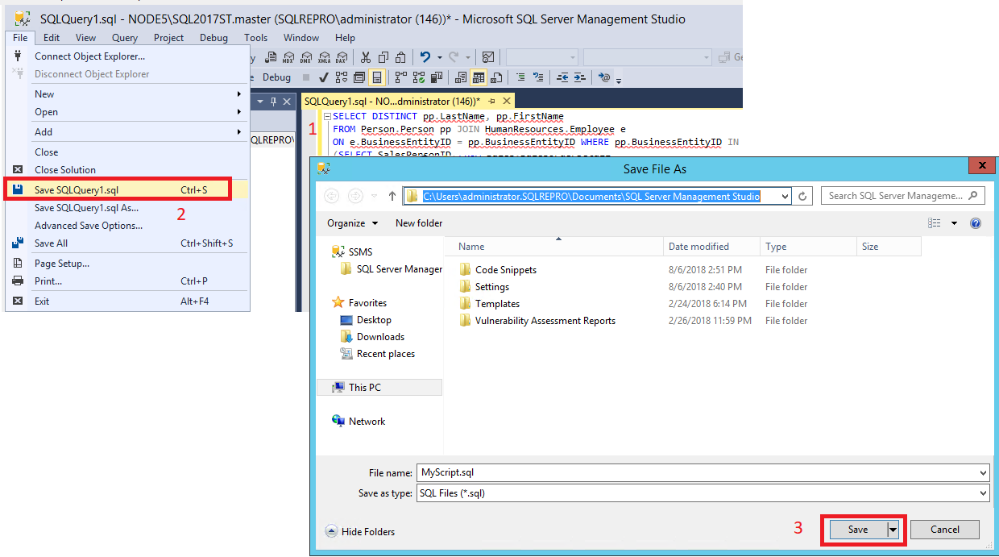
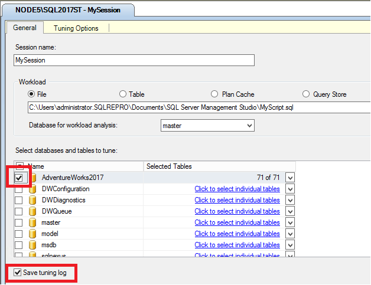
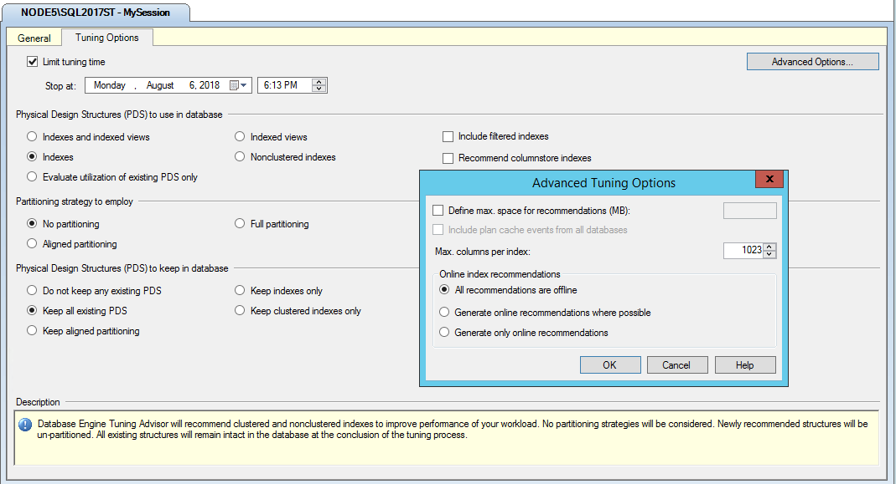
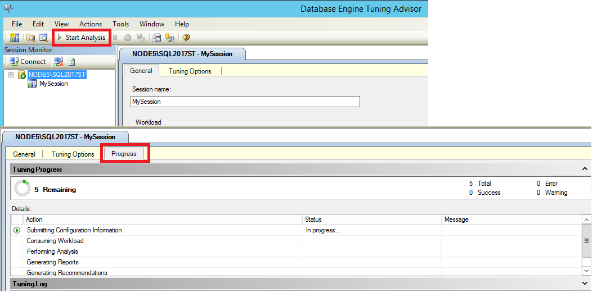
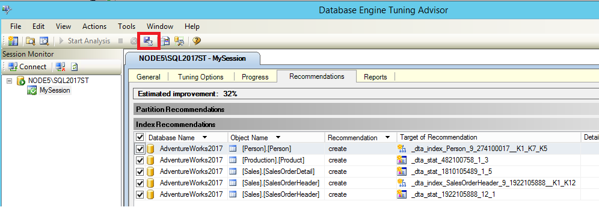
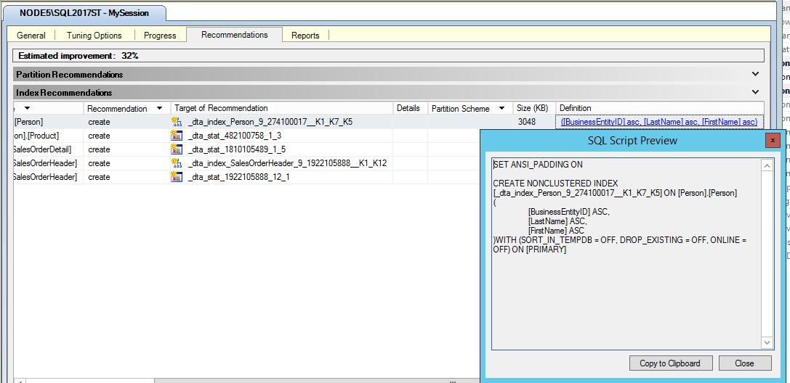
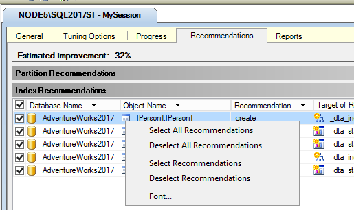
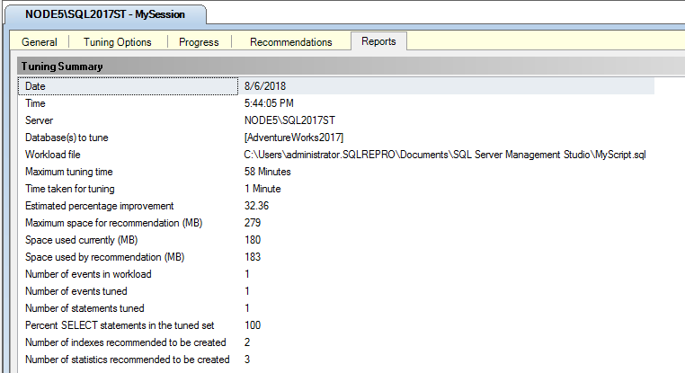
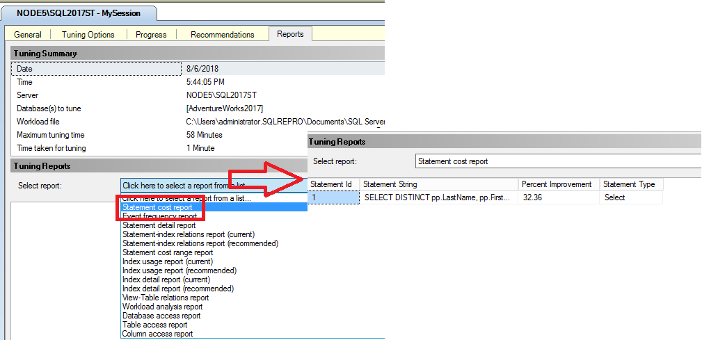

# Lesson 2: Using Database Engine Tuning Advisor

 [!INCLUDE [SQL Server](../../includes/applies-to-version/sqlserver.md)]

Database Engine Tuning Advisor enables you to tune databases, manage tuning sessions, and view tuning recommendations. Users with advanced knowledge of physical design structures can use this tool to perform exploratory database tuning analysis. Database tuning novices can also use the tool to find the best configuration of physical design structures for the workloads they tune. This lesson provides basic practice for database administrators who are new to the Database Engine Tuning Advisor graphical user interface and for system administrators who may not have extensive knowledge of physical design structures.  

## Prerequisites 

To complete this tutorial, you need SQL Server Management Studio, access to a server that's running SQL Server, and an AdventureWorks database.

- Install [SQL Server Management Studio.](../../ssms/download-sql-server-management-studio-ssms.md)
- Install [SQL Server 2017 Developer Edition.](https://www.microsoft.com/sql-server/sql-server-downloads)
- Download [AdventureWorks2017 sample database.](../../samples/adventureworks-install-configure.md)


Instructions for restoring databases in SSMS are here: [Restore a database.](../../relational-databases/backup-restore/restore-a-database-backup-using-ssms.md)

  >[!NOTE]
  > This tutorial is meant for a user familiar with using SQL Server Management Studio and basic database administration tasks. 
  
## Tuning a workload
The Database Engine Tuning Advisor can be used to find the best physical database design for query performance on the databases and tables that you select for tuning.  

1.  Copy a sample [SELECT](../../t-sql/queries/select-examples-transact-sql.md) statement and paste the statement into the Query Editor of [!INCLUDE[ssManStudioFull](../../includes/ssmanstudiofull-md.md)]. Save the file as **MyScript.sql** in a directory where you can easily find it. An example that works against the AdventureWorks2017 database has been provided below.  

 ```sql
 Use [Adventureworks2017]; -- may need to modify database name to match database
 GO
 SELECT DISTINCT pp.LastName, pp.FirstName 
 FROM Person.Person pp JOIN HumanResources.Employee e
 ON e.BusinessEntityID = pp.BusinessEntityID WHERE pp.BusinessEntityID IN 
 (SELECT SalesPersonID 
 FROM Sales.SalesOrderHeader
 WHERE SalesOrderID IN 
 (SELECT SalesOrderID 
 FROM Sales.SalesOrderDetail
 WHERE ProductID IN 
 (SELECT ProductID 
 FROM Production.Product p 
 WHERE ProductNumber = 'BK-M68B-42')));
 GO
 ```

  
  
2.  Start Database Engine Tuning Advisor. Select **Database Tuning Advisor** from the **Tools** menu in SQL Server Management Studio (SSMS).  For more information, see [Launch Database Engine Tuning Advisor](lesson-1-basic-navigation-in-database-engine-tuning-advisor.md#launch-database-tuning-advisor). Connect to your SQL Server in the **Connect to Server** dialog box.  
  
3.  In the **General** tab of the right pane of the Database Engine Tuning Advisor GUI, type **MySession** in **Session name**. 
  
4.  Select **File** for your **Workload**, and select the binoculars icon to **Browse for a workload file**. Locate the **MyScript.sql** file that you saved in Step 1.  

   
  
5.  Select AdventureWorks2017 in the **Database for workload analysis** list, select AdventureWorks2017 in the **Select databases and tables to tune** grid, and selecet  **Save tuning log**. **Database for workload analysis** specifies the first database to which Database Engine Tuning Advisor connects when tuning a workload. After tuning begins, Database Engine Tuning Advisor connects to the databases specified by the `USE DATABASE` statements contained in the workload.  

  
  
6.  Click the **Tuning Options** tab. You will not set any tuning options for this practice, but take a moment to review the default tuning options. Press F1 to view the Help for this tabbed page. Click **Advanced Options** to view additional tuning options. Click **Help** in the **Advanced Tuning Options** dialog box for information about the tuning options that are displayed there. Click **Cancel** to close the **Advanced Tuning Options** dialog box, leaving the default options selected.  

  
  
7.  Click the **Start Analysis** button on the toolbar. While Database Engine Tuning Advisor is analyzing the workload, you can monitor the status on the **Progress** tab. When tuning is complete, the **Recommendations** tab is displayed.  
  
    If you receive an error about the tuning stop date and time, check the **Stop at** time on the main **Tuning Options** tab. Make sure the **Stop at** date and time are greater than the current date and time, and if necessary, change them.  

  

  
8.  After the analysis completes, save your recommendation as a [!INCLUDE[tsql](../../includes/tsql-md.md)] script by clicking **Save Recommendations** on the **Actions** menu. In the **Save As** dialog box, navigate to the directory where you want to save the recommendations script, and type the file name **MyRecommendations**.  

  

## View tuning recommendations
  
1.  On the **Recommendations** tab, use the scroll bar at the bottom of the tabbed page to view all of the **Index Recommendations** columns. Each row represents a database object (indexes or indexed views) that [!INCLUDE[ssDE](../../includes/ssde-md.md)] Tuning Advisor recommends be dropped or created. Scroll to the right-most column and click a **Definition**. [!INCLUDE[ssDE](../../includes/ssde-md.md)] Tuning Advisor displays a **SQL Script Preview** window where you can view the [!INCLUDE[tsql](../../includes/tsql-md.md)] script that creates or drops the database object on that row. Click **Close** to close the preview window.  
  
    If you are having difficulty locating a **Definition** that contains a link, click to clear the **Show existing objects** check box at the bottom of the tabbed page, which will decrease the number of rows displayed. When you clear this checkbox, [!INCLUDE[ssDE](../../includes/ssde-md.md)] Tuning Advisor shows you only the objects for which it has generated a recommendation. Select the **Show existing objects** check box to view all the database objects that currently exist in the [!INCLUDE[ssSampleDBobject](../../includes/sssampledbobject-md.md)] database. Use the scroll bar at the right side of the tabbed page to view all of the objects.

    
  
2.  Right-click the grid in the **Index Recommendations** pane. This right-click menu enables you to select and deselect recommendations. It also enables you to change the font for the grid text.  
 
   
  
3.  On the **Actions** menu, click **Save Recommendations** to save all of the recommendations into one [!INCLUDE[tsql](../../includes/tsql-md.md)] script. Name the script **MySessionRecommendations.sql**.  
  
    Open the MySessionRecommendations.sql script in the Query Editor of [!INCLUDE[ssManStudioFull](../../includes/ssmanstudiofull-md.md)] to view it. You could apply the recommendations to the [!INCLUDE[ssSampleDBobject](../../includes/sssampledbobject-md.md)] sample database by executing the script in the Query Editor, but do not do this. Close the script in Query Editor without running it.  
  
    As an alternative, you could also apply the recommendations by clicking **Apply Recommendations** on the **Actions** menu of [!INCLUDE[ssDE](../../includes/ssde-md.md)] Tuning Advisor, but do not apply these recommendations now in this practice.  
  
4.  If more than one recommendation exists on the **Recommendations** tab, clear some of the rows that list database objects in the **Index Recommendations** grid.  
  
5.  On the **Actions** menu, click **Evaluate Recommendations**. [!INCLUDE[ssDE](../../includes/ssde-md.md)] Tuning Advisor creates a new tuning session where you can evaluate a subset of the original recommendations from MySession.  
  
6.  Type **EvaluateMySession** for your new **Session name**, and click the **Start Analysis** button on the toolbar. You can repeat Steps 2 and 3 for this new tuning session to view its recommendations.  
  
### Summary  
Evaluating a subset of tuning recommendations may be necessary if you find you must change tuning options after you run a session. For example, if you ask [!INCLUDE[ssDE](../../includes/ssde-md.md)] Tuning Advisor to consider indexed views when you specify tuning options for a session, but after the recommendation is generated you decide against using indexed views. You can then use the **Evaluate Recommendations** option on the **Actions** menu to have [!INCLUDE[ssDE](../../includes/ssde-md.md)] Tuning Advisor reevaluate the session without considering indexed views. When you use the **Evaluate Recommendations** option the previously generated recommendations are hypothetically applied to the current physical design to arrive at the physical design for the second tuning session.  
  
More tuning result information can be viewed in the **Reports** tab, which is described in the next task of this lesson.  

## View tuning reports
Although it is useful to view the scripts that can be used to implement the tuning results, Database Engine Tuning Advisor also provides many useful reports that you can view. These reports provide information about the existing physical design structures in the database you are tuning, and about the recommended structures. The tuning reports can be viewed by clicking the **Reports** tab as described in the following practice.


1. Select the **Reports** tab in Database Tuning Advisor. 
2. In the **Tuning Summary** pane, you can view information about this tuning session. Use the scroll bar to view all of the pane contents. Note the **Expected percentage improvement** and the **Space used by recommendation**. It is possible to limit the space used by the recommendation when you set the tuning options. On the **Tuning Options** tab, select **Advanced Options**. Check **Define max. space for recommendations** and specify in megabytes the maximum space a recommendation configuration can use. Use the **Back** button in your help browser to return to this tutorial. 

    
  
3.  In the **Tuning Reports** pane, click **Statement cost report** in the **Select report** list. If you need more space to view the report, drag the **Session Monitor** pane border to the left. Each [!INCLUDE[tsql](../../includes/tsql-md.md)] statement that executes against a table in your database has a performance cost associated with it. This performance cost can be reduced by creating effective indexes on frequently accessed columns in a table. This report shows the estimated percentage improvement between the original cost of executing a statement in the workload and the cost if the tuning recommendation is implemented. Note that the amount of information contained in the report is based on the length and complexity of the workload.  

    
  
4.  Right-click the **Statement cost report** pane in the grid area, and click **Export to File**. Save the report as **MyReport**. An .xml extension is automatically appended to the file name. You can open MyReport.xml in your favorite XML editor or in [!INCLUDE[ssManStudioFull](../../includes/ssmanstudiofull-md.md)] to view the report contents.  
  
5.  Return to the **Reports** tab of Database Engine Tuning Advisor, and right-click the **Statement cost report** again. Review the other options that are available. Note that you can change the font for the report you are viewing. Changing the font here also changes it on the other tabbed pages.  
  
6.  Click other reports in the **Select report** list to familiarize yourself with them.  
  
### Summary  
You have now explored the **Reports** tab of the Database Engine Tuning Advisor GUI for the MySession tuning session. You can use these same steps to explore the reports that were generated for the EvaluateMySession tuning session. Double-click **EvaluateMySession** in the **Session Monitor** pane to begin.  


 ## Next Lesson  
[Lesson 3: Using the DTA command prompt utility](../../tools/dta/lesson-3-using-the-dta-command-prompt-utility.md)  
   
  
