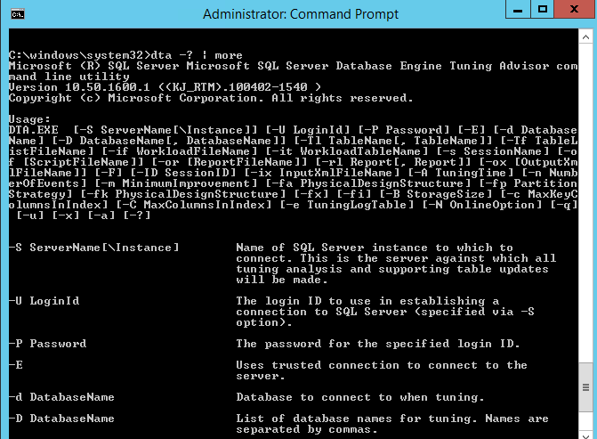
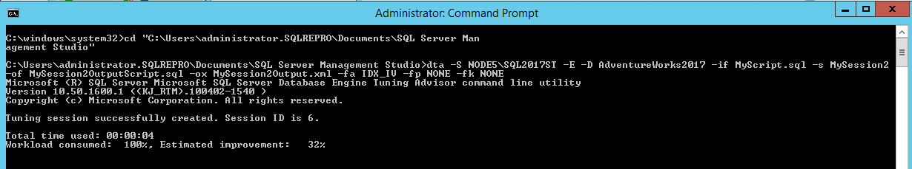

# Lesson 3: Using the dta Command Prompt Utility
[!INCLUDE[appliesto-ss-xxxx-xxxx-xxx-md](../../includes/appliesto-ss-xxxx-xxxx-xxx-md.md)]
The **dta** command-prompt utility offers functionality in addition to that provided by the Database Engine Tuning Advisor.  
  
You can use your favorite XML tools to create input files for the utility by using the Database Engine Tuning Advisor XML schema. This schema is installed when you install [!INCLUDE[ssNoVersion](../../includes/ssnoversion-md.md)] and can be found at: C:\Program Files (x86)\Microsoft SQL Server\110\Tools\Binn\schemas\sqlserver\2004\07\dta\dtaschema.xsd.  
  
The Database Engine Tuning Advisor XML schema is also available online at [this Microsoft Web site](https://go.microsoft.com/fwlink/?linkid=43100&clcid=0x409).  
  
The Database Engine Tuning Advisor XML schema provides more flexibility to set tuning options. For example, it enables you to perform "what-if" analysis. "What-if" analysis involves specifying a set of existing and hypothetical physical design structures for the database you want to tune, and then analyzing it with the Database Engine Tuning Advisor to find out whether this hypothetical physical design will improve query processing performance. This type of analysis provides the advantage of evaluating the new configuration without incurring the overhead of actually implementing it. If your hypothetical physical design does not provide the performance improvements you want, it is easy to change it and analyze it again until you reach the configuration that produces the results you need.  
  
In addition, using the Database Engine Tuning Advisor XML schema and the **dta** command-prompt utility, you can incorporate Database Engine Tuning Advisor functionality into scripts and use it with other database design tools.  
  
Using the XML input functionality of Database Engine Tuning Advisor is beyond the scope of this lesson.  
  
This task guides you through starting the **dta** utility, viewing its Help, and then using it to tune a workload from the command prompt. It uses the workload, MyScript.sql, which you created for the Database Engine Tuning Advisor graphical user interface (GUI) practice [Tuning a Workload](lesson-2-using-database-engine-tuning-advisor.md#tuning-a-workload)  
  
The tutorial uses the AdventureWorks2017 sample database. For security reasons, the sample databases are not installed by default. To install the sample databases, see [Installing SQL Server Samples and Sample Databases](https://docs.microsoft.com/sql/samples/adventureworks-install-configure).  
  
The following tasks guide you through opening a command prompt, starting the **dta** command prompt utility, viewing its syntax Help, and tuning a simple workload, MyScript.sql, which you created in [Tuning a Workload](../../tools/dta/lesson-1-1-tuning-a-workload.md).  

## Prerequisites 

To complete this tutorial, you need SQL Server Management Studio, access to a server that's running SQL Server, and an AdventureWorks database.

- Install [SQL Server 2017 Developer Edition.](https://www.microsoft.com/sql-server/sql-server-downloads)
- Download [AdventureWorks2017 sample database.](https://docs.microsoft.com/sql/samples/adventureworks-install-configure)


Instructions for restoring databases in SSMS are here: [Restore a database.](https://docs.microsoft.com/sql/relational-databases/backup-restore/restore-a-database-backup-using-ssms?view=sql-server-2017)

  >[!NOTE]
  > This tutorial is meant for a user familiar with using SQL Server Management Studio and basic database administration tasks. 

## Access DTA command prompt utility help menu
  
  
1.  On the **Start** menu, point to **All Programs**, point to **Accessories**, and then click **Command Prompt**.  
  
2.  At the command prompt, type the following, and press ENTER:  
  
    ```  
    dta -? | more  
    ```  
  
    The `| more` part of this command is optional. However, using it enables you to page through the syntax help for the utility. Press ENTER to advance the help text by the line, or press the SPACEBAR to advance it by the page.  

  

## Tune simple workload using the DTA command prompt utility  


  
1.  At the command prompt, navigate to the directory where you have stored the MyScript.sql file.  
  
2.  At the command prompt, type the following, and press ENTER to run the command and start the tuning session (note that the utility is case-sensitive when it parses commands):  
  
    ```  
    dta -S YourServerName\YourSQLServerInstanceName -E -D AdventureWorks2012 -if MyScript.sql -s MySession2 -of MySession2OutputScript.sql -ox MySession2Output.xml -fa IDX_IV -fp NONE -fk NONE  
    ```  
  
    where `-S` specifies the name of your server and the [!INCLUDE[ssNoVersion](../../includes/ssnoversion-md.md)] instance where the [!INCLUDE[ssSampleDBobject](../../includes/sssampledbobject-md.md)] database is installed. The setting `-E` specifies that you want to use a trusted connection to the instance, which is appropriate if you are connecting with a Windows domain account. The setting `-D` specifies the database that you want to tune, `-if` specifies the workload file, `-s` specifies the session name, `-of` specifies the file to which you want the tool to write the [!INCLUDE[tsql](../../includes/tsql-md.md)] recommendations script, and `-ox` specifies the file to which you want the tool to write the recommendations in XML format. The last three switches specify tuning options as follows: `-fa IDX_IV` specifies that Database Engine Tuning Advisor should only consider adding indexes (both clustered and nonclustered) and indexed views; `-fp NONE` specifies that no partition strategy should be considered during analysis; and `-fk NONE` specifies that no existing physical design structures in the database must be kept when Database Engine Tuning Advisor makes its recommendations.  

  
  
3.  After Database Engine Tuning Advisor finishes tuning the workload, it displays a message indicating that your tuning session completed successfully. You can view the tuning results, by using [!INCLUDE[ssManStudioFull](../../includes/ssmanstudiofull-md.md)] to open the files MySession2OutputScript.sql and MySession2Output.xml. Alternatively, you can also open the MySession2 tuning session in the Database Engine Tuning Advisor GUI and view its recommendations and reports in the same way that you did in [Viewing Tuning Recommendations](../../tools/dta/lesson-1-2-viewing-tuning-recommendations.md) and [Viewing Tuning Reports](../../tools/dta/lesson-1-3-viewing-tuning-reports.md).  
  
 
## After You Finish This Tutorial  
After you finish the lessons in this tutorial, refer to the following topics for more information about Database Engine Tuning Advisor:  
  
-   [Database Engine Tuning Advisor](../../relational-databases/performance/database-engine-tuning-advisor.md) for descriptions of how to perform tasks with this tool. 
-   [dta Utility](../../tools/dta/dta-utility.md) for reference material on the command prompt utility and the optional XML file you can use to control the operation of the utility.  
  
To return to the start of the tutorial, see [Tutorial: Database Engine Tuning Advisor](../../tools/dta/tutorial-database-engine-tuning-advisor.md).  
  
## See Also  
[Database Engine Tutorials](../../relational-databases/database-engine-tutorials.md)  
    
