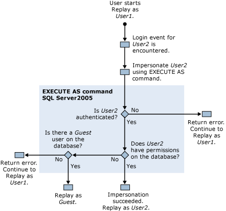

# Permissions Required to Run SQL Server Profiler
[!INCLUDE[appliesto-ss-xxxx-xxxx-xxx-md](../../includes/appliesto-ss-xxxx-xxxx-xxx-md.md)]
  By default, running [!INCLUDE[ssSqlProfiler](../../includes/sssqlprofiler-md.md)] requires the same user permissions as the Transact-SQL stored procedures that are used to create traces. To run [!INCLUDE[ssSqlProfiler](../../includes/sssqlprofiler-md.md)], users must be granted the ALTER TRACE permission. For more information, see [GRANT Server Permissions &#40;Transact-SQL&#41;](../../t-sql/statements/grant-server-permissions-transact-sql.md).  
  
> [!IMPORTANT]  
>  Users who have the SHOWPLAN, the ALTER TRACE, or the VIEW SERVER STATE permission can view queries that are captured in Showplan output. These queries may contain sensitive information such as passwords. Therefore, we recommend that you only grant these permissions to users who are authorized to view sensitive information, such as members of the db_owner fixed database role, or members of the sysadmin fixed server role. Additionally, we recommend that you only save Showplan files or trace files that contain Showplan-related events to a location that uses the NTFS file system, and that you restrict access to users who are authorized to view sensitive information.  
  
## Permissions Used to Replay Traces  
 Replaying traces also requires that the user who is replaying the trace have the ALTER TRACE permission.  
  
 However, during replay, [!INCLUDE[ssSqlProfiler](../../includes/sssqlprofiler-md.md)] uses the EXECUTE AS command if an Audit Login event is encountered in the trace that is being replayed. [!INCLUDE[ssSqlProfiler](../../includes/sssqlprofiler-md.md)] uses the EXECUTE AS command to impersonate the user who is associated with the login event.  
  
 If [!INCLUDE[ssSqlProfiler](../../includes/sssqlprofiler-md.md)] encounters a login event in a trace that is being replayed, the following permission checks are performed:  
  
1.  User1, who has the ALTER TRACE permission, starts replaying a trace.  
  
2.  A login event for User2 is encountered in the replayed trace.  
  
3.  [!INCLUDE[ssSqlProfiler](../../includes/sssqlprofiler-md.md)] uses the EXECUTE AS command to impersonate User2.  
  
4.  [!INCLUDE[ssNoVersion](../../includes/ssnoversion-md.md)] attempts to authenticate User2, and depending on the results, one of the following occurs:  
  
    1.  If User2 cannot be authenticated, [!INCLUDE[ssSqlProfiler](../../includes/sssqlprofiler-md.md)] returns an error, and continues replaying the trace as User1.  
  
    2.  If User2 is successfully authenticated, replaying the trace as User2 continues.  
  
5.  Permissions for User2 are checked on the target database, and depending on the results, one of the following occurs:  
  
    1.  If User2 has permissions on the target database, impersonation has succeeded, and the trace is replayed as User2.  
  
    2.  If User2 does not have permissions on the target database, the server checks for a Guest user on that database.  
  
6.  Existence of a Guest user is checked on the target database, and depending on the results, one of the following occurs:  
  
    1.  If a Guest account exists, the trace is replayed as the Guest account.  
  
    2.  If no Guest account exists on the target database, an error is returned and the trace is replayed as User1.  
  
 The following diagram shows this process of checking permission when replaying traces:  
  
   
  
## See Also  
 [SQL Server Profiler Stored Procedures &#40;Transact-SQL&#41;](../../relational-databases/system-stored-procedures/sql-server-profiler-stored-procedures-transact-sql.md)   
 [Replay Traces](../../tools/sql-server-profiler/replay-traces.md)   
 [Create a Trace &#40;SQL Server Profiler&#41;](../../tools/sql-server-profiler/create-a-trace-sql-server-profiler.md)   
 [Replay a Trace Table &#40;SQL Server Profiler&#41;](../../tools/sql-server-profiler/replay-a-trace-table-sql-server-profiler.md)   
 [Replay a Trace File &#40;SQL Server Profiler&#41;](../../tools/sql-server-profiler/replay-a-trace-file-sql-server-profiler.md)  
  
  
