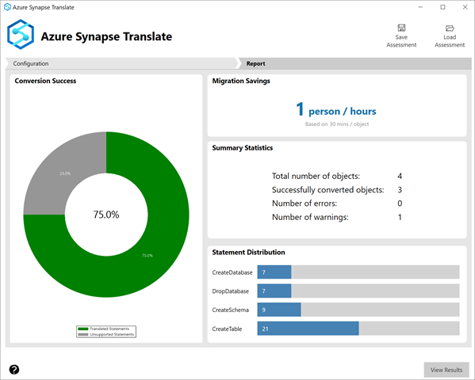
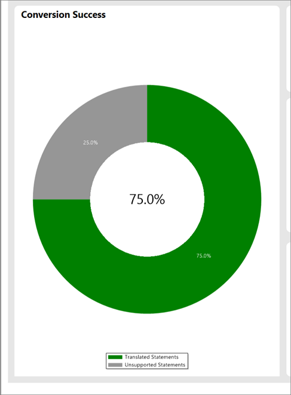
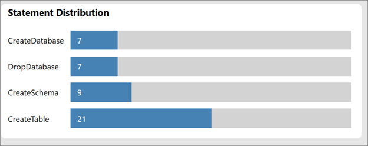

# Report Generation for Azure Synapse Pathway
[!INCLUDE [Azure Synapse Analytics](../../includes/applies-to-version/asa.md)]

Azure Synapse Pathway provides a comprehensive report of the number of scripts that were successfully translated. The report also shows the number of errors and warnings on statements that didn't get translated.

## Generate Report

When you select **Translate**, you're presented with a report like below:

## Report Summary

The Conversion Success will show the percentage of scripts translated successfully.

The Statement Distribution section details the number of DDL and DML statements that have been translated, including the number of schemas, tables, and databases created.

The migration savings are calculated based on the number  and complexity, simple, high, or medium, of objects translated. Synapse Pathway assumes 30 mins of manual effort for each object translation.

## Next steps

[Download Azure Synapse Pathway](synapse-pathway-download.md)