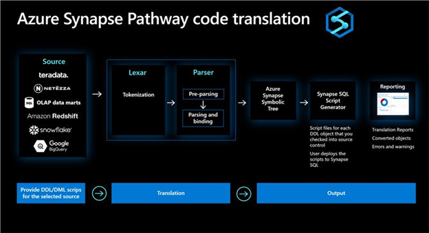

<!--Remove all the comments in this template before you sign-off or merge to the 
main branch.
-->

<!--
This template provides the basic structure of a concept article.
See the [concept guidance](contribute-how-write-concept.md) in the contributor guide.

To provide feedback on this template contact 
[the templates workgroup](mailto:templateswg@microsoft.com).
-->

<!-- 1. H1
Required. Set expectations for what the content covers, so customers know the 
content meets their needs. Should NOT begin with a verb.
-->

# Azure Synapse Pathway behind the scenes

Azure Synapse Pathway’s goal is to preserve the functional intent of the original code while optimizing for the modern Synapse SQL data warehouse. Synapse Pathway uses a three-stage process for translating SQL code from a source system to Azure Synapse SQL. 

Each of the stages preserves and augments the knowledge of the source with original location information including source-specific metadata to ensure the highest quality in translation.
 

## Stage 1 – Lexing and Parsing
SQL Language parsing is a problem that has been solved many times over. There are many commercial and open-source parsers that help with the underlying process of taking a source statement, breaking it down into logical tokens and then executing against a set or parser rules to ensure language consistency. 

Synapse Pathway defines source grammars that allow the tool to identify and process the SQL input into an augmented Abstract Syntax Tree (AST) that is used in further processing. 

## Stage 2 - Augmented Abstract Syntax Tree (AST)
Synapse Pathway defines a common representation of all objects in an augment Abstract Syntax Tree (AST). The Synapse Pathway AST includes additional statements or fragment metadata that is used to make the proper decision when translating code between the two systems. 

By not just tracking that a token is a function but rather the source system type requirement, the script generation components can make smarter decisions about translating to Synapse SQL.

For example, the source function for the absolute function is defined as:
```sql  
ABS( float_expression ) 
```
Azure Synapse SQL defines the absolute function as:
```sql  
ABS ( numeric_expression )  
```
In this simple case, Synapse Pathway understands that the conversion in Synapse SQL from float to numeric is an implicit [conversion](..https://docs.microsoft.com/en-us/sql/t-sql/functions/cast-and-convert-transact-sql?view=sql-server-ver15#implicit-conversions) and requires no further type casting. Simple, clean, and effective code translation. 

Keeping this meta-information about the source statements and fragments helps the structural differences between platforms – conversions in opt-out logic for search condition predicates in a WHERE clause for example.


## Stage 3 - Syntax Generation

The last stage of the process is to generate syntax for Synapse SQL. Using the AST structure generated from the source files, Synapse Pathway writes each DDL object to an individual file. The syntax generators use in-depth knowledge of the target platform to optimize statements.

For example, a common pattern that is seen in data loading scenarios is to first delete all of the contents in a staging table and then load the data from another staging table in an INSERT/SELECT fashion.
```sql  
DELETE staging.table1 ALL;
INSERT INTO staging.table1…FROM staging.table2;
```
Synapse SQL has an optimized path for this scenario – a [CREATE TABLE AS SELECT](https://docs.microsoft.com/azure/synapse-analytics/sql-data-warehouse/sql-data-warehouse-develop-ctas). The CTAS statement is a batched based operation and minimally logged driving performance up by using all the compute infrastructure available. Without this insight about Synapse SQL, tools often produce a truncate and INSERT/SELECT statement.
```sql  
TRUNCATE TABLE staging.table1;
INSERT INTO staging.table1…FROM staging.table2;
```
While not bad,this can be optimized to a DROP TABLE and CTAS to provide better performance.
```sql  
DROP TABLE staging.table1;
CREATE TABLE staging.table1
WITH
(
    -- Derived from the original table definition 
    DISTRIBUTION = HASH(column1),
    -- Derived from the original table definition
    CLUSTERED COLUMNSTORE INDEX
)
AS SELECT  * FROM staging.table2;
```
## Next steps
<!-- Add a context sentence for the following links -->
- [Download Azure Synapse Pathway](synapse-pathway-download.md)
- [FAQ](pathway-faq.md)

<!--
Remove all the comments in this template before you sign-off or merge to the 
main branch.
-->