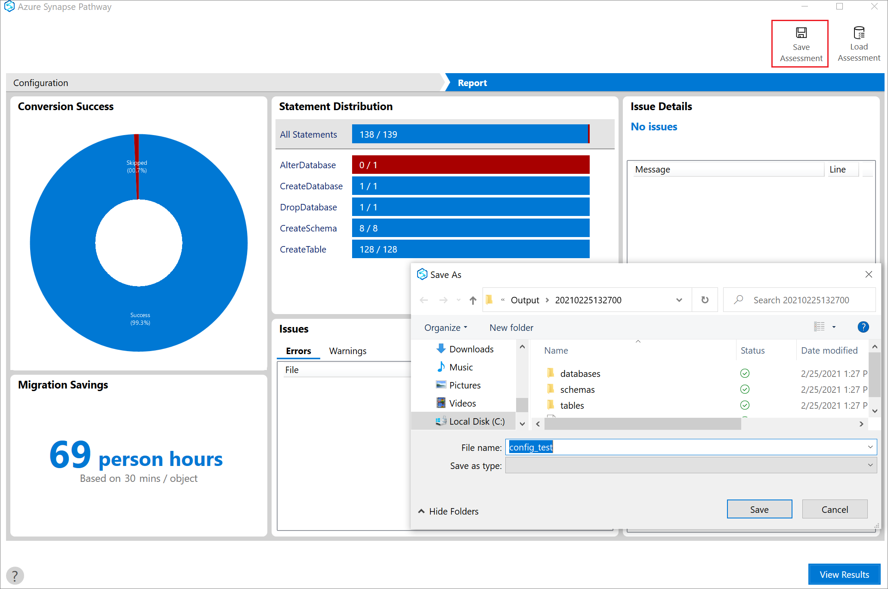
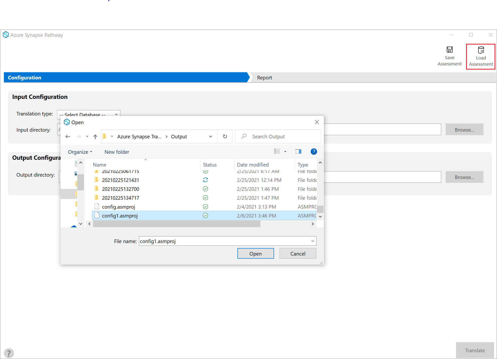

# Save and load assessments with Azure Synapse Pathway
[!INCLUDE [Azure Synapse Analytics](../../includes/applies-to-version/asa.md)]

The following step-by-step instructions demonstrate how to save and upload a data warehouse assessment from a file using Azure Synapse Pathway.

In this tutorial, you learn how to:

> [!div class="checklist"]
> * Save an assessment to a file
> * Load the assessment from a file

## Prerequisites

To complete this tutorial, make sure you've installed [Azure Synapse Pathway](synapse-pathway-download.md) See [Azure Synapse Pathway overview](azure-synapse-pathway-overview.md) to learn more about the tool.

## Saving an assessment to a file

1. Once you have run the translation, you should see the report summarizing the code translation 
 
1. Select the **Save assessment** button, specify the name of the file, and then select **Save**.

1. A .asmprj file is created at the specified destination.

## Loading an assessment from a file

1. To open the same assessment, select **Load assessment** and provide the .asmprj file name

1. The source, input, and output folders will be populated based on selected assessment.

1. Select **Translate** to rerun the code translation again

## Next steps

> [!div class="nextstepaction"]
> [Report Generation](report-generation.md)
