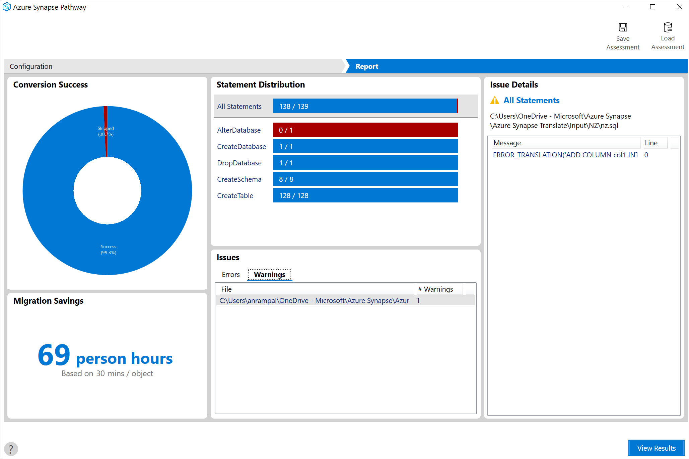
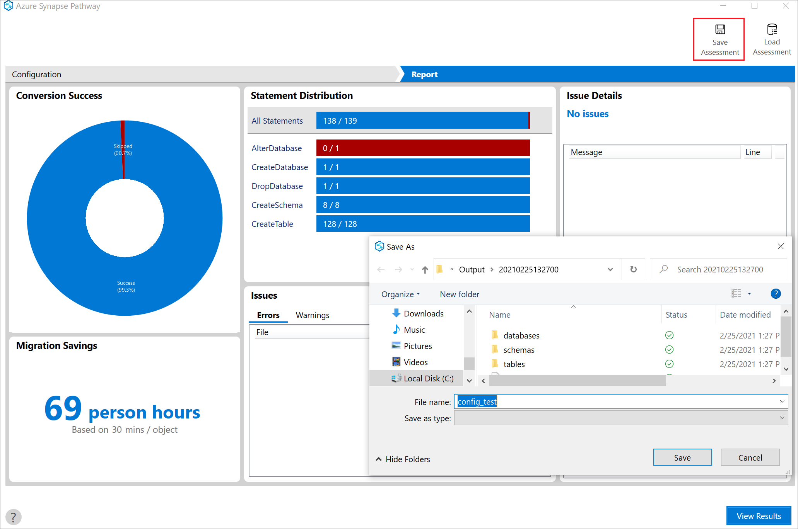
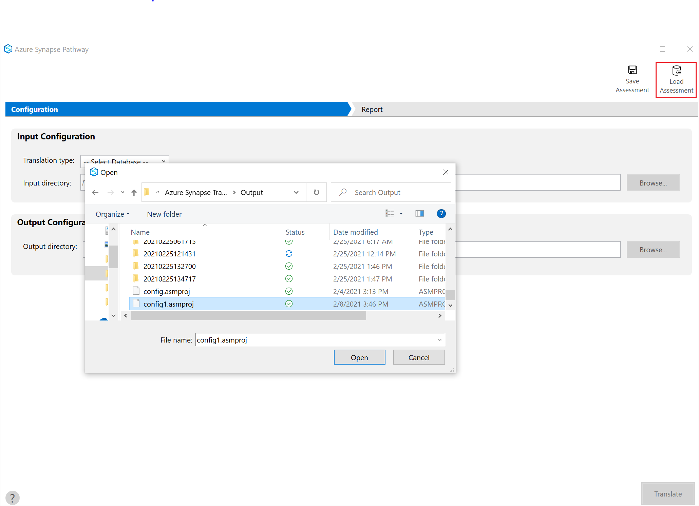
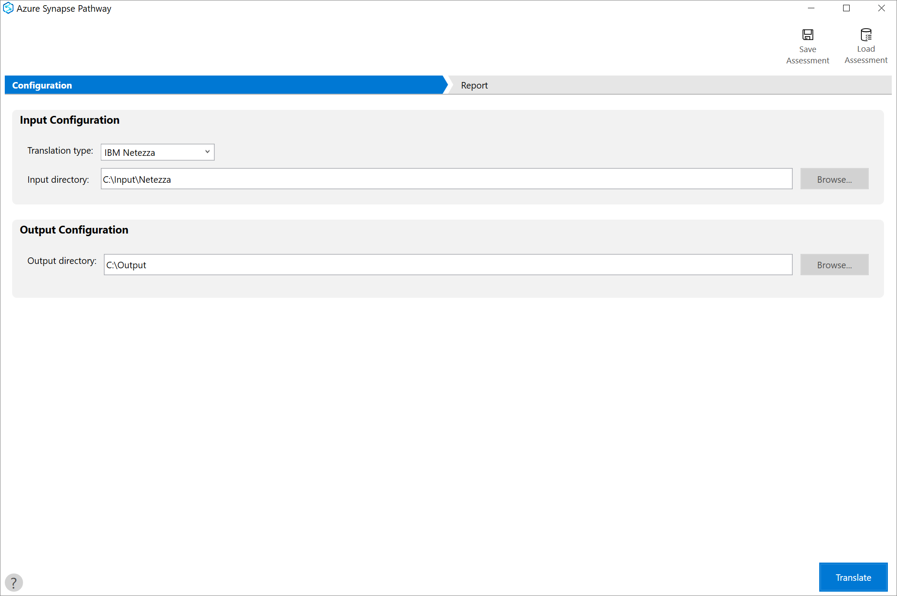

# Save and load assessments with Azure Synapse Pathway
[!INCLUDE [Azure Synapse Analytics](../../includes/applies-to-version/asa.md)]

The following step-by-step instructions demonstrate how to save and upload a data warehouse assessment from a file by using Azure Synapse Pathway.

In this tutorial, you learn how to:

> [!div class="checklist"]
> * Save an assessment to a file
> * Load the assessment from a file

## Prerequisites

To complete this tutorial, make sure you install [Azure Synapse Pathway](synapse-pathway-download.md). See [Azure Synapse Pathway overview](azure-synapse-pathway-overview.md) to learn more about the tool.

## Save an assessment to a file

1. After you run the translation, you see the report summarizing the code translation. 
 
1. Select **Save assessment**, enter a name for the file, and then select **Save**.

1. The process creates an `.asmprj` file at the specified destination.

## Loading an assessment from a file

1. Select **Load assessment** and enter the `.asmprj` file name to open the assessment.

1. The source, input, and output folders populate based on the selected assessment.

1. Select **Translate** to run the code translation again.

## Next steps

> [!div class="nextstepaction"]
> [Report Generation](report-generation.md)
