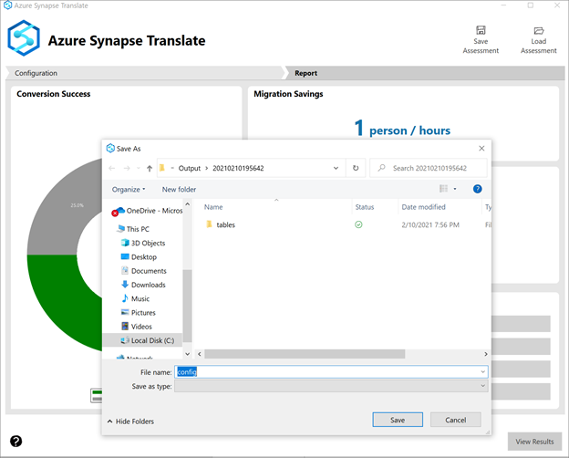
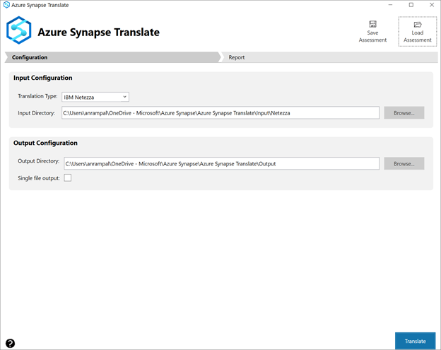

# Save and load assessments with Azure Synapse Pathway 

The following step-by-step instructions show you how to use Azure Synapse Pathway, version 1.0 or later, to save a data warehouse assessment to a file. You'll then be shown how to load the assessment from a file.

In this tutorial, you learn how to:

> [!div class="checklist"]
> * Saving an assessment to a file
> * Loading the assessment

## Prerequisites

To complete this tutorial, make sure you've installed [Azure Synapse Pathway]( If you need an introduction, see [Azure Synapse Pathway overview]azure-synapse-pathway-overview).

## Saving an assessment to a file

1. After entering the information on the source type, the location of source file, and target destination, select **Translate**.

>[!Note]
>For more information about how to run a translation in Azure Synapse Pathway, see the article Perform a SQL Server migration assessment with Data Migration Assistant.

2. You will see the report summarizing the code translation that was done.
 
3. Select the **Save assessment** button, specify the name of the file, and then select **Save**.

4. A .asmprj file gets created at the specified destination

## Loading an assessment from a file

1. To open the same assessment, select **Load assessment** and provide the .asmprj file name

1. The source, input, and output folders will be populated based on selected assessment.

1. Select **Translate** to rerun the code translation again

## Next steps

> [!div class="nextstepaction"]
> [Report Generation](report-generation.md)
