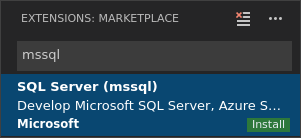

# mssql extension for Visual Studio Code

This article introduces the **mssql** extension for Visual Studio Code (VS Code) to work with databases in SQL Server on Windows, macOS, and Linux, as well as Azure SQL Database and Azure SQL Managed Instance. The [mssql extension for Visual Studio Code](https://aka.ms/mssql-marketplace) provides querying capabilities for Azure SQL and SQL Server as well as additional features for developers with SQL Projects and SQL bindings for Azure Functions.. The mssql extension for VS Code includes the [SQL Database Projects extension](../../azure-data-studio/extensions/sql-database-project-extension.md).

## Functionality overview

The following functionality is available in the mssql extension for VS Code:

- [Connect](sql-server-develop-use-vscode.md) to Microsoft SQL Server, Azure SQL Database, Azure SQL Managed Instance and Azure Synapse Analytics dedicated SQL pools. 
- Create and manage connection profiles and most-recently used connections.
- Write T-SQL script with IntelliSense, Go to Definition, T-SQL snippets, syntax colorizations, T-SQL error validations and GO batch separator.
- Execute your scripts and view results in a simple-to-use grid.
- Access executed [query history](mssql-query-history.md). 
- Save results to json or csv file format and view in the editor.
- Customizable extension options including command shortcuts and more.
- Create Azure Functions with [SQL binding](create-azure-function-with-mssql.md).

### Compare Azure Data Studio and the mssql extension

Both [Azure Data Studio](../../azure-data-studio/what-is-azure-data-studio.md) and the mssql extension for VS Code are available for Windows, macOS, and Linux. 

Benefits of working with Azure SQL and SQL Server in VS Code include:

- Single code editor for your SQL and other code (such as C#, Python, JavaScript, Java, PHP, and Go).
- Broad extension marketplace with extensions for remote development, Docker, and more.
- Available for use in GitHub Codespaces.

You might consider using Azure Data Studio in addition to the mssql extension for VS Code if you would benefit from these capabilities:

- Quickly create charts and visualize result sets
- Graphical table designer and query plans. 
- Schema comparison for databases, SQL projects, and dacpacs. 
- Extensions for SQL Agent, SQL Profiler, and Flat File Import. 
- SQL and .NET Interactive notebooks. 

## Install the mssql extension in VS Code

To install the mssql extension in VS Code, follow these steps: 

1. [Download and install Visual Studio Code](https://code.visualstudio.com/) on your machine.

1. In Visual Studio Code, select **View** > **Command Palette**, or press **Ctrl**+**Shift**+**P**, or press **F1** to open the **Command Palette**.

2. In the **Command Palette**, select **Extensions: Install Extensions** from the dropdown.

3. In the **Extensions** pane, type *mssql*.

4. Select the **SQL Server (mssql)** extension, and then select **Install**.

   

5. After the installation completes, select **Reload** to enable the extension.

## Supported operating systems

The mssql extension for VS Code is supported on Windows, macOS, and Linux.  The following versions are supported:

- Windows: 7 (with SP1), 8, 8.1, 10, 11
- Windows Server: 2016, 2019, 2022
- macOS: 10.12+, 11, 12
- Linux: Debian 9+, RHEL 7+, Ubuntu 18.04+

## SQL Tools Service

The mssql extension automatically installs the [SQL Tools Service](https://github.com/microsoft/sqltoolsservice), an open source .NET-based API that provides services to several SQL tools, including [Azure Data Studio](../../azure-data-studio/what-is-azure-data-studio.md) and the mssql extension for VS Code. The SQL Tools Service provides features such as common language service operations (IntelliSense auto-complete suggestions, peek definition, SQL error diagnostics, quickinfo hovers), connection management, and query execution.  The source code for SQL Tools Service is available on [GitHub](https://github.com/microsoft/sqltoolsservice).

## Next steps

- [Use the mssql extension to query a SQL instance](sql-server-develop-use-vscode.md).
- [Learn more about Visual Studio Code](https://code.visualstudio.com/docs).
- [Learn more about contributing to the mssql extension](https://github.com/Microsoft/vscode-mssql/wiki).