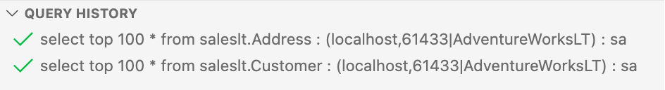

# Query History in the mssql extension

This article introduces the functionality of query history in the mssql extension for VS Code. Query History is displayed as a section in the SQL Server view, which is available in the side bar by default when the [mssql extension for VS Code](mssql-extensions-vscode.md) is installed.

## View query history

Initially the query history view will be empty but once you execute a query it will be captured and displayed in the window - with a separate row displayed for every execution.

Each row consists of three parts :
- Status icon : This will be a ✔️ if the query executed successfully. If any errors occurred a ❌ is shown.
- Query Text : This is the text of the query that was executed
- Connection Info : The server and database the query was executed against

## Query History row actions

Right clicking on a history row will bring up a menu with a number of actions available.

- Open Query
- Run Query
- Delete

### Open query

This will open a new query editor window populated with the query text from the query executed and using the connection of that query.

### Run query

This will do the same thing as Open Query but will additionally run the statement immediately.

### Delete

This will permanently delete the selected history row.

## Query History management

Query history capture can be managed with the ability to clear all the history or dynamically pause/start history capture.

### Data storage

Currently all information is stored in memory and not persisted upon application exit.  Query history from a session is not available in a new VS Code window.

### Clear all history

This will permanently delete **ALL** history rows.

This action is also available from the command palette (**MS SQL: Clear All History**) and as an action button on the view.

### Pause/Start query history capture

This will Pause or Start Query History Capture. While paused no data will be stored for queries run.

This action is also available from the command palette (**MS SQL: Toggle Query History Capture**) and as an action button
on the panel.

## Next steps
- [Use the mssql extension to query a SQL instance](sql-server-develop-use-vscode.md)
- [Learn more about Visual Studio Code](https://code.visualstudio.com/docs)
- [Learn mroe about contributing to the mssql extension ](https://github.com/Microsoft/vscode-mssql/wiki)