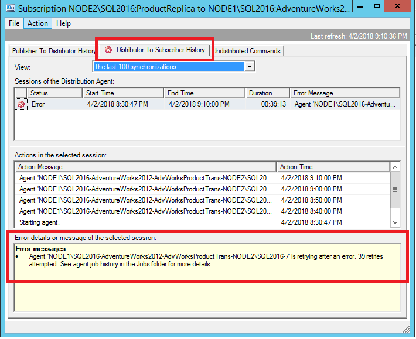
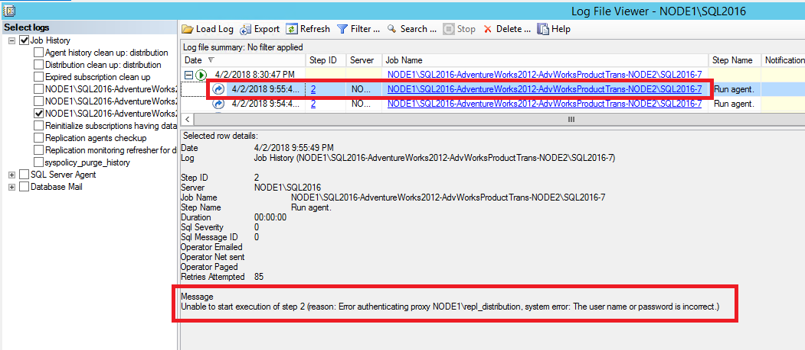
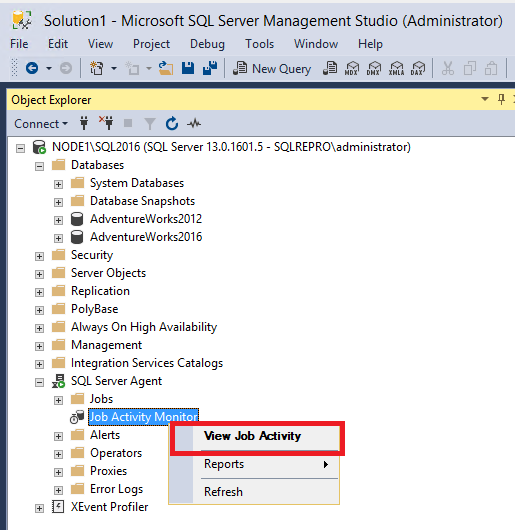
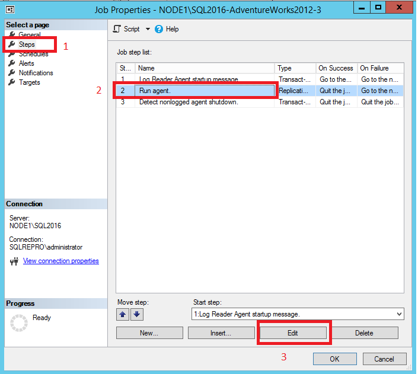
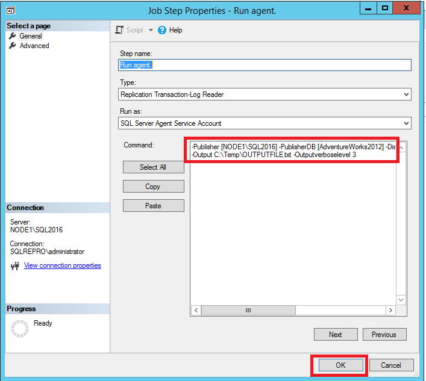

# Troubleshooter: Finding Errors with SQL Server Transactional Replication 
Troubleshooting replication errors can be frustrating without a basic understanding of how transactional replication works. The first step to creating a publication is having the **Snapshot Agent** create the snapshot and save it to the snapshot folder. Next, the **Distribution Agent** will take the snapshot, and apply it to the subscriber. 

This creates the publication, and puts it into the *synchronizing* state. Synchronization works in three phases:
- Transactions occur on objects that are replicated, and are marked 'for replication' in the transaction log. 
- The **Log Reader Agent** scans through the transaction log looking for transactions that are marked 'for replication'. These transactions are then saved to the distribution database. 
- The **Distribution Agent** scans through the distribution database using the reader thread and then, using the writer thread, connects to the subscriber to apply those changes to the subscriber.

Errors can occur in any step of this process, and finding those errors can be the most challenging aspect of troubleshooting synchronization issues. Thankfully, the use of **Replication Monitor** makes this process easy. 

  >[!NOTE]
  > - The purpose of this troubleshooting guide is to teach troubleshooting methodology. It is not designed to solve your specific error,  but provide general guidance in finding errors. Some specific examples are provided but the resolution to them may vary depending on environment. 
 > - The errors that are provided as examples are based on the tutorial [Configuring Transacational Replication](/../../relational-databases/replication/tutorial-replicating-data-between-continuously-connected-servers.md).


## Troubleshooting Methodology 

### Questions to ask
1. Where is replication synchronization failing?
2. Which agent is experiencing an error? 

### Steps to take
1. Use **Replication Monitor** to identify at which point replication is encountering the error (which agent?).
    - If errors are occurring in the *Synchronization Status*, then the issue is with the snapshot agent. 
    - If errors are occurring in the *Publisher to Distributor* section, then the issue is with the log reader agent. 
    -  If errors are occurring the *Distributor to Subscriber* section, then the issue is with the distribution agent.  
2. Look through that agent's **Job History**  in **Job Activity Monitor** to identify details of the error. 
    -  If job history is not showing sufficient details,  you can [enable verbose logging](#enable-verbose-logging) on the specific agent.
3. Attempt to determine a solution for the error.


## Troubleshoot Errors with Snapshot Agent
The **Snapshot Agent** is the agent that generates the snapshot, and writes it to the specified snapshot folder. 

1. To view the status of your snapshot agent, expand the **Local Publication** node under replication, right select your publication **AdvWorksProductTrans** > **View Snapshot Agent Status**. 
2. If an error is reported in the **Snapshot Agent Status**, more details can be found in the **Snapshot Agent** job history. To access this, expand **SQL Server Agent** in **Object Explorer** and open the **Job Activity Monitor**. 

    a. Sort by **Category** and identify the **Snapshot Agent** by the category 'REPL-Snapshot'. 

    b. Right-click the **Snapshot Agent** and **View History**: 

   
    
1. In the **Snapshot Agent History**, select the relevant log entry. This will usually be a line or two *before* the entry reporting the error (errors are indicated by the red X).  Review the message text in the text box below the logs: 

    

        The replication agent had encountered an exception.
        Exception Message: Access to path '\\node1\repldata.....' is denied.

If your windows permissions are not configured correctly for your snapshot folder, you'll see an 'access is denied' error for the **Snapshot Agent**. You'll need to verify permissions to the folder where your snapshot is stored, and make sure that the account used to run the **Snapshot Agent** has adequate permissions to access to the share.  

## Troubleshoot Errors with Log Reader Agent
The **Log Reader Agent** connects to  your publisher database and scans the transaction log for any transactions that are marked 'for replication'. It then adds those transactions to the **Distribution** database. 

1.  Connect to the Publisher in [!INCLUDE[ssManStudioFull](../../includes/ssmanstudiofull-md.md)], expand the server node, right-click the **Replication** folder, and then select **Launch Replication Monitor**:  

    
  
    Replication Monitor launches: 
     
   
2. The Red X is an indication that the publication is not synchronizing. Expand **My Publishers** on the left-hand side, and then expand the relevant publisher server.  
  
3.  Select the **AdvWorksProductTrans** publication on the left and then look for the Red X on one of the tabs to identify where the issue is. In this case, the Red X is on the **Agents Tab**, indicating that one of the Agents is running into an error: 

    

4. Select the **Agents Tab** to identify which agent is encountering the error: 

    


5. This view will show you two Agents, the **Snapshot Agent** and the **Log Reader Agent**. The one encountering an error will have the Red X. In this case, the **Log Reader Agent** is the one with the Red X, which indicates there's an issue with it. Double-click the line that's reporting the error, in this case the **Log Reader Agent**. This will launch the **Agent History** for the Agent you've selected, in this case the **Log Reader Agent** history. This provides more information about the error: 
    
    

       Status: 0, code: 20011, text: 'The process could not execute 'sp_replcmds' on 'NODE1\SQL2016'.'.
       The process could not execute 'sp_replcmds' on 'NODE1\SQL2016'.
       Status: 0, code: 15517, text: 'Cannot execute as the database principal because the principal "dbo" does not exist, this type of principal cannot be impersonated, or you do not have permission.'.
       Status: 0, code: 22037, text: 'The process could not execute 'sp_replcmds' on 'NODE1\SQL2016'.'.        

6. The aforementioned error is typically caused because the owner of the publisher database is not set correctly. This typically happens when a database has been restored. To verify this, expand **Databases** in **Object Explorer** > right-click **AdventureWorks2012** > **Properties**. Verify that an owner exists under the **Files** page. If this field is blank, then this is the likely cause of your issue: 

   

7. If the owner is blank on the **Files** page, open a **New Query Window** within the context of the **AdventureWorks2012** database. Run the following T-SQL code snippet:

    ```sql
    -- set the owner of the database to 'sa' or a specific user account, without the brackets. 
    EXEC sp_changedbowner '<useraccount>'
    -- example for sa: exec sp_changedbowner 'sa'
    -- example for user account: exec sp_changedbowner 'sqlrepro\administrator' 
    ```

8. You'll need to restart the **Log Reader Agent**. To do this, expand the **SQL Server Agent** node in **Object Explorer** and open the **Job Activity Monitor**. Sort by **Category** and identify the **Log Reader Agent** by the **'REPL-LogReader'** category. Right-click the **Log Reader Agent** job and **Start Job at Step**: 

    

9. Validate that your publication is now synchronizing by opening the **Replication Monitor** again. If it's not already open, it can be found by right-clicking **Replication** in **Object Explorer**. 
10. Select the **AdvWorksProductTrans** publication, select the **Agents** tab, and double-select the **Log Reader Agent** to open the agent history. You should now see that the **Log Reader Agent** is running and either replicating commands, or that it has "No Replicated Transactions":

    

### Troubleshoot errors with Distribution Agent
The **Distribution Agent** takes data it finds in the **Distribution** database and then applies it to the Subscriber. 

1. Connect to the Publisher in [!INCLUDE[ssManStudioFull](../../includes/ssmanstudiofull-md.md)], expand the server node, right-click the **Replication** folder, and then select **Launch Replication Monitor**.  
2. In **Replication Monitor**, select the **AdvWorksProductTrans** publication, and select the **All Subscriptions** tab. Right-click the Subscription and **View Details**:

    

2. The **Distributor to Subscriber** history dialog box opens, and clarifies what error the agent is encountering: 

     
    
        Error messages:
        Agent 'NODE1\SQL2016-AdventureWorks2012-AdvWorksProductTrans-NODE2\SQL2016-7' is retrying after an error. 89 retries attempted. See agent job history in the Jobs folder for more details.

3. The error indicates that the **Distribution Agent** is retrying. To find out more information, expand **SQL Server Agent** in **Object Explorer** > **Job Activity Monitor**. Sort the jobs by **Category**. 

    a. Identify the **Distribution Agent** by the category **'REPL-Distribution'**. Right-click the agent and **View History**:

    

5. Select one of the error entries and view the error text at the bottom of the window:  

    
    
        Message:
        Unable to start execution of step 2 (reason: Error authenticating proxy NODE1\repl_distribution, system error: The user name or password is incorrect.)

6. This error is an indication that the password used by the **Distribution Agent** is incorrect. To resolve this, expand the **Replication** node in **Object Explorer**, right-click the subscription > **Properties**. Select the ellipses (...) next to **Agent Process Account** and modify the password:

    

7. Check your **Replication Monitor** again, which can be found by right-clicking **Replication** in **Object Explorer**. A Red X under **All Subscriptions** indicates that our **Distribution Agent** is still encountering an error. Open the **Distribution to Subscriber** history by right-clicking the Subscription in **Replication Monitor** > **View Details**. Here, the error is now different: 

    
           
        Connecting to Subscriber 'NODE2\SQL2016'        
        Agent message code 20084. The process could not connect to Subscriber 'NODE2\SQL2016'.
        Number:  18456
        Message: Login failed for user 'NODE2\repl_distribution'.

8. This error indicates that the **Distribution Agent** could not connect to the subscriber, as the login failed for user **NODE2\repl_distribution**. To investigate further, connect to the Subscriber and open the *current* **SQL Error Log** under the **Management** node in **Object Explorer**: 

    
    If you're seeing this error, it means that the login is missing on the subscriber. To resolve this, please see [Permissions for Replication](/../../relational-databases/replication/security/security-role-requirements-for-replication.md).

9. Once the login error has been resolved, check **Replication Monitor** again. If all issues have been addressed, you should see a green arrow next to the **Publication Name** and a status of **Running** under **All Subscriptions**. Right-click the **Subscription** to launch the **Distributor to Subscriber** history once more to verify success. If this is the first time running the distribution agent, you'll see that the snapshot has been bulk copied to the subscriber as the picture below indicates: 

        


## Enable Verbose Logging
Sometimes the errors we find in the agent history prove to be insufficient in helping determine what's going wrong. As such,  you have the ability to enable verbose logging on each agent - the steps are the same for each agent, you just need to make sure you're selecting the correct agent in **Job Activity Monitor**. 

   >[!NOTE]   
   > The agents may either be on the publisher, or the subscriber, depending on if it's a pull or push subscription. If you can't find the agent you're looking for on the server you're looking at, try checking the other server as well.  

1. Decide where you want the verbose logging to be saved, and ensure that folder exists. We chose c:\temp. 
2. Expand the **SQL Server Agent** node in **Object Explorer** and open **Job Activity Monitor**. 

        

1. Sort by **Category** and identify the agent of interest. We chose the **Log Reader**. Right-click the agent of interest > **Properties**.

    

1. Select the **Steps** page, and then highlight the **Run Agent** step. Select **Edit**. 

    

1. In the **Command** window, start a new line, and enter in the following text and select **OK**: -Output C:\Temp\OUTPUTFILE.txt -Outputverboselevel 3
    - You can modify the location and verbosity level per preference.

    

   >[!NOTE]
   > Things that may cause you issues when adding the verbose output parameter: 
   > <br> - There is a formatting issue where the dash became a hyphen. 
   > <br> - The location doesn't exists on disk, or the account unning the agent lacks permission to write to the location. 
   > <br> - There is a space missing between the last parameter and the -Output parameter. 

1. Restart the Log Reader agent by right-clicking the agent > **Stop Job at Step**. **Refresh**. Right-click the agent > **Start Job at Step**
2. Review the output on disk. 

    

    
1. To disable verbose logging, follow the same steps as before but this time remove the entire line you just added, starting with -Output. 

For more information, please see [Enabling verbose logging for replication agents](https://support.microsoft.com/en-us/help/312292/how-to-enable-replication-agents-for-logging-to-output-files-in-sql-se) 


## See Also
<br>[Transactional Replication Overview](../../relational-databases/replication/transactional/transactional-replication.md)
<br>[Replication Tutorials](/../../relational-databases/replication/replication-tutorials.md)
<br>[ReplTalk Blog](https://blogs.msdn.microsoft.com/repltalk)

[!INCLUDE[get-help-options](../../includes/paragraph-content/get-help-options.md)]

