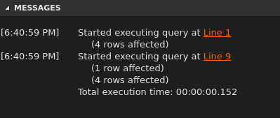
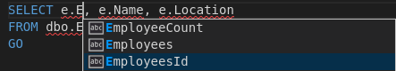
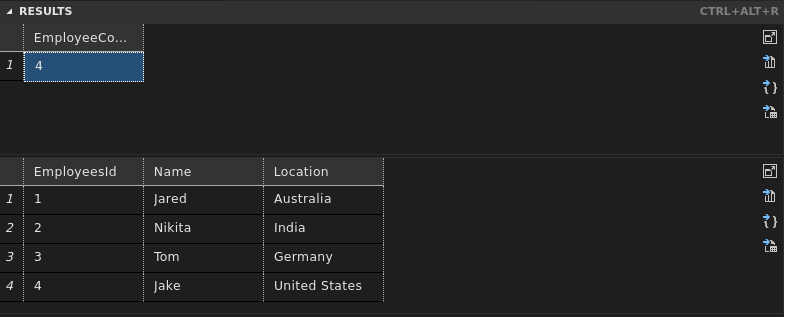
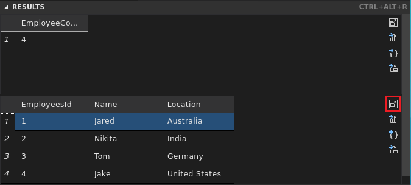

# Use Visual Studio Code to create and run Transact-SQL scripts

[!INCLUDE [SQL Server - Linux](../includes/applies-to-version/sql-linux.md)]

This article shows how to use the **mssql** extension for Visual Studio Code to develop SQL Server databases. Because Visual Studio Code is cross-platform, you can use **mssql** extension on Linux, macOS, and Windows.

## Install and start Visual Studio Code

Visual Studio Code is a cross-platform, graphical code editor that supports extensions.

1. [Download and install Visual Studio Code](https://code.visualstudio.com/) on your machine.

2. Start Visual Studio Code.

    >[!NOTE]
    >If Visual Studio Code does not start when you are connected through an xrdp remote desktop session, see [VS Code not working on Ubuntu when connected using XRDP](https://github.com/Microsoft/vscode/issues/3451).

## Install the mssql extension

The [mssql extension for Visual Studio Code](https://aka.ms/mssql-marketplace) lets you connect to a SQL Server, query with Transact-SQL (T-SQL), and view the results.

1. In Visual Studio Code, select **View** > **Command Palette**, or press **Ctrl**+**Shift**+**P**, or press **F1** to open the **Command Palette**.

2. In the **Command Palette**, select **Extensions: Install Extensions** from the dropdown.

3. In the **Extensions** pane, type *mssql*.

4. Select the **SQL Server (mssql)** extension, and then select **Install**.

   

5. After the installation completes, select **Reload** to enable the extension.

## Create or open a SQL file

The mssql extension enables mssql commands and T-SQL IntelliSense in the code editor when the language mode is set to **SQL**.

1. Select **File** > **New File** or press **Ctrl**+**N**. Visual Studio Code opens a new Plain Text file by default. 

2. Select **Plain Text** on the lower status bar, or press **Ctrl**+**K** > **M**, and select **SQL** from the languages dropdown. 

   

   > [!NOTE]
   > If this is the first time you have used the extension, the extension installs supporting SQL Server tools.

If you open an existing file that has a *.sql* file extension, the language mode is automatically set to SQL.  

## Connect to SQL Server

Follow these steps to create a connection profile and connect to a SQL Server.

1. Press **Ctrl**+**Shift**+**P** or **F1** to open the **Command Palette**. 

2. Type *sql* to display the mssql commands, or type *sqlcon*, and then select **MS SQL: Connect** from the dropdown.

   

   >[!NOTE]
   >A SQL file, such as the empty SQL file you created, must have focus in the code editor before you can execute the mssql commands.

3. Select the **MS SQL: Manage Connection Profiles** command.

4. Then select **Create** to create a new connection profile for your SQL Server.

5. Follow the prompts to specify the properties for the new connection profile. After specifying each value, press **Enter** to continue.

   | Connection property | Description |
   |---|---|
   | **Server name or ADO connection string** | Specify the SQL Server instance name. Use *localhost* to connect to a SQL Server instance on your local machine. To connect to a remote SQL Server, enter the name of the target SQL Server, or its IP address. To connect to a SQL Server container, specify the IP address of the container's host machine. If you need to specify a port, use a comma to separate it from the name. For example, for a server listening on port 1401, enter `<servername or IP>,1401`.<br/><br/>As an alternative, you can enter the ADO connection string for your database here. |
   | **Database name** (optional) | The database that you want to use. To connect to the default database, don't specify a database name here. |
   | **Authentication Type** | Choose either **Integrated** or **SQL Login**. |
   | **User name** | If you selected **SQL Login**, enter the name of a user with access to a database on the server. |
   | **Password** | Enter the password for the specified user. |
   | **Save Password** | Press **Enter** to select **Yes** and save the password. Select **No** to be prompted for the password each time the connection profile is used. |
   | **Profile Name** (optional) | Type a name for the connection profile, such as *localhost profile*. |

   After you enter all values and select **Enter**, Visual Studio Code creates the connection profile and connects to the SQL Server.

   > [!TIP]
   > If the connection fails, try to diagnose the problem from the error message in the **Output** panel in Visual Studio Code. To open the **Output** panel, select **View** > **Output**. Also review the [connection troubleshooting recommendations](../linux/sql-server-linux-troubleshooting-guide.md).

6. Verify your connection in the lower status bar.

   

As an alternative to the previous steps, you can also create and edit connection profiles in the User Settings file (*settings.json*). To open the settings file, select **File** > **Preferences** > **Settings**. For more information, see [Manage connection profiles](https://github.com/Microsoft/vscode-mssql/wiki/manage-connection-profiles).

## Create a SQL database

1. In the new SQL file that you started earlier, type *sql* to display a list of editable code snippets.

   

2. Select **sqlCreateDatabase**.

3. In the snippet, type `TutorialDB` to replace 'DatabaseName':

   ```sql
   -- Create a new database called 'TutorialDB'
   -- Connect to the 'master' database to run this snippet
   USE master
   GO
   IF NOT EXISTS (
      SELECT name
      FROM sys.databases
      WHERE name = N'TutorialDB'
   )
   CREATE DATABASE [TutorialDB]
   GO
   ```

4. Press **Ctrl**+**Shift**+**E** to execute the Transact-SQL commands. View the results in the query window.

    

    > [!TIP]
    > You can customize the shortcut keys for the mssql commands. See [Customize shortcuts](https://github.com/Microsoft/vscode-mssql/wiki/customize-shortcuts).

## Create a table

1. Delete the contents of the code editor window.

2. Press **Ctrl**+**Shift**+**P** or **F1** to open the **Command Palette**.

3. Type *sql* to display the mssql commands, or type *sqluse*, and then select the **MS SQL: Use Database** command.

4. Select the new **TutorialDB** database.

   

5. In the code editor, type *sql* to display the snippets, select **sqlCreateTable**, and then press **Enter**.

6. In the snippet, type `Employees` for the table name.

7. Press **Tab** to get to the next field, and then type `dbo` for the schema name.

8. Replace the column definitions with the following columns:

   ```sql
   EmployeesId INT NOT NULL PRIMARY KEY,
   Name [NVARCHAR](50)  NOT NULL,
   Location [NVARCHAR](50)  NOT NULL
   ```

9. Press **Ctrl**+**Shift**+**E** to create the table.

## Insert and query

1. Add the following statements to insert four rows into the **Employees** table.

   ```sql
   -- Insert rows into table 'Employees'
   INSERT INTO Employees
      ([EmployeesId],[Name],[Location])
   VALUES
      ( 1, N'Jared', N'Australia'),
      ( 2, N'Nikita', N'India'),
      ( 3, N'Tom', N'Germany'),
      ( 4, N'Jake', N'United States')
   GO
   -- Query the total count of employees
   SELECT COUNT(*) as EmployeeCount FROM dbo.Employees;
   -- Query all employee information
   SELECT e.EmployeesId, e.Name, e.Location
   FROM dbo.Employees as e
   GO
   ```

   While you type, T-SQL IntelliSense helps you to complete the statements:

   

   > [!TIP]
   > The mssql extension also has commands to help create INSERT and SELECT statements. These were not used in the previous example.

2. Press **Ctrl**+**Shift**+**E** to execute the commands. The two result sets display in the **Results** window.

   

## View and save the result

1. Select **View** > **Editor Layout** > **Flip Layout** to switch to a vertical or horizontal split layout.

2. Select the **Results** and **Messages** panel headers to collapse and expand the panels.

   

   > [!TIP]
   > You can customize the default behavior of the mssql extension. See [Customize extension options](https://github.com/Microsoft/vscode-mssql/wiki/customize-options).

3. Select the maximize grid icon on the second result grid to zoom in to those results.

   

   > [!NOTE]
   > The maximize icon displays when your T-SQL script produces two or more result grids.

4. Open the grid context menu by right-clicking on the grid.

   

5. Select **Select All**.

6. Open the grid context menu again and select **Save as JSON** to save the result to a *.json* file.

7. Specify a file name for the JSON file.

8. Verify that the JSON file saves and opens in Visual Studio Code.

   

If you need to save and run SQL scripts later, for administration or a larger development project, save the scripts with a *.sql* extension.

## Next steps

If you're new to T-SQL, see [Tutorial: Write Transact-SQL statements](https://docs.microsoft.com/sql/t-sql/tutorial-writing-transact-sql-statements) and the [Transact-SQL Reference (Database Engine)](https://docs.microsoft.com/sql/t-sql/language-reference).

For more information on using or contributing to the mssql extension, see the [mssql extension project wiki](https://github.com/Microsoft/vscode-mssql/wiki).

For more information on using Visual Studio Code, see the [Visual Studio Code documentation](https://code.visualstudio.com/docs).