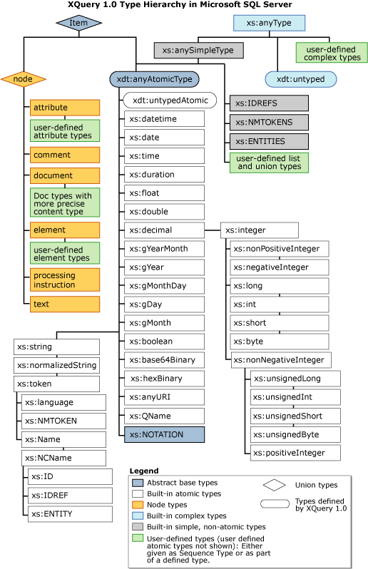
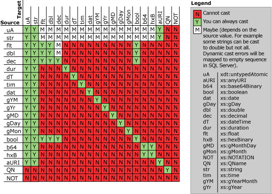

# Type Casting Rules in XQuery
[!INCLUDE [SQL Server Azure SQL Database ](../includes/applies-to-version/sqlserver.md)]

  The following W3C XQuery 1.0 and XPath 2.0 Functions and Operators specifications diagram shows the built-in data types. This includes the built-in primitive and built-in derived types.  
  
   
  
 This topic describes the type casting rules that are applied when casting from one type to another by using one of the following methods:  
  
-   Explicit casting that you do by using **cast as** or the type constructor functions (for example, `xs:integer("5")`).  
  
-   Implicit casting that occurs during type promotion  
  
## Explicit Casting  
 The following table outlines the allowed type casting between the built-in primitive types.  
  
   
  
-   A built-in primitive type can cast to another built-in primitive type, based on the rules in the table.  
  
-   A primitive type can be cast to any type derived from that primitive type. For example, you can cast from **xs:decimal** to **xs:integer**, or from **xs:decimal** to **xs:long**.  
  
-   A derived type can be cast to any type that is its ancestor in the type hierarchy, all the way up to its built-in primitive base type. For example, you can cast from **xs:token** to **xs:normalizedString** or to **xs:string**.  
  
-   A derived type can be cast to a primitive type if its primitive ancestor can be cast to the target type. For example, you can cast **xs:integer**, a derived type, to an **xs:string**, primitive type, because **xs:decimal**, **xs:integer**'s primitive ancestor, can be cast to **xs:string**.  
  
-   A derived type can be cast to another derived type if the source type's primitive ancestor can be cast to the target type's primitive ancestor. For example, you can cast from **xs:integer** to **xs:token**, because you can cast from **xs:decimal** to **xs:string**.  
  
-   The rules for casting user-defined types to built-in types are the same as for the built-in types. For example, you can define a **myInteger** type derived from **xs:integer** type. Then, **myInteger** can be cast to **xs:token**, because **xs:decimal** can be cast to **xs:string**.  
  
 The following kinds of casting are not supported:  
  
-   Casting to or from list types is not allowed. This includes both user-defined list types and built-in list types such as **xs:IDREFS**, **xs:ENTITIES**, and **xs:NMTOKENS**.  
  
-   Casting to or from **xs:QName** is not supported.  
  
-   **xs:NOTATION** and the fully ordered subtypes of duration, **xdt:yearMonthDuration** and **xdt:dayTimeDuration**, are not supported. As a result, casting to or from these types is not supported.  
  
 The following examples illustrate explicit type casting.  
  
### Example A  
 The following example queries an xml type variable. The query returns a sequence of a simple type value typed as xs:string.  
  
```  
declare @x xml  
set @x = '<e>1</e><e>2</e>'  
select @x.query('/e[1] cast as xs:string?')  
go  
```  
  
### Example B  
 The following example queries a typed xml variable. The example first creates an XML schema collection. It then uses the XML schema collection to create a typed xml variable. The schema provides the typing information for the XML instance assigned to the variable. Queries are then specified against the variable.  
  
```  
create xml schema collection myCollection as N'  
<xs:schema xmlns:xs="http://www.w3.org/2001/XMLSchema">  
      <xs:element name="root">  
            <xs:complexType>  
                  <xs:sequence>  
                        <xs:element name="A" type="xs:string"/>  
                        <xs:element name="B" type="xs:string"/>  
                        <xs:element name="C" type="xs:string"/>  
                  </xs:sequence>  
            </xs:complexType>  
      </xs:element>  
</xs:schema>'  
go  
```  
  
 The following query returns a static error, because you do not know how many top level <`root`> elements are in the document instance.  
  
```  
declare @x xml(myCollection)  
set @x = '<root><A>1</A><B>2</B><C>3</C></root>  
          <root><A>4</A><B>5</B><C>6</baz></C>'  
select @x.query('/root/A cast as xs:string?')  
go  
```  
  
 By specifying a singleton <`root`> element in the expression, the query succeeds. The query returns a sequence of a simple type value typed as xs:string.  
  
```  
declare @x xml(myCollection)  
set @x = '<root><A>1</A><B>2</B><C>3</C></root>  
              <root><A>4</A><B>5</B><C>6</C></root>'  
select @x.query('/root[1]/A cast as xs:string?')  
go  
```  
  
 In the following example, the xml type variable includes a document keyword that specifies the XML schema collection. This indicates that the XML instance must be a document that has a single top-level element. If you create two <`root`> elements in the XML instance, it will return an error.  
  
```  
declare @x xml(document myCollection)  
set @x = '<root><A>1</A><B>2</B><C>3</C></root>  
              <root><A>4</A><B>5</B><C>6</C></root>'  
go  
```  
  
 You can change the instance to include only one top level element and the query works. Again, the query returns a sequence of a simple type value typed as xs:string.  
  
```  
declare @x xml(document myCollection)  
set @x = '<root><A>1</A><B>2</B><C>3</C></root>'  
select @x.query('/root/A cast as xs:string?')  
go  
```  
  
## Implicit Casting  
 Implicit casting is allowed only for numeric types and untyped atomic types. For example, the following **min()** function returns the minimum of the two values:  
  
```  
min(xs:integer("1"), xs:double("1.1"))  
```  
  
 In this example, the two values passed in to the XQuery **min()** function are of different types. Therefore, implicit conversion is performed where **integer** type is promoted to **double** and the two **double** values are compared.  
  
 The type promotion as described in this example follows these rules:  
  
-   A built-in derived numeric type may be promoted to its base type. For example, **integer** may be promoted to **decimal**.  
  
-   A **decimal** may be promoted to **float,** and a **float** may be promoted to **double**.  
  
 Because implicit casting is allowed only for numeric types, the following is not allowed:  
  
-   Implicit casting for string types is not allowed. For example, if two **string** types are expected and you pass in a **string** and a **token**, no implicit casting occurs and an error is returned.  
  
-   Implicit casting from numeric types to string types is not allowed. For example, if you pass an integer type value to a function that is expecting a string type parameter, no implicit casting occurs and an error is returned.  
  
## Casting values  
 When casting from one type to another, the actual values are transformed from the source type's value space to the target type's value space. For example, casting from an xs:decimal to an xs:double will transform the decimal value into a double value.  
  
 Following are some of the transformation rules.  
  
##### Casting a value from a string or untypedAtomic type  
 The value that is being cast to a string or untypedAtomic type is transformed in the same manner as validating the value based on the target type's rules. This includes eventual pattern and white-space processing rules. For example, the following will succeed and generate a double value, 1.1e0:  
  
 `xs:double("1.1")`  
  
 When casting to binary types such as xs:base64Binary or xs:hexBinary from a string or untypedAtomic type, the input values have to be base64 or hex encoded, respectively.  
  
##### Casting a value to a string or untypedAtomic type  
 Casting to a string or untypedAtomic type transforms the value to its XQuery canonical lexical representation. Specifically, this can mean that a value that may have obeyed a specific pattern or other constraint during input will not be represented according to that constraint.  To inform users about this, [!INCLUDE[ssNoVersion](../includes/ssnoversion-md.md)] flags types where the type constraint can be a problem by providing a warning when those types are loaded into the schema collection.  
  
 When casting a value of type xs:float or xs:double, or any one of their subtypes, to a string or untypedAtomic type, the value is represented in scientific notation. This is done only when the value's absolute value is less than 1.0E-6, or greater than or equal to 1.0E6. This means that 0 is serialized in scientific notation to 0.0E0.  
  
 For example, `xs:string(1.11e1)` will return the string value `"11.1"`, while `xs:string(-0.00000000002e0)` will return the string value, `"-2.0E-11"`.  
  
 When casting binary types, such as xs:base64Binary or xs:hexBinary, to a string or untypedAtomic type, the binary values will be represented in their base64 or hex encoded form, respectively.  
  
##### Casting a value to a numeric type  
 When casting a value of one numeric type to a value of another numeric type, the value is mapped from one value space to the other without going through string serialization. If the value does not satisfy the constraint of a target type, the following rules apply:  
  
-   If the source value is already numeric and the target type is either xs:float or a subtype thereof that allows -INF or INF values, and casting of the source numeric value would result in an overflow, the value is mapped to INF if the value is positive or -INF if the value is negative. If the target type does not allow INF or -INF, and an overflow would occur, the cast fails and the result in this release of SQL Server is the empty sequence.  
  
-   If the source value is already numeric and the target type is a numeric type that includes 0, -0e0, or 0e0 in its accepted value range, and casting of the source numeric value would result in an underflow, the value is mapped in the following ways:  
  
    -   The value is mapped to 0 for a decimal target type.  
  
    -   The value is mapped to -0e0 when the value is a negative underflow.  
  
    -   The value is mapped to 0e0 when the value is a positive underflow for a float or double target type.  
  
     If the target type does not include zero in its value space, the cast fails and the result is the empty sequence.  
  
     Note that casting a value to a binary floating point type, such as xs:float, xs:double, or any one of their subtypes, may lose precision.  
  
## Implementation Limitations  
 These are the limitations:  
  
-   The floating point value NaN is not supported.  
  
-   Castable values are restricted by the target types implementation restrictions. For example, you cannot cast a date string with a negative year to **xs:date**. Such casts will result in the empty sequence if the value is provided at run time (instead of raising a run-time error).  
  
## See Also  
 [Define the Serialization of XML Data](../relational-databases/xml/define-the-serialization-of-xml-data.md)  
  
  
