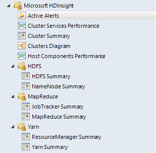
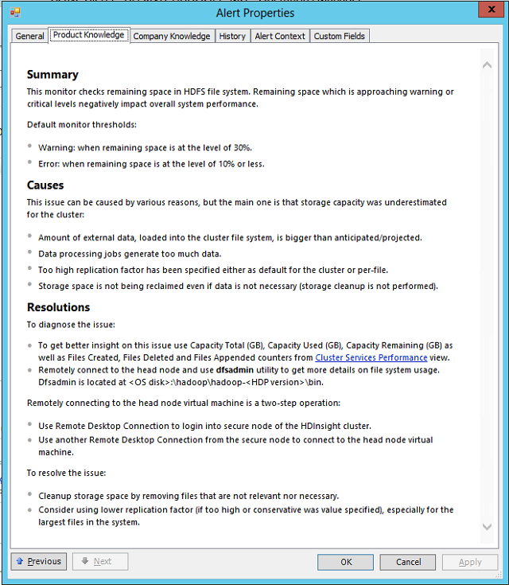
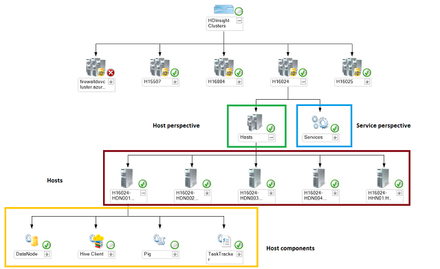
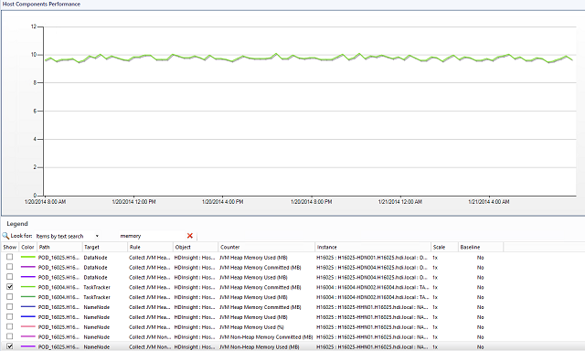

# HDInsight Management Tasks Using SCOM (Analytics Platform System)
The System Center Operation Manager Management Pack for HDInsight allows you to manage alerts, view the HDInsight topology, monitor the cluster condition, and view performance counters.  
  
## Management Pack Menu Option  
Once imported, the management pack creates an additional menu in the **Monitoring** pane of Operations Console.  
  
  
  
Here is a short description of available options:  
  
Active Alerts  
Provides information about monitor alerts that have been raised by all monitored HDInsight clusters.  
  
Cluster Services Performance  
A view with performance indicators relevant for the entire cluster. For this management pack HDSF indicators are available.  
  
Cluster Summary  
Dashboard page showing the most important health and performance indicators for all monitored clusters. This is the default page where administrators should start their every-day activities.  
  
Clusters diagram  
Provides a topology view of all HDInsight clusters that are configured for monitoring.  
  
Host Components Performance  
A view with performance indicators for each cluster node. This is the detailed level of information that a user can get about HDInsight performance.  
  
HDFS  
Grouping folder for HDFS service details.  
  
HDFS Summary  
Dashboard widgets displaying HDFS health and performance indicators.  
  
NameNode Summary  
Dashboard widgets displaying NameNode health and performance indicators.  
  
MapReduce  
Grouping folder for MapReduce service details.  
  
JobTracker Summary  
Dashboard widgets displaying JobTracker health and performance indicators.  
  
MapReduce Summary  
Dashboard widgets displaying MapReduce health and performance indicators.  
  
Yarn  
Grouping folder for Yarn service details.  
  
ResourceManager Summary  
Dashboard widgets displaying Yarn health and performance indicators.  
  
Yarn Summary  
Dashboard widgets displaying Resource Manager health and performance indicators.  
  
### Manage Active Alerts  
An administrator can click **Active Alerts** and see critical event for all monitored HDInsight clusters in the data center or Azure.  
  
  
  
For selected alerts, an administrator can see details including which cluster was affected and the recommended actions in that situation.  
  
  
  
### Display Cluster Topology  
The clusters diagram view shows all the monitored clusters and offers two perspectives: **Service** and **Host**. An administrator can learn how many nodes each cluster has, where the HDInsight components are deployed, and what their health is. The health monitors are rolled up from host component level through hosts (or services) up to the entire HDInsight cluster. The administrator can visualize where the problem is located.  
  
  
  
### Cluster Summary Dashboard  
The Cluster Summary is a view where the most important information is available for all monitored clusters. This includes:  
  
-   Cluster overall health (based on health roll-up rules)  
  
-   List of services with their health  
  
-   List of host components (per service)  
  
-   Live vs. Dead nodes widget  
  
-   Total space utilization widget  
  
  
  
The management pack offers other dashboards, specific to HDInsight services, and those dashboards contain the the most relevant widgets.  
  
### Tracking Performance Counters  
Performance counters are available at the cluster level  (for front-end services) and at the level of each cluster node. To analyze the first set of counters, use the Cluster Services Performance,  while for later ones click the Host Components Performance from the main menu.  Performance counters are consumed in usual way by selecting counters and adjusting the time range on the graph.  
  
  
  
## See Also  
[Import the SCOM Management Pack for HDInsight &#40;Analytics Platform System&#41;](../management/import-the-scom-management-pack-for-hdinsight-analytics-platform-system.md)  
  
