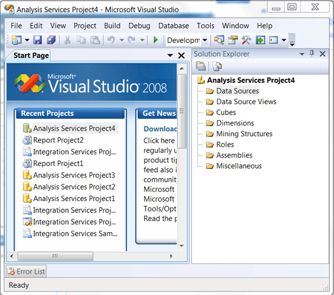
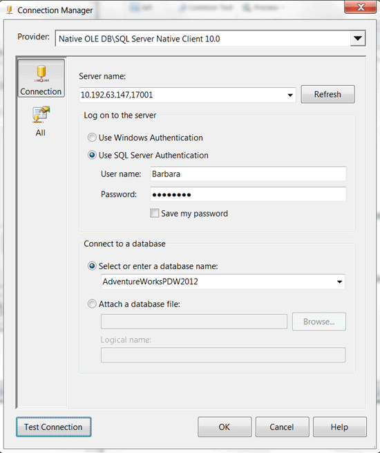
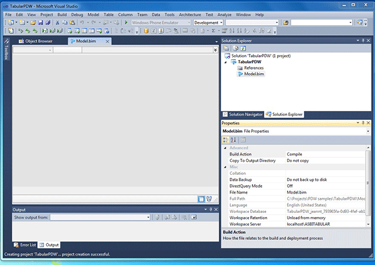
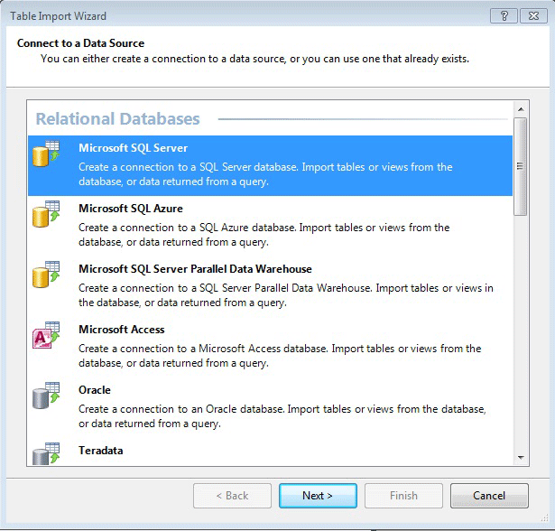
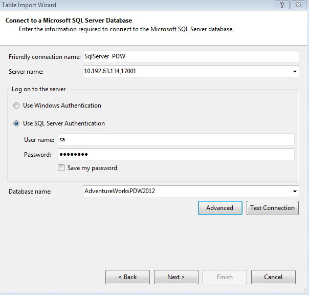
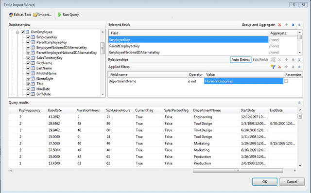

# Connect With SQL Server Analysis Services (SQL Server PDW)
This topic describes how to create a SQL Server PDW data source for Analysis Services, and then provides remarks and recommendations about how to use Analysis Services with SQL Server PDW data. Use SQL Server PDW as a highly performant relational data source for building multidimensional or tabular models with Analysis Services. For example:  
  
-   Use **DirectQuery** to perform real-time queries against a SQL Server PDW data source from a tabular model.  
  
-   Reduce **ROLAP** query times by using clustered columnstore indexes on SQL Server PDW tables.  
  
## Contents  
  
-   Create a SQL Server PDW Data Source for:  
  
    -   [Create a SQL Server PDW Data Source for SQL Server 2008 R2 Analysis Services](#Connect2008R2)  
  
    -   [Create a SQL Server PDW Data Source for SQL Server 2012 Analysis Services – Multidimensional](#Connect2012Multi)  
  
    -   [Create a SQL Server PDW Data Source for SQL Server 2012 Analysis Services - Tabular](#Connect2012Tabular)  
  
-   [General Remarks - Managing Data Size in Analysis Services Applications](#General)  
  
-   [Restrictions](#LimitRest)  
  
## Before You Begin  
Before you connect to SQL Server PDW by using Analysis Services, verify that you have met the following requirements.  
  
### Software Prerequisites – SQL Server 2008 R2  
Use these software prerequisites if you plan to use SQL Server PDW as a data source for SQL Server 2008 R2Analysis Services.  
  
-   SQL Server 2008 R2 Analysis Services  
  
-   Business Intelligence Development Studio (BIDS). See [Introducing Business Intelligence Development Studio](http://msdn.microsoft.com/en-us/library/ms173767(v=sql11).aspx).  
  
-   .NET Framework 3.5 SP1 or higher. For installation details, see [Microsoft .NET Framework 3.5 Service Pack 1](http://www.microsoft.com/downloads/en/confirmation.aspx?familyId=ab99342f-5d1a-413d-8319-81da479ab0d7&displayLang=en). If you have Windows 7 or later, you already have this.  
  
-   SQL Server Native Client (SNAC) 10.0. Version 10.5, which was included as part of the SQL Server 2008 release, is also supported. For installation instructions, see [Install SQL Server Native Client &#40;SQL Server PDW&#41;](../sqlpdw/install-sql-server-native-client-sql-server-pdw.md).  
  
### Software Prerequisites – SQL Server 2012  
Use these software prerequisites if you plan to use SQL Server PDW as a data source for SQL Server 2012Analysis Services.  
  
-   SQL Server 2012Analysis Services  
  
-   SQL Server Data Tools. To install the required tools, install the Client Connectivity Tools in your SQL Server 2012 installation. You already have this installed unless you unchecked Client Connectivity Tools in your SQL Server 2012 installation. For more information, see [Creating Multidimensional Models using SQL Server Data Tools](http://msdn.microsoft.com/en-us/library/ms174597.aspx).  
  
-   .NET Framework 3.5 SP1 or higher. See [Microsoft .NET Framework 3.5 Service Pack 1](http://www.microsoft.com/downloads/en/confirmation.aspx?familyId=ab99342f-5d1a-413d-8319-81da479ab0d7&displayLang=en). If you have Windows 7 or later, you already have this.  
  
-   SQL Server Native Client (SNAC) 11.0. See [Install SQL Server Native Client &#40;SQL Server PDW&#41;](../sqlpdw/install-sql-server-native-client-sql-server-pdw.md).  
  
## Create a SQL Server PDW Data Source for SQL Server 2008 R2 Analysis Services  
These steps explain how to create a data source that connects to SQL Server PDW. The connection uses SQL Server Native Client 10.0 and connects in the same manner that you would connect to SQL Server.  
  
1.  Open Business Intelligence Development Studio, and create a new project.  
  
2.  In the **New Project** window, for **Project type**, select **Business Intelligence Projects**, and then select the template, **Analysis Services Project**. Click **OK**.  
  
3.  In Solution Explorer, under your new project, right-click **Data Sources**, and select **New Data Source**.  
  
      
  
4.  Click **Next** to connect.  
  
5.  In the **Welcome to the Data Source Wizard** screen, click **Next**.  
  
6.  In the **Select how to define the connection** screen, choose **Create a data source based on an existing or new connection**, and click **New**.  
  
7.  In the **Connection Manager** window, make the following selections:  
  
    -   **Provider**: Select **Native OLE DB\SQL Server Native Client 10.0**.  
  
    -   For InfiniBand connections, **Server name**: Enter <appliance-name>-SQLCTL01,17001. For example, PDW001-SQLCTL01,17001.  
  
        For Ethernet connections, **Server name**: Enter the IP address of the Control node cluster, comma, port 17001. For example, 10.192.63.134,17001.  
  
    -   Choose **Use Windows Authentication**, or choose **Use SQL Server Authentication**.  
  
    -   **User name** and **Password** fields: Type your SQL Server PDW login and password if using SQL Server Authentication .  
  
    -   **Select or enter a Database Name**: Select or enter the name of the target database.  
  
          
  
8.  Click **Test Connection** to verify that the new data source is available.  
  
9. Click **OK** to return to the page, **Select how to define the connection**.  
  
10. In the **Select how to define the connection** window, view your new connection, listed under **Data Connections**.  
  
11. Click **Finish** to bypass the **Impersonation Information** page.  
  
12. On the **Completing the Wizard** page, type a friendly name for your data source.  
  
13. You can now see your data source listed in Solution Explorer under your Analysis Services Project.  
  
      
  
## Create a SQL Server PDW Data Source for SQL Server 2012 Analysis Services – Multidimensional  
  
1.  Open SQL Server Data Tools, and create a new project.  
  
2.  In the **New Project** window, for **Project type**, select **Business Intelligence Projects**, and then select the template, **Analysis Services Multidimensional and Data Mining Project**. Click **OK**.  
  
3.  In Solution Explorer, under your new project, right-click **Data Sources**, and select **New Data Source**.  
  
4.  On the **Welcome to the Data Source Wizard** page of the Data source wizard, click **Next**.  
  
5.  On the **Select how to define the connection** page, choose **Create a data source based on an existing or new connection**, and click **New**.  
  
6.  In the **Connection Manager** dialog box, make the following selections:  
  
    -   **Provider**: Select **Native OLE DB\SQL Server Native Client 11.0**.  
  
    -   For InfiniBand connections, **Server name**: Enter <appliance-name>-SQLCTL01,17001. For example, PDW001-SQLCTL01,17001.  
  
        For Ethernet connections, **Server name**: Enter the IP address of the Control node cluster, comma, port 17001. For example, 10.192.63.134,17001.  
  
    -   Choose **Use Windows Authentication**, or choose **Use SQL Server Authentication**.  
  
    -   **User name** and **Password** fields: Type your SQL Server PDW login and password if using SQL Server Authentication.  
  
    -   **Select or enter a Database Name**: Select or enter the name of the target database.  
  
7.  Click **Test Connection** to verify that the new data source is available.  
  
8.  Click **OK** to return to the page, **Select how to define the connection**.  
  
9. On the **Select how to define the connection** page, view your new connection, listed under **Data Connections**.  
  
10. Click **Finish** to bypass the **Impersonation Information** page.  
  
11. On the **Completing the Wizard** page, type a friendly name for your data source.  
  
12. You can now see your data source listed in Solution Explorer under your Analysis Services project.  
  
## Create a SQL Server PDW Data Source for SQL Server 2012 Analysis Services - Tabular  
  
1.  Open SQL Server Data Tools, and create a new project.  
  
2.  In the **New Project** window, for **Project type**, select **Business Intelligence Projects**, and then select the template, **Analysis Services Tabular Project**. Click **OK**.  
  
3.  Wait a few minutes as Analysis Services creates the model, and initializes all properties. At this point the model will contain no data.  
  
      
  
4.  On the **Model** menu, select **Import from Data Source**.  
  
    Note: If the **Model** menu item is not visible, click one of the tabular model icons in Solution Explorer.  
  
5.  In the first page of the Table Import Wizard, **Connect to a Data Source**, select **Microsoft SQL Server**, and then click **Next**.  
  
    > [!WARNING]  
    > Note: The data source, Microsoft SQL Server Parallel Data Warehouse, can be used only for connections using the MPP driver. This connection type is not supported from SQL Server 2012.  
  
      
  
6.  On the page, **Connect to a Microsoft SQL Server Database**, make the following selections:  
  
    -   **Friendly connection name:** Type a name that will help you identify the connection.  
  
    -   **Server name:** Type the IP address of the Control Node cluster.  
  
    -   Choose **Use Windows Authentication**, or choose **Use SQL Server Authentication**.  
  
    -   **User name** and **Password** fields: Type your SQL Server PDW login and password if using SQL Server Authentication.  
  
        Note: Do not select the option, **Save my password**. The option to persist security information must be set to FALSE.  
  
    -   **Database name:** Type the name of the database to use, or select a database from the list of databases hosted in PDW 2.  
  
      
  
7.  Click **Next**.  
  
8.  On the **Impersonation Information** page, select **Service Account**, and click **Next**.  
  
9. On the page, **Choose How to Import the Data**, select one of the following options:  
  
    -   **Select from a list of tables and views to import:** Select tables and/or views to use in your tabular model.  
  
        Note: When using a PDW data source, you should be aware of potential memory limitations in the Analysis Services model and plan your data import accordingly. For more information, see the Remarks section of this topic.  
  
    -   **Write a query that will specify the data to import:** Paste in a query, or click **Design** to use the Query Builder to select tables and views, create queries, and apply filters.  
  
        For example, the following diagram shows the filtering and data selection options in the query builder. To optimize performance and memory usage in Analysis Services tabular models, you should deselect columns that are not necessary, or create row-based filters.  
  
      
  
    Note that the query builder does not support automatic relationship detection; therefore, there is no option to add related tables, nor can the model designer in SQL Server Data Tools automatically create relationships after the data has been imported to the model. If you know that related tables will be needed in the Analysis Services model, you must add them individually and create the relationships manually using the model designer.  
  
10. On the page, **Specify a SQL Query**, verify that the list of tables or the query against the PDW data source is correct, and click **Finish**.  
  
    If you create a query, be sure to provide a friendly name for the query, because the Import Wizard will use this name as the table name for imported data. You can rename the query later; however, renaming and other metadata changes require that the data be refreshed.  
  
11. Click **Finish**.  
  
    The Table Import Wizard will immediately begin to load the specified data into the tabular model. You can reopen the connection and add more tables or queries, or rename the tables in the model.  
  
      
  
## General Remarks - Managing Data Size in Analysis Services Applications  
When you use SQL Server PDW as a data source for tabular models, consider the following techniques for managing relational data access.  
  
**Multidimensional solutions:** In SQL Server 2008 R2, you can use SQL Server PDW as a data source for building multidimensional solutions, such as cubes and data mining models. When you create a SQL Server PDW data source for a multidimensional model, the definition of the data source is saved together with other solution metadata, but the data is not actually read until you process the model. At that time, a copy of the data is read into memory, summarized or otherwise processed according to the definition of your model, and the resulting aggregates or values are saved to disk or cache as part of the Analysis Services solution.  
  
**Tabular models:** When you create a SQL Server PDW data source for a tabular model, data is also loaded into memory and this data is used while defining the model. Typically, to make the design experience better, you would use only a subset of the data. However, when you deploy the model, you must read the entire data set into memory and process the data according to the definition of the model. If it is unlikely that the data will fit into memory, you have several options:  
  
-   You can define partitions, process them, and add more partitions.  
  
-   You can use a test server which contains a subset of records as a data source, and then change the connection string when you deploy the tabular model against a production data source.  
  
-   You can modify your tabular model to use DirectQuery. A tabular model running in DirectQuery mode does not cache data, other than the data initially used to design the mode. Instead, queries against the model are converted from DAX to SQL statements and any calculations required by the model are performed against the relational data source on the fly using the xVelocity in-memory engine.  
  
    In general, DirectQuery requires fewer machine resources compared with ROLAP, because data is not cached in memory. The conversion of DAX to SQL has also been optimized, so simple queries on DirectQuery models might perform better than similar queries on ROLAP models. However, use of columnstore indexes is recommended for optimum performance in DirectQuery mode.  
  
**PowerPivot models:** Similar considerations apply when you use SQL Server PDW as a data source for a PowerPivot model. However, in PowerPivot you cannot define partitions, and it is expected that you will load the entire set of data into the PowerPivot workbook. Moreover, if you publish the workbook to a SharePoint site as part of a PowerPivot gallery, restrictions may apply on the size of the workbook. Therefore, you may wish to work with a subset of data from SQL Server PDW while building a PowerPivot model.  
  
Note that, when you build a tabular model or a PowerPivot model, you do not create a set of metadata that is included with solution objects, but rather specify the data you want to use through a wizard. Therefore, if you later edit the data source data definition later to use different data, each time you make any change, however small, the previous cache of data is cleared and new data is loaded into memory. This will usually also force all calculations in your workbook or model to be recalculated, with corresponding impacts on performance. For more information about options for managing recalculation, see [Manually Recalculate Formulas in PowerPivot](http://msdn.microsoft.com/en-us/library/ee835594.aspx).  
  
## Restrictions  
**Using SQL Server PDW data for ROLAP and MOLAP multidimensional models (cubes)**  
  
-   When using SQL Server PDW as a data source for ROLAP queries, we recommend that you consider the use of columnstore indexes to improve performance. For more information, see [Clustered Columnstore Indexes &#40;SQL Server PDW&#41;](../sqlpdw/clustered-columnstore-indexes-sql-server-pdw.md)  
  
-   Auto-cube refresh is not supported in this release. The auto-cube refresh feature depends on notifications of table data changes to trigger refresh of the cube partitions, but these stored procedures are not available in SQL Server PDW. When you set up your Analysis Services multidimensional database, be sure to deselect all notification refresh options (**Tracking tables**, **Client initiated**, and **Scheduled polling**).  
  
-   Materialized views are not supported in this release. As a result, aggregations cannot be created if the cube partition uses the ROLAP storage mode and its source data is stored in SQL Server PDW.  
  
    The reason is that Analysis Services tries to create indexed views to contain aggregations of the partition values. Because SQL Server PDW does not support creation of the `WITH SCHEMABINDING` syntax of the `CREATE VIEW` statement, Analysis Services cannot create the views needed and therefore cannot store the aggregations.  
  
-   Proactive caching is supported only if you use the polling mechanisms provided by Analysis Services.  
  
    If you use ROLAP storage mode, you must disable proactive caching. The reasons is that the current implementation of proactive caching for ROLAP  data sources relies on traces created by SQL Server and by the automatic creation of materialized views, neither of which are available in this release.  
  
-   Writeback is not supported, either in ROLAP or MOLAP mode.  
  
**Using SQL Server PDW data in a tabular model in DirectQuery mode**  
  
-   **DAX query conversion:** When you use SQL Server PDW as a DirectQuery data source, DAX queries generated by the tabular model are converted into equivalent statements in Transact-SQL and then sent to SQL Server PDW. In some cases the results of those queries might be different than the result you get when you execute the same formula against the data stored in the tabular model cache. The reason is that the xVelocity in-memory data storage engine handles some data types and calculations differently than does Transact-SQL.  For a detailed description of the possible semantic differences, see [Formula Compatibility in DirectQuery Mode](http://go.microsoft.com/fwlink/?LinkId=294103).  
  
    If you are interested in seeing how the DAX formula for a query is converted into Transact-SQL, you can create a trace on the Analysis Services server that hosts the tabular model, and review the DirectQuery events in SQL Profiler. This class of events is not selected by default when you start a trace session using the default template; therefore, be sure to click the **Events Selection** tab in the **Trace Properties** dialog box, select the option, **Show all events**, and then select the DirectQuery events.  
  
-   **Data type compatibility and unsupported data types:** To enable loading of data from SQL Server to SQL Server PDW, some data types have had to be converted. In other words, not all SQL Server data types are supported. Unsupported types include **geometry**, **xml**, and **nvarchar(max)**.  
  
    Generally, the unsupported data types are converted to a compatible type that is supported by SQL Server PDW. For example, **xml** data might be converted to **varchar**.  
  
    Conversion to SQL Server PDW data types can lead to overflow errors or truncation of values. For example, the conversion of a datetime data type to a smalldatetime data type results in an out-of-range value.  
  
    If your data contains a data type not supported in PDW and no compatible data type can be found, the data is loaded but the values are nullified. This can create problems in the model.  
  
## See Also  
[Connect With Applications &#40;SQL Server PDW&#41;](../sqlpdw/connect-with-applications-sql-server-pdw.md)  
  
