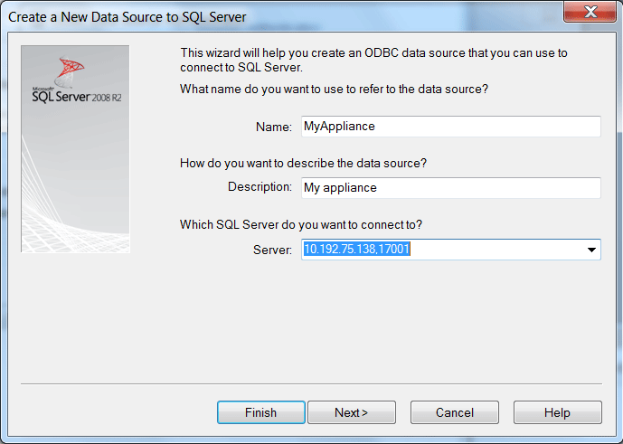
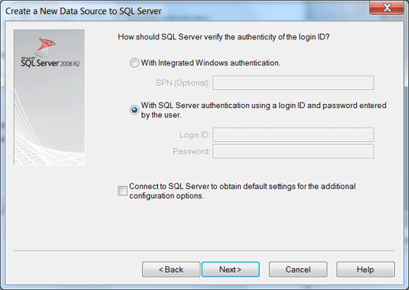
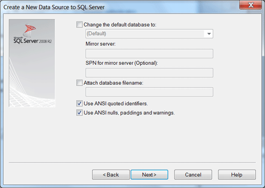
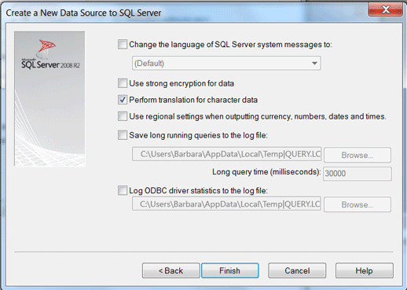
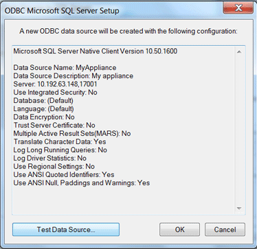
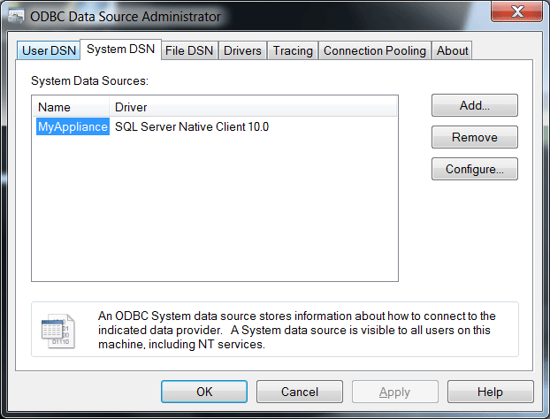

# Connection Strings for ODBC and SQL Server Native Client (SQL Server PDW)
This topic describes connecting to SQL Server PDW with ODBC by using SQL Server Native Client 10.0.  
  
## Contents  
  
-   [Before You Begin](#BeforeBegin)  
  
-   [Add SQL Server PDW as an ODBC Data Source](#AddODBC)  
  
-   [Connection String Keywords](#ConnectionString)  
  
-   [Establish a Secure Connection](#SecureConnection)  
  
## Before You Begin  
**Software Requirements**  
  
-   SQL Server Native Client 10.0. See [Install SQL Server Native Client &#40;SQL Server PDW&#41;](../sqlpdw/install-sql-server-native-client-sql-server-pdw.md)  
  
## Add SQL Server PDW as an ODBC Data Source  
Before an application can to connect to SQL Server PDW by using the SQL Server Native Client ODBC driver, you need to add SQL Server PDW as a data source.  
  
The following steps show how to add your SQL Server PDW appliance as a data source by using the ODBC Data Source Administrator that ships with Windows. The dialogs may vary among Windows versions.  
  
1.  Open the ODBC Data Source Administrator in Windows.  
  
    1.  On your Windows system, click **Start**, and enter **odbcad32**.  
  
2.  In the ODBC Data Source Administrator window:  
  
    1.  Click the **System DSN** tab, and then click **Add**. This will open the Create New Data Source window.  
  
    2.  In the Create New Data Source window, select **SQL Server Native Client 10.0**, and click **Finish**.  
  
      
  
3.  In the **Create a New Data Source to SQL Server** window, enter the following:  
  
    -   **Name / Description:** Enter the human-readable name and description for the data source. Make a note of the Data Source Name. You will need this information later.  
  
    -   **Server:** Enter the IP address of the appliance Control node. Append a comma and then port 17001. For example, 10.192.45.136**,**17001, and click **Next**.  
  
          
  
4.  In response to the question **How should SQL Server verify the authenticity of the login ID?**  
  
    1.  Choose **With Integrated Windows authentication** to use Windows Authentication. Choose **With SQL Server authentication using a login name and password entered by the user** to use SQL Server Authentication.  
  
    2.  Uncheck **Connect to SQL Server to obtain default settings for the additional configuration options.**, and click **Next**.  
  
          
  
5.  On the page with database options and ANSI options, leave everything unchanged, and click **Next**.  
  
      
  
6.  Leave remaining options unchanged, and click **Finish**.  
  
      
  
7.  Click **OK** to skip running the **Test Connection**.  
  
      
  
8.  Verify that your new data source is listed in the System Data Sources, and uses the SQL Server Native Client 10.0 driver. Click **OK** to close the window.  
  
      
  
9. Your data source is now available for applications that need to connect to your appliance.  
  
## Connection String Keywords  
This table lists the keywords that can be used for connecting to SQL Server PDW with ODBC and SQL Server Native Client. This is a subset of keywords supported when connecting to SQL Server. Also included are additional instructions when keyword behavior with SQL Server PDW differs from SQL Server. For full descriptions of each string keyword, connection string creation information, and usage of the APIs, see the ODBC section in [Using Connection String Keywords with SQL Server Native Client](http://msdn.microsoft.com/en-us/library/ms130822.aspx).  
  
|Keyword|SQL Server PDW Support Notes|  
|-----------|-------------------------------------------------------|  
|**Addr**||  
|**Address**|Only accepts TCP/IP protocol (default). Port must be 17001.|  
|**APP**||  
|**AutoTranslate**||  
|**Database**||  
|**Driver**||  
|**DSN**||  
|**Encrypt**||  
|**Fallback**||  
|**FileDSN**||  
|**Language**|‘English’ only.|  
|**MARS_Connection**|‘no’ only.|  
|**Net**||  
|**Network**|‘dbmssocn’ only.|  
|**PWD**||  
|**QueryLog_On**||  
|**QueryLogFile**||  
|**QueryLogTime**||  
|**Regional**||  
|**SaveFile**||  
|**Server**|No named instances. Protocol must be “TCP/IP”. Port is 17001.|  
|**StatsLog_On**||  
|**StatsLogFile**||  
|**Trusted_Connection**||  
|**TrustServerCertificate**||  
|**UID**||  
|**UseProcForPrepare**||  
|**WSID**||  
  
## Establish a Secure Conection  
To establish a secure connection to SQL Server PDW via an ODBC or OLE DB connection, the connection string must contain the following:  
  
1.  The *ValidateServerCertificate* value set to **true**.  
  
2.  The *HostNameInCertificate* (HNIC) value is optional. It can be used as an extra validation, and when used, complies with the following HNIC values:  
  
    -   When the certificate has a *dnsName* value in the *subjectAltName* value, the *HostNameInCertificate* value in the connection string must match the *dnsName*  
  
    -   When the certificate does not have a *dnsName* value in the *subjectAltName* field or no *subjectAltName* value is present, the *HostNameInCertificate* value in the connection string must match the *commonName* (CN) part in the *Subject name* of the certificate. If multiple *commonName* parts exist in the *Subject name* of the certificate, the connection succeeds if the HNIC value matches any of the *Common Name* parts.  
  
