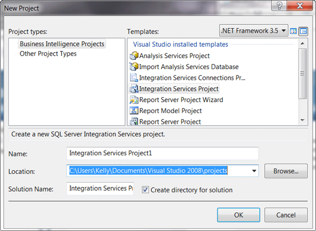
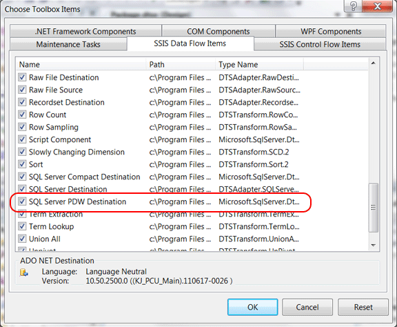

# Install Integration Services Destination Adapters (SQL Server PDW)
This topic describes how to install the Integration Services Destination Adapters for Parallel Data Warehouse.  
  
Parent Topic: [Client Tools and Applications &#40;SQL Server PDW&#41;](../sqlpdw/client-tools-and-applications-sql-server-pdw.md)  
  
## Contents  
  
-   [Before You Begin](#BeforeYouBegin)  
  
-   [Step 1: Obtain the Installation files](#Obtain)  
  
-   [Step 3: Install the Integration Services Destination Adapters](#Install)  
  
-   [Step 4: Verify the Destination Adapters](#Verify)  
  
-   [Step 5 – SQL Server 2008 R2 only: Add SQL Server PDW as a Data Flow Destination](#AddDataFlow)  
  
## Basics  
The destination adapters enable you to load data into SQL Server PDW by using Integration Services.  They need to be installed onto the computer that uses Integration Services to build and run loading packages.  
  
## Before You Begin  
  
### Supported Operating Systems  
Windows 7, Windows Server 2008, Windows Server 2012, Windows Server 2012 R2.  
  
### Supported Appliances  
To load data into Appliance Update 5, use the Appliance Update 5 destination adapters. There are 32-bit and 64-bit Appliance Update 5 destination adapter for SQL Server 2008 R2, SQL Server 2012, SQL Server 2014, and SQL Server 2016.  
  
### Software Prerequisites  
If not already installed, install [Microsoft .NET Framework 3.5 Service Pack 1](http://www.microsoft.com/downloads/en/confirmation.aspx?familyId=ab99342f-5d1a-413d-8319-81da479ab0d7&displayLang=en).  
  
Integration Services for any of these versions of SQL Server.  
  
- SQL Server 2016

-   SQL Server 2014  
  
-   SQL Server 2012 Service Pack 1 plus [Cumulative Update Package  2](http://support.microsoft.com/kb/2790947), or later.  
  
-   SQL Server 2012 plus [Cumulative Update Package  5](http://support.microsoft.com/kb/2777772), or later.  
  
    > [!IMPORTANT]  
    > If the Cumulative Update Packages are not applied, SQL Server 2012 Integration Services will load files serially instead of in parallel.  
  
-   SQL Server 2008 R2  
  
## Step 1: Obtain the Installation files  
Obtain the Windows Installer files for the destination adapters from your appliance administrator, or see [Client Tools and Applications &#40;SQL Server PDW&#41;](../sqlpdw/client-tools-and-applications-sql-server-pdw.md) for the location of the tools. You will need both the 32-bit and 64-bit installation files for your version of Integration Services.  
  
General Remarks  
  
We recommend installing both the 32-bit and the 64-bit destination adapters for the following reasons:  
  
-   Integration Services packages are usually created by using SQL Server Business Intelligence Development Studio (BIDS) for SQL Server 2008 R2, or SQL Server Data Tools (SSDT) for SQL Server 2012, or SQL Server data tooling for Visual Studio 2013 These are all 32-bit programs. Therefore, to create integration services packages with BIDS, SSDT, or SQL Server data tooling, you need to install the 32-bit destination adaptor.  
  
-   Integration Services packages are usually run with 64-bit binaries for performance reasons. Therefore, to run an Integration Services package efficiently, you need to install the 64-bit destination adaptor. For more information, see [64-Bit Considerations for Integration Services](http://msdn.microsoft.com/library/ms141766(v=sql11).aspx).  
  
## Step 3: Install the Integration Services Destination Adapters  
Install the Destination Adapters onto the computers that will use Integration Services to build or run Integration Services packages that load data into SQL Server PDW.  
 
Only one version of the destination adapters can be installed on your client.  For example, if you have SQL Server 2014 and SQL Server 2016 installed on the same client, you can either install the 2014 adapters for use with SQL Server 2014, or the 2016 adapters for use with SQL Server 2016.  
  
To install the Destination Adapters  
  
-   For SQL Server 2008 R2Integration Services, run the following Windows Installer files:  
  
    -   SSISSQLPDWDest-x86.msi  
  
    -   SSISSQLPDWDest-x64.msi  
  
-   For SQL Server 2012Integration Services, run the following Windows Installer files:  
  
    -   SSISSQL**2012**PDWDest-x86.msi  
  
    -   SSISSQL**2012**PDWDest-x64.msi  
  
-   For SQL Server 2014 Integration Services, run the following Windows Installer files:  
  
    -   SSISSQL**2014**PDWDest-x86.msi  
  
    -   SSISSQL**2014**PDWDest-x64.msi  
 
-   For SQL Server 2016 Integration Services, run the following Windows Installer files:  
  
    -   SSISSQL**2016**PDWDest-x86.msi  
  
    -   SSISSQL**2016**PDWDest-x64.msi  

 
  
## Step 4: Verify the Destination Adapters  
To verify the installations  
  
After the installation has finished, you can view your installed destination adapters in **Control Panel**, **Programs and Features** with the following names:  
  
-   Microsoft SQL Server PDW SSIS Destination x86 Components  
  
-   Microsoft SQL Server PDW SSIS Destination x64 Components  
  
-   Microsoft SQL Server 2012 PDW SSIS Destination x86 Components  
  
-   Microsoft SQL Server 2012 PDW SSIS Destination x64 Components  
  
-   Microsoft SQL Server 2014 PDW SSIS Destination x86 Components  
  
-   Microsoft SQL Server 2014 PDW SSIS Destination x64 Components  
 
-   Microsoft SQL Server 2016 PDW SSIS Destination x86 Components  
  
-   Microsoft SQL Server 2016 PDW SSIS Destination x64 Components  
 
  
**For SQL Server 2008 R2Integration Services**, continue to the next step to add SQL Server PDW as a data flow destination.  
  
**For SQL Server 2012Integration Services**, verify SQL Server PDW is listed as a destination in the SSIS toolbox in SQL Server Data Tools. To do this:  
  
1.  Open SQL Server Data Tools for Visual Studio 2010. To open these, find the All Programs menu, select Microsoft SQL Server 2012, and select SQL Server Data Tools. To do this in:  
  
    -   Windows 7, open the Start menu, select All Programs, select Microsoft SQL Server 2012, and select SQL Server Data Tools.  
  
    -   Windows 8, press the Start key, select search, click Apps, find Microsoft SQL Server 2012. Under Microsoft SQL Server 2012, click to open SQL Server Data Tools. This opens SQL Server Data Tools for Visual Studio 2010.  
  
2.  Open an existing Integration Services project or create a new one. At least one project must exist in order to add the data flow destination. To create a project:  
  
    -   Click on the **File** menu, choose **New**, choose **Project**, and click OK.  
  
    -   In the new project window, choose Integration Services Project under Business Intelligence. This opens the package design window.  
  
    -   In the Package.dtsx [Design] window, click on the **Data Flow** tab.  
  
    -   Scroll down through the SSIS Toolbox. You should now see **SQL Server PDW Destination** under **Other Destinations** in the SSIS Toolbox.  
  
    -   The SQL Server PDW Destination is installed correctly! For next steps, see [Load Data With Integration Services &#40;SQL Server PDW&#41;](../sqlpdw/load-data-with-integration-services-sql-server-pdw.md)  
  
## Step 5 – SQL Server 2008 R2 only: Add SQL Server PDW as a Data Flow Destination  
  
> [!IMPORTANT]  
> This step is only required for SQL Server 2008 R2 Integration Services. Skip this step if you are using SQL Server 2012Integration Services.  
  
In this step, you will add SQL Server PDW as a Data Flow Destination in the Integration Services toolbox.  
  
**To add the SQL Server PDW Destination to the Toolbox**  
  
1.  Open SQL Server Business Intelligence Development Studio (BIDS). To do this in:  
  
    -   Windows 7, click on the Windows **Start** menu, select **All Programs**, select **Microsoft SQL Server 2008 R2**, and select **SQL Server Business Intelligence Development Studio**.  
  
    -   Windows 8, press the Start key, select search, click Apps, find Microsoft SQL Server 2008 R2. Under Microsoft SQL Server 2008 R2, click Business Intelligence Development Tools.  
  
2.  Open an existing Integration Services project or create a new one. At least one project must exist in order to add the data flow destination. To create a project:  
  
    -   Click on the **File** menu, choose **New**, choose **Project**.  
  
          
  
    -   In the new project window, choose Integration Services Project. This opens the package design window.  
  
3.  Add SQL Server PDW Destination as a Data Flow Destination.  
  
    -   Select the **Data Flow** tab.  
  
    -   Scroll through the toolbox until you see the Data Flow Destinations category. Right-click on **Data Flow Destinations**, wait for the Choose Toolbox dialog to appear, and select **Choose items …**  
  
    -   In the **Choose Items** window, click the **SSIS Data Flow Items** tab.  
  
    -   Select **SQL Server PDW Destination**, and click OK.  
  
          
  
    -   You should now see **SQL Server PDW Destination** in the **Data Flow Destinations** of the Toolbox.  
  
          
  
## Next Steps  
Your computer is now setup to build and run Integration Services loading packages. For more information, see [Load Data With Integration Services &#40;SQL Server PDW&#41;](../sqlpdw/load-data-with-integration-services-sql-server-pdw.md).  
  
## See Also  
[How to create a script task that uses the SSIS PDW destination adapter &#40;SQL Server PDW&#41;](../sqlpdw/how-to-create-a-script-task-that-uses-the-ssis-pdw-destination-adapter-sql-server-pdw.md)  
  
