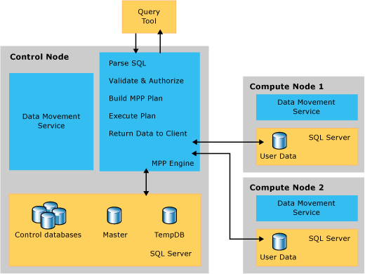

# Understanding Query Plans (SQL Server PDW)
A SQL Server PDW query plan is the translation of sequential SQL statements into an execution plan that will run in parallel on the SQL Server PDW appliance. Use the query plan to understand how your query will be processed and find ways to optimize performance.  
  
Use the [EXPLAIN](../sqlpdw/explain-sql-server-pdw.md) command to generate a query plan without submitting the query for execution.  
  
## Contents  
  
-   [Understanding the Query Process](#UnderstandQueryProcess)  
  
-   [DMS Query Plan Operations](#DMSQueryOps)  
  
-   [SQL Query Plan Operations](#SQLQueryPlanOps)  
  
-   [Other Query Plan Operations](#OtherQueryPlanOps)  
  
## Understanding the Query Process  
User-submitted SQL queries are processed by the Control node. The Control node engine parses the query and creates a query plan that defines the sequence of operations it will use to run the query on the appliance. The Control node distributed query plan operations run serially. When a query plan operation uses multiple parallel operations, the SQL Server PDW engine waits for all parallel operations to complete before starting the next distributed query plan operation.  
  
  
  
And this is the query execution sequence:  
  
  
  
## DMS Query Plan Operations  
A *Data Movement Service (DMS) operation* is a SQL Server PDW query plan operation that moves data among the nodes in the appliance. The data is always moved into temporary tables. The permanent data in user databases remains intact during DMS operations and is not removed from the original location in the appliance.  
  
Moving data ensures that data exists on the correct nodes at the correct time to run queries in the MPP Shared Nothing architecture. For example, DMS operations are required if the data for a SQL join is not collocated on each Compute node, or data needs to be moved from the Compute nodes to the Control node for an aggregation operation.  
  
SQL Server PDW query plans contain the following DMS operations.  
  
|Operation Name|OpType Name for EXPLAIN|Description|  
|------------------|---------------------------|---------------|  
|**BroadcastMoveOperation**|BROADCAST_MOVE|Moves distributed data into a replicated table. This operation is frequently used when running a distribution incompatible join.  To perform this operation, each distribution broadcasts its rows to all other Compute nodes. The result is that each Compute node uses its own rows plus all the rows it receives from the other Compute nodes to create a replicated table.|  
|**CopyOperation**|CopyOperation|Copies data from SQL Server PDW to a SMP SQL Server database. This operation is used only when running the [CREATE REMOTE TABLE AS SELECT &#40;SQL Server PDW&#41;](../sqlpdw/create-remote-table-as-select-sql-server-pdw.md) statement. It is always preceded by a RemoteOperation.|  
|**DistributedReplicatedTableMoveOperation**|DISTRIBUTE_REPLICATED_TABLE_MOVE|Copies a replicated table from one Compute node to all other Compute nodes. This operation guarantees data consistency among all copies of a replicated table after a non-deterministic query operation. For example, it might be necessary to perform this operation after an Insert, Update, Delete, or CTAS statement on a replicated table.|  
|**MoveOperation**|MASTER_TABLE_MOVE|Moves data from the Control node to all Compute nodes. This operation is used to copy data into a replicated table.|  
|**PartitionMoveOperation**|PARTITION_MOVE|Moves data from a distributed table to a single table on the Control node. This operation is used for aggregation operations on the Control node.|  
|**ReturnOperation**|RETURN|Sends query results from the Control node to the user who submitted the query. This is the final operation for a parallel query plan.|  
|**ShuffleMoveOperation**|SHUFFLE_MOVE|Redistributes a distributed table. The redistributed table has a different distribution column than the original distributed table. This might be used to when running incompatible joins or incompatible aggregations.  To perform this operation, DMS moves each row to the correct Compute node according to distribution column of the destination table. Rows that are already stored on the correct Compute node are not copied during this operation.|  
|**TrimMoveOperation**|TRIM_MOVE|Moves a replicated table to a distributed table.  To perform this operation, data does not need to be copied from one Computer node to another because all rows are already stored in the replicated table on each Compute node. Instead, each Compute node distributes only the rows that belong in its distributions.|  
|**DSQLCallBackOperation**|(Not visible via EXPLAIN)|Redistributes distributed tables as part of a database restore. This is used only when a restore operation is restoring a database to a destination appliance that has more Compute nodes than the source appliance.|  
  
## SQL Query Plan Operations  
A SQL operation performs an action on a database or object. Each SQL operation runs on a specific set of nodes. For example, it can run on the Control node, some of the Compute nodes, all of the Compute nodes, or a remote SQL Server instance.  
  
|Operation Name|OpType Name for EXPLAIN|Description|  
|------------------|---------------------------|---------------|  
|**OnOperation**|ON|Performs an action on a database or object.  The OnOperation can be performed after DMS operations have completed, or it can be used to run a query that does not require data movement.  Each OnOperation specifies which node or nodes that will perform the action.  For example, the OnOperation performs DDL statements such as Create Table, Create Index, Drop Table, Drop View, etc.|  
|**RemoteOperation**|RemoteOnOperation|Performs an action on a SMP SQL Server database or table. This is similar to OnOperation, but is only used when running the CREATE REMOTE TABLE statement.|  
  
## Other Query Plan Operations  
  
|Operation Name|OpType Name for EXPLAIN|Description|  
|------------------|---------------------------|---------------|  
|**MetaDataCreateOperation**|MetaDataCreate_Operation|Stores data into or retrieves data from a system view.  For example, this operation is used to perform a SELECT from a system view.|  
|**RandomIDOperation**|RND_ID|Creates a unique name. This operation is used to generate random names for temporary objects that get created as part of the query plan. The RandomIDOperation is always run on the Control node.  Temporary tables are named *q_<RandomID>*.  The query plan might use *q_temp_partition1* to refer to a temporary name before it is generated.|  
  
## External Operations for Reads  
  
|Operation Name|OpType Name for EXPLAIN|Description|  
|------------------|---------------------------|---------------|  
|**HadoopBroadcastOperation**|ExternalBroadcastMove||  
|**HadoopRoundRobinOperation**|ExternalRoundRobinMove||  
|**HadoopShuffleOperation**|ExternalShuffleMove||  
  
## External Operations for MapReduce  
  
|Operation Name|OpType Name for EXPLAIN|Description|  
|------------------|---------------------------|---------------|  
|**HadoopJobOperation**|HadoopOperation||  
|**HdfsDeleteOperation**|HadoopFileOperation||  
  
## External Operations for Writes  
  
|Operation Name|OpType Name for EXPLAIN|Description|  
|------------------|---------------------------|---------------|  
|**ExternalExportControlOperation**|ExternalExportControlMove||  
|**ExternalExportDistributedOperation**|ExternalExportDistributedMove||  
|**ExternalExportReplicatedOperation**|ExternalExportReplicatedMove||  
  
